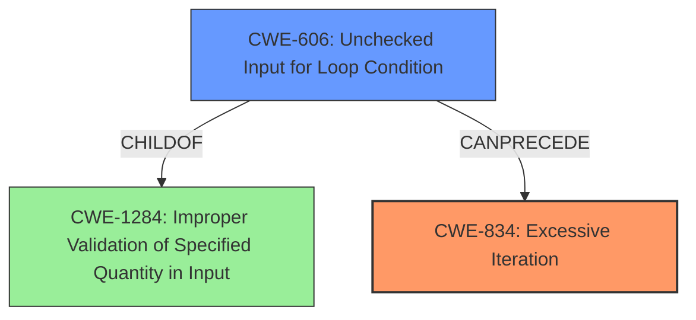

# Analysis Report for CVE-2022-26477

# Vulnerability Analysis Report: CVE-2022-26477

## Description


## Analysis (with Relationship Data)

# Summary
| CWE ID | CWE Name | Confidence | CWE Abstraction Level | CWE Vulnerability Mapping Label | CWE-Vulnerability Mapping Notes |
|---|---|---|---|---|---|
| CWE-834 | Excessive Iteration | 0.9 | Class | Primary | Allowed |
| CWE-606 | Unchecked Input for Loop Condition | 0.7 | Base | Secondary | Allowed |

## Evidence and Confidence

*   **Confidence Score:** 0.8
*   **Evidence Strength:** HIGH

## Relationship Analysis
The primary CWE is CWE-834, which is a Class-level CWE. CWE-606 is a ChildOf CWE-1284 and a potential cause of CWE-834. Selecting CWE-834 indicates the **CPU exhaustion** from **improper termination condition**, but doesn't specify the specific **rootcause** itself.



## Vulnerability Chain
The vulnerability chain starts with an **improper termination condition** which can lead to **CPU exhaustion**.
  - Initial Flaw: **Improper Termination Condition**
  - Resulting Weakness: **CPU Exhaustion**

## Summary of Analysis
The vulnerability description states, "The Security Team noticed that the termination condition of the for loop in the readExternal method is a controllable variable, which, if tampered with, may lead to **CPU exhaustion**." The **rootcause** is an **improper termination condition** and the **weakness** is **CPU exhaustion**.

CWE-834 (Excessive Iteration) is a Class-level CWE that describes a situation where a product performs an iteration or loop without sufficiently limiting the number of times that the loop is executed. This can lead to excessive resource consumption, such as CPU, which aligns with the described **CPU exhaustion** **weakness**.

CWE-606 (Unchecked Input for Loop Condition) describes a scenario where the product does not properly check inputs that are used for loop conditions, potentially leading to a denial of service or other consequences because of excessive looping. This aligns with the **improper termination condition** **rootcause**.

Therefore, CWE-834 and CWE-606, when combined, accurately represent the vulnerability.

CWE-770 (Allocation of Resources Without Limits or Throttling) was considered, as **CPU exhaustion** can be considered a resource issue, but the **rootcause** in this case stems from the loop condition rather than a memory allocation problem.
CWE-789 (Memory Allocation with Excessive Size Value) was also considered, as **CPU exhaustion** can happen if too much memory is allocated.
CWE-1284 (Improper Validation of Specified Quantity in Input) was also considered, as a loop termination condition can be considered a quantity.

Ultimately, CWE-834 was chosen as the primary CWE to capture the **CPU exhaustion** **weakness**, and CWE-606 as a secondary to capture the **improper termination condition** **rootcause**. The CWEs are at the most appropriate level of specificity based on the available information.


## CWE Relationship Analysis

Current CWEs represent these abstraction levels: .


### Vulnerability Chain Analysis

**Chain starting from CWE-606:**
- 606 (Unchecked Input for Loop Condition) - ROOT


**Chain starting from CWE-834:**
- 834 (Excessive Iteration) - ROOT


### CWE Relationship Diagram

```mermaid
graph TD
    classDef primary fill:#f96,stroke:#333,stroke-width:2px
    classDef secondary fill:#69f,stroke:#333
    classDef tertiary fill:#9e9,stroke:#333
```


*Report generated on 2025-03-31 08:29:24*
