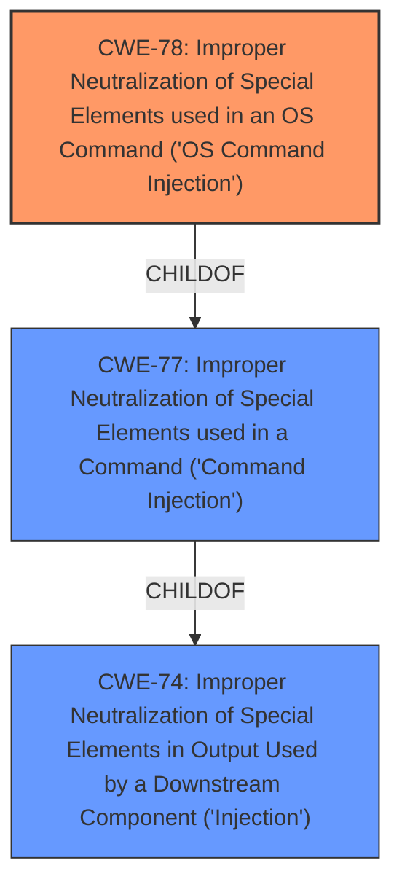

# Enhanced Analysis for CVE-2022-26481

# Summary
| CWE ID | CWE Name | Confidence | CWE Abstraction Level | CWE Vulnerability Mapping Label | CWE-Vulnerability Mapping Notes |
|---|---|---|---|---|---|
| CWE-78 | Improper Neutralization of Special Elements used in an OS Command ('OS Command Injection') | 1.0 | Base | Allowed | Primary CWE |

## Evidence and Confidence

*   **Confidence Score:** 1.0
*   **Evidence Strength:** HIGH

## Relationship Analysis
The primary relationship is that CWE-78 is a `ChildOf` CWE-77, which is a more general form of command injection. The selection of CWE-78 is due to the vulnerability specifically involving OS commands, making it a more precise classification than CWE-77.



## Vulnerability Chain
The vulnerability chain starts with **insufficient input sanitization**, which leads to **Improper Neutralization of Special Elements used in an OS Command ('OS Command Injection') (CWE-78)**. The impact is **full system compromise** due to the injected commands being executed with root privileges.

## Summary of Analysis
The analysis is based on the detailed vulnerability description and the CVE Reference Links Content Summary, both of which explicitly state the presence of command injection via the CN field in the CSR, leading to arbitrary OS command execution with root privileges.

The "Vulnerability Description Key Phrases" section highlights "**Command Injection**" as the primary weakness. The "CVE Reference Links Content Summary" confirms the **root cause** as insufficient input sanitization in the web interface when creating a certificate, enabling the injection of arbitrary OS commands. The technical details further specify that the injection occurs in the `Common Name (CN)` field using the syntax `$(command)`, resulting in command execution with root privileges.

The retriever results strongly suggest CWE-77 and CWE-78. Given that the vulnerability involves injecting OS commands, CWE-78 is a more precise classification than CWE-77, which is a more general form of command injection. The relationship analysis supports this decision, as CWE-78 is a child of CWE-77. The mapping guidance for CWE-78 allows its usage and confirms that it's at the Base level of abstraction, which is a preferred level.

CWE-77 was considered but not used because the evidence clearly points to OS command injection rather than a more general form of command injection.
CWE-88 (Improper Neutralization of Argument Delimiters in a Command) was considered, but the vulnerability description indicates that the attacker is injecting entire commands rather than just manipulating arguments.
CWE-94 (Improper Control of Generation of Code ('Code Injection')) was considered but not used as it is too general and applies when the product's functionality intentionally constructs all or part of a code segment. In this case, the product intends to create a certificate signing request, not generate code.

The selection of CWE-78 is based on clear evidence, relationship analysis, and mapping guidance, making it the most accurate and specific classification for this vulnerability.


## CWE Relationship Analysis

Current CWEs represent these abstraction levels: .


### Vulnerability Chain Analysis

**Chain starting from CWE-78:**
- 78 (Improper Neutralization of Special Elements used in an OS Command ('OS Command Injection')) - ROOT


**Chain starting from CWE-94:**
- 94 (Improper Control of Generation of Code ('Code Injection')) - ROOT


### CWE Relationship Diagram

```mermaid
graph TD
    classDef primary fill:#f96,stroke:#333,stroke-width:2px
    classDef secondary fill:#69f,stroke:#333
    classDef tertiary fill:#9e9,stroke:#333
```