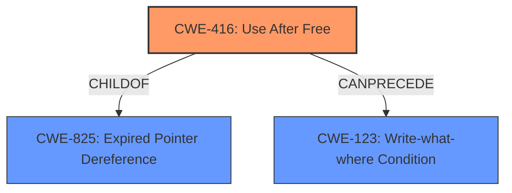

# Analysis for CVE-2022-26485

# Summary
| CWE ID | CWE Name | Confidence | CWE Abstraction Level | CWE Vulnerability Mapping Label | CWE-Vulnerability Mapping Notes |
|---|---|---|---|---|---|
| CWE-416 | Use After Free | 1.0 | Variant | Allowed | Primary CWE |
| CWE-123 | Write-what-where Condition | 0.6 | Base | Allowed | Secondary CWE |

## Evidence and Confidence

*   **Confidence Score:** 0.8
*   **Evidence Strength:** HIGH

## Relationship Analysis
The primary weakness is CWE-416 Use After Free, which is a variant level CWE and a child of CWE-825 Expired Pointer Dereference. CWE-416 can be triggered by race conditions (CWE-362) or improper locking (CWE-667) scenarios where memory is freed prematurely. The vulnerability can lead to writing arbitrary values to arbitrary locations (CWE-123).

## Vulnerability Chain
The vulnerability chain starts with the removal of an XSLT parameter during processing, leading to an **exploitable use-after-free (CWE-416)**. The attacker can potentially write arbitrary values to arbitrary locations in memory (**CWE-123**), ultimately leading to remote code execution.

## Summary of Analysis
The analysis is based on the provided evidence, which clearly indicates a **use-after-free** vulnerability.

The "Vulnerability Description Key Phrases" section highlights the **rootcause** as "**exploitable use-after-free**".

The "CVE Reference Links Content Summary" section elaborates on this: "The core weakness is a use-after-free vulnerability. The `txVariable` object representing an XSLT parameter can be freed prematurely...leading to a dangling pointer."

The technical details in the "CVE Reference Links Content Summary" further solidify this by explaining how the `removeParameter` function frees the `txVariable` object while the `Convert` function continues to operate on it, resulting in a use-after-free.

CWE-416 is a Variant-level CWE that accurately represents the root cause. The description of CWE-416 states: "The product reuses or references memory after it has been freed." This aligns perfectly with the vulnerability description. The mapping guidance for CWE-416 indicates "This CWE entry is at the Variant level of abstraction, which is a preferred level of abstraction for mapping to the root causes of vulnerabilities."

CWE-123, Write-what-where, is added as a secondary CWE because the use-after-free can potentially lead to writing arbitrary values to arbitrary locations in memory. While the provided information does not explicitly state this, the potential for this condition exists given the nature of UAF vulnerabilities.

CWE-787, Out-of-bounds Write, was considered but deemed less accurate than CWE-416, as the root cause is the use of freed memory rather than a general out-of-bounds write. While out-of-bounds writes might occur as a result of the use-after-free, the primary weakness is the UAF itself.

CWE-362, Concurrent Execution using Shared Resource with Improper Synchronization ('Race Condition'), and CWE-667, Improper Locking, were considered because race conditions or locking issues can sometimes lead to use-after-free vulnerabilities. However, the evidence does not explicitly indicate a race condition or locking issue in this case, so these CWEs were not selected.

CWE-843, Access of Resource Using Incompatible Type ('Type Confusion'), was considered because use-after-free vulnerabilities can sometimes lead to type confusion. However, the evidence does not explicitly indicate type confusion in this case, so this CWE was not selected.