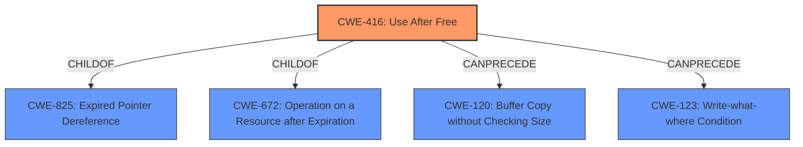

# Analysis Report for CVE-2022-26486

# Vulnerability Analysis Report: CVE-2022-26486

## Description


## Analysis (with Relationship Data)

# Summary
| CWE ID | CWE Name | Confidence | CWE Abstraction Level | CWE Vulnerability Mapping Label | CWE-Vulnerability Mapping Notes |
|---|---|---|---|---|---|
| CWE-416 | Use After Free | 1.0 | Variant | Allowed | Primary CWE |

## Evidence and Confidence

*   **Confidence Score:** 1.0
*   **Evidence Strength:** HIGH

## Relationship Analysis
The primary relationship influencing the CWE selection is the direct match of the "**use-after-free**" root cause identified in the vulnerability description to CWE-416. While other CWEs like CWE-787 (Out-of-bounds Write) could potentially follow a use-after-free, the provided information focuses specifically on the UAF condition as the root cause. CWE-416 is a variant of CWE-825 (Expired Pointer Dereference), but the description explicitly mentions "use-after-free", making CWE-416 a more precise choice.



## Vulnerability Chain
The vulnerability chain starts with an "unexpected message in the WebGPU IPC framework" which leads to the **"use-after-free"** condition. The impact of this UAF is an "exploitable sandbox escape".

Unexpected Message -> **Use-After-Free (CWE-416)** -> Exploitable Sandbox Escape

## Summary of Analysis
The analysis is strongly based on the provided evidence, particularly the "**rootcause: use-after-free**" key phrase and the CVE Reference Links Content Summary, which states that "an unexpected message in the WebGPU IPC framework could lead to a use-after-free condition." The Retriever Results also lists CWE-416 as the top combined result with a score of 1.0.

The hierarchical relationships confirm that CWE-416 is the most specific and appropriate choice, being a Variant level CWE. The mapping guidance for CWE-416 explicitly allows its usage and states that it is a preferred level of abstraction for mapping vulnerabilities.

The selected CWE is at the optimal level of specificity because the vulnerability description directly indicates a **use-after-free** condition. Selecting a more general CWE would not accurately represent the specific nature of the vulnerability.

Relevant CWE Information:

# Enhanced Context (25 CWEs)
The following CWEs were identified as potentially relevant to this vulnerability:

## CWE-668: Exposure of Resource to Wrong Sphere
**Abstraction Level**: Class
**Similarity Score**: 0.77
**Source**: dense

**Description**:
The product exposes a resource to the wrong control sphere, providing unintended actors with inappropriate access to the resource.

**Mapping Guidance**:
- Usage: Discouraged
- Rationale: CWE-668 is high-level and is often misused as a catch-all when lower-level CWE IDs might be applicable. It is sometimes used for low-information vulnerability reports [REF-1287]. It is a level-1 Class (i.e., a child of a Pillar). It is not useful for trend analysis.

**CWE-668 Considered but not used:** While a sandbox escape (the impact) involves resources being exposed to the wrong sphere, the root cause is the **use-after-free**, making CWE-416 a more direct and appropriate mapping.

## CWE-404: Improper Resource Shutdown or Release
**Abstraction Level**: Class
**Similarity Score**: 0.77
**Source**: dense

**Description**:
The product does not release or incorrectly releases a resource before it is made available for re-use.

**Mapping Guidance**:
- Usage: Allowed-with-Review
- Rationale: This CWE entry is a Class and might have Base-level children that would be more appropriate

**CWE-404 Considered but not used:** Although the vulnerability occurs during the shutdown of the WebGPU IPC framework, the core issue is not simply the improper shutdown, but the specific **use-after-free** that occurs as a result.

## CWE-610: Externally Controlled Reference to a Resource in Another Sphere
**Abstraction Level**: Class
**Similarity Score**: 0.76
**Source**: dense

**Description**:
The product uses an externally controlled name or reference that resolves to a resource that is outside of the intended control sphere.

**Mapping Guidance**:
- Usage: Discouraged
- Rationale: This CWE entry is a level-1 Class (i.e., a child of a Pillar). It might have lower-level children that would be more appropriate

**CWE-610 Considered but not used:** While the vulnerability is triggered by an unexpected message (potentially externally controlled), the core weakness is the **use-after-free** condition, not the externally controlled reference.

## CWE-664: Improper Control of a Resource Through its Lifetime
**Abstraction Level**: Pillar
**Similarity Score**: 0.76
**Source**: dense

**Description**:
The product does not maintain or incorrectly maintains control over a resource throughout its lifetime of creation, use, and release.

**Mapping Guidance**:
- Usage: Discouraged
- Rationale: This CWE entry is high-level when lower-level children are available.

**CWE-664 Considered but not used:** This is a very high-level CWE. The **use-after-free** condition (CWE-416) is a more specific and accurate representation of the vulnerability.

## CWE-226: Sensitive Information in Resource Not Removed Before Reuse
**Abstraction Level**: Base
**Similarity Score**: 0.75
**Source**: dense

**Description**:
The product releases a resource such as memory or a file so that it can be made available for reuse, but it does not clear or "zeroize" the information contained in the resource before the product performs a critical state transition or makes the resource available for reuse by other entities.

**Mapping Guidance**:
- Usage: Allowed
- Rationale: This CWE entry is at the Base level of abstraction, which is a preferred level of abstraction for mapping to the root causes of vulnerabilities.

**CWE-226 Considered but not used:** This CWE relates to sensitive information not being removed, while the identified issue is a **use-after-free**.

## CWE-669: Incorrect Resource Transfer Between Spheres
**Abstraction Level**: Class
**Similarity Score**: 0.75
**Source**: dense

**Description**:
The product does not properly transfer a resource/behavior to another sphere, or improperly imports a resource/behavior from another sphere, in a manner that provides unintended control over that resource.

**Mapping Guidance**:
- Usage: Allowed-with-Review
- Rationale: This CWE entry is a Class and might have Base-level children that would be more appropriate

**CWE-669 Considered but not used:** The vulnerability involves a **use-after-free**, not necessarily an incorrect resource transfer.

## CWE-653: Improper Isolation or Compartmentalization
**Abstraction Level**: Class
**Similarity Score**: 0.75
**Source**: dense

**Description**:
The product does not properly compartmentalize or isolate functionality, processes, or resources that require different privilege levels, rights, or permissions.

**Mapping Guidance**:
- Usage: Allowed
- Rationale: This CWE entry is at the Base level of abstraction, which is a preferred level of abstraction for mapping to the root causes of vulnerabilities.

**CWE-653 Considered but not used:** The vulnerability leads to a sandbox escape, which is related to isolation, but the root cause is the **use-after-free**.

## CWE-405: Asymmetric Resource Consumption (Amplification)
**Abstraction Level**: Class
**Similarity Score**: 0.74
**Source**: dense

**Description**:
The product does not properly control situations in which an adversary can cause the product to consume or produce excessive resources without requiring the adversary to invest equivalent work or otherwise prove authorization, i.e., the adversary's influence is "asymmetric."

**Mapping Guidance**:
- Usage: Allowed-with-Review
- Rationale: This CWE entry is a Class and might have Base-level children that would be more appropriate

**CWE-405 Considered but not used:** This vulnerability is a **use-after-free**, not related to resource consumption.


## CWE Relationship Analysis

Current CWEs represent these abstraction levels: .


### Vulnerability Chain Analysis

**Chain starting from CWE-825:**
- 825 (Expired Pointer Dereference) - ROOT


**Chain starting from CWE-669:**
- 669 (Incorrect Resource Transfer Between Spheres) - ROOT


### CWE Relationship Diagram

```mermaid
graph TD
    classDef primary fill:#f96,stroke:#333,stroke-width:2px
    classDef secondary fill:#69f,stroke:#333
    classDef tertiary fill:#9e9,stroke:#333
```


*Report generated on 2025-03-30 11:26:31*
