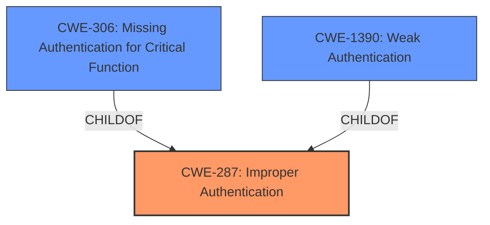

# Raw Analyzer Response for CVE-2022-26504

# Summary
| CWE ID  | CWE Name                                                                      | Confidence | CWE Abstraction Level | CWE Vulnerability Mapping Label | CWE-Vulnerability Mapping Notes |
| :-------- | :---------------------------------------------------------------------------- | :---------- | :---------------------- | :------------------------------ | :------------------------------ |
| CWE-287   | Improper Authentication                                                       | 0.9         | Class                   | Primary                         | Discouraged                     |
| CWE-306   | Missing Authentication for Critical Function                                  | 0.7         | Base                    | Secondary                       | Allowed                         |
| CWE-1390  | Weak Authentication                                                           | 0.7         | Class                   | Secondary                       | Allowed-with-Review             |

## Evidence and Confidence

*   **Confidence Score:** 0.9
*   **Evidence Strength:** HIGH

## Relationship Analysis
The primary CWE is CWE-287, Improper Authentication. While discouraged, it serves as a high-level classification. The retriever results suggest CWE-306 and CWE-1390 as more specific alternatives. CWE-306 (Missing Authentication) and CWE-1390 (Weak Authentication) are both children of CWE-287, providing a more granular view of the authentication issue. The relationships highlight a hierarchy of authentication-related weaknesses, from general improper authentication to specific cases of missing or weak authentication.

## Vulnerability Chain
The vulnerability chain starts with **improper authentication** (CWE-287), potentially leading to the ability to execute arbitrary code.

## Summary of Analysis
The initial analysis identified **improper authentication** as the core weakness. The retriever results pointed to CWE-306 (Missing Authentication for Critical Function) and CWE-1390 (Weak Authentication) as potential candidates.

The evidence supports CWE-287 as the primary issue. According to the "CVE Reference Links Content Summary":

- The `Veeam.Backup.PSManager.exe` process allows authentication using non-administrative domain credentials.
- This **improper authentication** can lead to remote code execution.

This aligns with the description of CWE-287: "When an actor claims to have a given identity, the product does not prove or insufficiently proves that the claim is correct."

CWE-306 is a possible alternative, as the vulnerability description indicates that the system might be missing proper authentication checks for non-administrative users. However, the authentication process does exist, but it is insufficient. Therefore, it is not a case of completely missing authentication as described in CWE-306.

CWE-1390 is also a possibility, as the authentication mechanism might be weak in that it allows non-administrative users to gain access.

Given that the authentication is present but insufficient, CWE-287 serves as the primary, higher-level classification, with CWE-306 and CWE-1390 being secondary classifications that provide more specific details.

CWE-287 is at the Class level, and the mapping guidance discourages its use when lower-level CWEs are applicable. However, in this case, the evidence does not strongly support either CWE-306 or CWE-1390 exclusively, so CWE-287 is chosen as the primary classification. CWE-306 and CWE-1390 are still relevant, so they are included as secondary classifications.

Relevant CWE Information:

# Enhanced Context (25 CWEs)

## CWE-274: Improper Handling of Insufficient Privileges
**Abstraction Level**: Base
**Similarity Score**: 0.76
**Source**: dense

**Description**:
The product does not handle or incorrectly handles when it has insufficient privileges to perform an operation, leading to resultant weaknesses.

**Mapping Guidance**:
- Usage: Discouraged
- Rationale: This CWE entry could be deprecated in a future version of CWE.

*Not Selected*: While relevant, it's more of a consequence of the authentication issue than the root cause.

## CWE-1220: Insufficient Granularity of Access Control
**Abstraction Level**: Base
**Similarity Score**: 0.76
**Source**: dense

**Description**:
The product implements access controls via a policy or other feature with the intention to disable or restrict accesses (reads and/or writes) to assets in a system from untrusted agents. However, implemented access controls lack required granularity, which renders the control policy too broad because it allows accesses from unauthorized agents to the security-sensitive assets.

**Mapping Guidance**:
- Usage: Allowed
- Rationale: This CWE entry is at the Base level of abstraction, which is a preferred level of abstraction for mapping to the root causes of vulnerabilities.

*Not Selected*: It is related to authentication, but not as directly as CWE-287, CWE-306 or CWE-1390.

## CWE-639: Authorization Bypass Through User-Controlled Key
**Abstraction Level**: Base
**Similarity Score**: 0.76
**Source**: dense

**Description**:
The system's authorization functionality does not prevent one user from gaining access to another user's data or record by modifying the key value identifying the data.

**Mapping Guidance**:
- Usage: Allowed
- Rationale: This CWE entry is at the Base level of abstraction, which is a preferred level of abstraction for mapping to the root causes of vulnerabilities.

*Not Selected*: Not directly applicable; the issue is with initial authentication, not authorization bypass via key modification.

## CWE-653: Improper Isolation or Compartmentalization
**Abstraction Level**: Class
**Similarity Score**: 0.76
**Source**: dense

**Description**:
The product does not properly compartmentalize or isolate functionality, processes, or resources that require different privilege levels, rights, or permissions.

**Mapping Guidance**:
- Usage: Allowed
- Rationale: This CWE entry is at the Base level of abstraction, which is a preferred level of abstraction for mapping to the root causes of vulnerabilities.

*Not Selected*: While relevant, it's more of a higher-level view.

## CWE-807: Reliance on Untrusted Inputs in a Security Decision
**Abstraction Level**: Base
**Similarity Score**: 0.76
**Source**: dense

**Description**:
The product uses a protection mechanism that relies on the existence or values of an input, but the input can be modified by an untrusted actor in a way that bypasses the protection mechanism.

**Mapping Guidance**:
- Usage: Allowed
- Rationale: This CWE entry is at the Base level of abstraction, which is a preferred level of abstraction for mapping to the root causes of vulnerabilities.

*Not Selected*: The core issue is not about relying on untrusted inputs, but rather about the authentication process itself.

## CWE-280: Improper Handling of Insufficient Permissions or Privileges
**Abstraction Level**: Base
**Similarity Score**: 0.76
**Source**: dense

**Description**:
The product does not handle or incorrectly handles when it has insufficient privileges to access resources or functionality as specified by their permissions. This may cause it to follow unexpected code paths that may leave the product in an invalid state.

**Mapping Guidance**:
- Usage: Allowed
- Rationale: This CWE entry is at the Base level of abstraction, which is a preferred level of abstraction for mapping to the root causes of vulnerabilities.

*Not Selected*: Similar to CWE-274, it's a consequence rather than the root cause.

## CWE-668: Exposure of Resource to Wrong Sphere
**Abstraction Level**: Class
**Similarity Score**: 0.75
**Source**: dense

**Description**:
The product exposes a resource to the wrong control sphere, providing unintended actors with inappropriate access to the resource.

**Mapping Guidance**:
- Usage: Discouraged
- Rationale: CWE-668 is high-level and is often misused as a catch-all when lower-level CWE IDs might be applicable. It is sometimes used for low-information vulnerability reports [REF-1287]. It is a level-1 Class (i.e., a child of a Pillar). It is not useful for trend analysis.

*Not Selected*: Too broad.

## CWE-472: External Control of Assumed-Immutable Web Parameter
**Abstraction Level**: Base
**Similarity Score**: 0.75
**Source**: dense

**Description**:
The web application does not sufficiently verify inputs that are assumed to be immutable but are actually externally controllable, such as hidden form fields.

**Mapping Guidance**:
- Usage: Allowed
- Rationale: This CWE entry is at the Base level of abstraction, which is