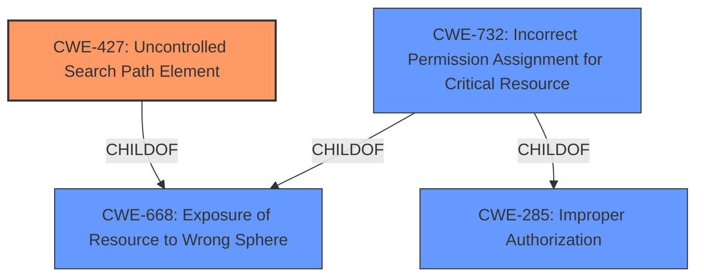

# Analysis Report for CVE-2022-26526

# Vulnerability Analysis Report: CVE-2022-26526

## Description


## Analysis (with Relationship Data)

# Summary
| CWE ID | CWE Name | Confidence | CWE Abstraction Level | CWE Vulnerability Mapping Label | CWE-Vulnerability Mapping Notes |
|---|---|---|---|---|---|
| CWE-427 | Uncontrolled Search Path Element | 0.9 | Base | Allowed | Primary CWE |
| CWE-732 | Incorrect Permission Assignment for Critical Resource | 0.6 | Class | Allowed-with-Review | Secondary Candidate |

## Evidence and Confidence

*   **Confidence Score:** 0.8
*   **Evidence Strength:** MEDIUM

## Relationship Analysis
The primary CWE is CWE-427, which describes the use of a fixed search path that includes a location controllable by unintended actors. CWE-427 is a child of CWE-668 (Incorrect Implementation of Standard) and CWE-668 (Exposure of Resource to Wrong Sphere). CWE-732 (Incorrect Permission Assignment for Critical Resource) is a Class-level CWE and a child of CWE-285 (Improper Authorization) and CWE-668 (Exposure of Resource to Wrong Sphere). The relationship between CWE-427 and CWE-732 is that both relate to incorrect security configurations but at different points. CWE-427 is more specific to the path, while CWE-732 is about the permissions of the directory.



## Vulnerability Chain
The vulnerability chain starts with the **creation of a world-writable directory** under %PROGRAMDATA%, followed by placing that directory into the system PATH. This leads to the possibility of local users gaining privileges by placing a Trojan horse file into that directory.

## Summary of Analysis
The primary weakness is the **inclusion of a world-writable directory in the system PATH**, which allows local users to introduce malicious executables. This aligns directly with CWE-427 (Uncontrolled Search Path Element).

The vulnerability description states that Anaconda and Miniconda can "**create a world-writable directory under %PROGRAMDATA% and place that directory into the system PATH environment variable**". This clearly indicates that the application is using a search path that includes a directory writable by unintended actors (local users). This is direct evidence for CWE-427.

CWE-732 (Incorrect Permission Assignment for Critical Resource) was considered because the directory is world-writable, which is an incorrect permission assignment. However, the core issue is not just the incorrect permissions, but that this world-writable directory is then added to the system PATH, making CWE-427 more accurate. CWE-732 is also a Class-level CWE, while CWE-427 is a Base-level CWE, which is preferred.

The selection of CWE-427 is at the appropriate level of specificity because it directly addresses the root cause of the vulnerability: the use of an uncontrolled search path element. Other CWEs, like CWE-22 (Improper Limitation of a Pathname to a Restricted Directory), are not applicable because there is no path traversal involved. The vulnerability is about the search path itself being vulnerable due to the inclusion of a world-writable directory.

Relevant CWE Information:

# Enhanced Context (25 CWEs)
The following CWEs were identified as potentially relevant to this vulnerability:

## CWE-427: Uncontrolled Search Path Element
**Abstraction Level**: Base
**Similarity Score**: 0.82
**Source**: dense

**Description**:
The product uses a fixed or controlled search path to find resources, but one or more locations in that path can be under the control of unintended actors.

**Mapping Guidance**:
- Usage: Allowed
- Rationale: This CWE entry is at the Base level of abstraction, which is a preferred level of abstraction for mapping to the root causes of vulnerabilities.

## CWE-732: Incorrect Permission Assignment for Critical Resource
**Abstraction Level**: Class
**Similarity Score**: 0.82
**Source**: dense

**Description**:
The product specifies permissions for a security-critical resource in a way that allows that resource to be read or modified by unintended actors.

**Mapping Guidance**:
- Usage: Allowed-with-Review
- Rationale: While the name itself indicates an assignment of permissions for resources, this is often misused for vulnerabilities in which "permissions" are not checked, which is an "authorization" weakness (CWE-285 or descendants) within CWE's model [REF-1287].


## CWE Relationship Analysis

Current CWEs represent these abstraction levels: .


### Vulnerability Chain Analysis

**Chain starting from CWE-668:**
- 668 (Exposure of Resource to Wrong Sphere) - ROOT


**Chain starting from CWE-427:**
- 427 (Uncontrolled Search Path Element) - ROOT


### CWE Relationship Diagram

```mermaid
graph TD
    classDef primary fill:#f96,stroke:#333,stroke-width:2px
    classDef secondary fill:#69f,stroke:#333
    classDef tertiary fill:#9e9,stroke:#333
```


*Report generated on 2025-03-31 04:46:53*
