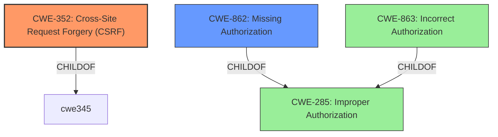

# Analysis for CVE-2022-2657

# Summary
| CWE ID  | CWE Name                                                                          | Confidence | CWE Abstraction Level | CWE Vulnerability Mapping Label | CWE-Vulnerability Mapping Notes |
| ------- | --------------------------------------------------------------------------------- | ---------- | ----------------------- | ------------------------------- | ------------------------------- |
| CWE-352 | Cross-Site Request Forgery (CSRF)                                                 | 0.9        | Compound                | Allowed                         | Primary CWE                   |
| CWE-862 | Missing Authorization                                                             | 0.9        | Class                   | Allowed-with-Review             | Secondary Candidate             |

## Evidence and Confidence

*   **Confidence Score:** 0.9
*   **Evidence Strength:** HIGH

## Relationship Analysis
The primary relationship is between CWE-285 (Improper Authorization), and its children CWE-862 (Missing Authorization) and CWE-863 (Incorrect Authorization). Given the description explicitly mentions "**lacking authorisation**", CWE-862 is a more precise classification than its parent CWE-285. CWE-352 (Cross-Site Request Forgery) is a compound weakness.

## Vulnerability Chain
The vulnerability chain starts with the **lack of authorization and CSRF** protection in multiple AJAX actions. This allows authenticated users to perform actions they shouldn't be able to, such as suspending vendors or updating arbitrary order statuses.
  - Root Cause: **Missing Authorization**, **Missing CSRF Protection**
  - Impact: Suspend vendors, Update arbitrary order status.

## Summary of Analysis
The vulnerability description clearly states the plugin is "**lacking authorisation and CSRF** in multiple AJAX actions". The CVE Reference Links Content Summary reinforces this by stating: "The plugin lacks authorization and CSRF protection in multiple AJAX actions" and "Missing authorization checks: Authenticated users, even subscribers, can call AJAX actions that should be restricted to administrators or specific roles."

Given this evidence, the primary CWE is CWE-352 (Cross-Site Request Forgery) and a secondary is CWE-862 (Missing Authorization).

CWE-352 is selected because the vulnerability description explicitly mentions "CSRF". CWE-862 is selected because the vulnerability description explicitly mentions "lacking authorisation".

CWE-863 (Incorrect Authorization) was considered, but CWE-862 (Missing Authorization) is more appropriate since the application **lacks** authorization checks rather than performing them incorrectly. CWE-285 (Improper Authorization) was considered, but is too high level, and per its mapping guidance, children like CWE-862 should be preferred.
CWE-79 (Improper Neutralization of Input During Web Page Generation ('Cross-site Scripting')) was considered, but there is no evidence to support this.
CWE-89 (Improper Neutralization of Special Elements used in an SQL Command ('SQL Injection')) was considered, but there is no evidence to support this.
CWE-434 (Unrestricted Upload of File with Dangerous Type) was considered, but is not relevant based on the description.

# Relevant CWE Information:

# Enhanced Context (25 CWEs)

## CWE-80: Improper Neutralization of Script-Related HTML Tags in a Web Page (Basic XSS)
**Abstraction Level**: Variant
**Similarity Score**: 0.77
**Source**: dense

**Description**:
The product receives input from an upstream component, but it does not neutralize or incorrectly neutralizes special characters such as "<", ">", and "&" that could be interpreted as web-scripting elements when they are sent to a downstream component that processes web pages.

**Mapping Guidance**:
- Usage: Allowed
- Rationale: This CWE entry is at the Variant level of abstraction, which is a preferred level of abstraction for mapping to the root causes of vulnerabilities.

## CWE-74: Improper Neutralization of Special Elements in Output Used by a Downstream Component ('Injection')
**Abstraction Level**: Class
**Similarity Score**: 0.77
**Source**: dense

**Description**:
The product constructs all or part of a command, data structure, or record using externally-influenced input from an upstream component, but it does not neutralize or incorrectly neutralizes special elements that could modify how it is parsed or interpreted when it is sent to a downstream component.

**Mapping Guidance**:
- Usage: Discouraged
- Rationale: CWE-74 is high-level and often misused when lower-level weaknesses are more appropriate.

## CWE-943: Improper Neutralization of Special Elements in Data Query Logic
**Abstraction Level**: Class
**Similarity Score**: 0.75
**Source**: dense

**Description**:
The product generates a query intended to access or manipulate data in a data store such as a database, but it does not neutralize or incorrectly neutralizes special elements that can modify the intended logic of the query.

**Mapping Guidance**:
- Usage: Allowed-with-Review
- Rationale: This CWE entry is a Class and might have Base-level children that would be more appropriate

## CWE-1289: Improper Validation of Unsafe Equivalence in Input
**Abstraction Level**: Base
**Similarity Score**: 0.75
**Source**: dense

**Description**:
The product receives an input value that is used as a resource identifier or other type of reference, but it does not validate or incorrectly validates that the input is equivalent to a potentially-unsafe value.

**Mapping Guidance**:
- Usage: Allowed
- Rationale: This CWE entry is at the Base level of abstraction, which is a preferred level of abstraction for mapping to the root causes of vulnerabilities.

## CWE-116: Improper Encoding or Escaping of Output
**Abstraction Level**: Class
**Similarity Score**: 0.75
**Source**: dense

**Description**:
The product prepares a structured message for communication with another component, but encoding or escaping of the data is either missing or done incorrectly. As a result, the intended structure of the message is not preserved.

**Mapping Guidance**:
- Usage: Allowed-with-Review
- Rationale: This CWE entry is a Class and might have Base-level children that would be more appropriate

## CWE-472: External Control of Assumed-Immutable Web Parameter
**Abstraction Level**: Base
**Similarity Score**: 0.74
**Source**: dense

**Description**:
The web application does not sufficiently verify inputs that are assumed to be immutable but are actually externally controllable, such as hidden form fields.

**Mapping Guidance**:
- Usage: Allowed
- Rationale: This CWE entry is at the Base level of abstraction, which is a preferred level of abstraction for mapping to the root causes of vulnerabilities.

## CWE-184: Incomplete List of Disallowed Inputs
**Abstraction Level**: Base
**Similarity Score**: 0.74
**Source**: dense

**Description**:
The product implements a protection mechanism that relies on a list of inputs (or properties of inputs) that are not allowed by policy or otherwise require other action to neutralize before additional processing takes place, but the list is incomplete.

**Mapping Guidance**:
- Usage: Allowed
- Rationale: This CWE entry is at the Base level of abstraction, which is a preferred level of abstraction for mapping to the root causes of vulnerabilities.

## CWE-639: Authorization Bypass Through User-Controlled Key
**Abstraction Level**: Base
**Similarity Score**: 0.74
**Source**: dense

**Description**:
The system's authorization functionality does not prevent one user from gaining access to another user's data or record by modifying the key value identifying the data.

**Mapping Guidance**:
- Usage: Allowed
- Rationale: This CWE entry is at the Base level of abstraction, which is a preferred level of abstraction for mapping to the root causes of vulnerabilities.

## CWE-89: Improper Neutralization of Special Elements used in an SQL Command ('SQL Injection')
**Abstraction Level**: Base
**Similarity Score**: 0.74
**Source**: dense

**Description**:
The product constructs all or part of an SQL command using externally-influenced input from an upstream component, but it does not neutralize or incorrectly neutralizes special elements that could modify the intended SQL command when it is sent to a downstream component. Without sufficient removal or quoting of SQL syntax in user-controllable inputs, the generated SQL query can cause those inputs to be interpreted as SQL instead of ordinary user data.

**Mapping Guidance**:
- Usage: Allowed
- Rationale: