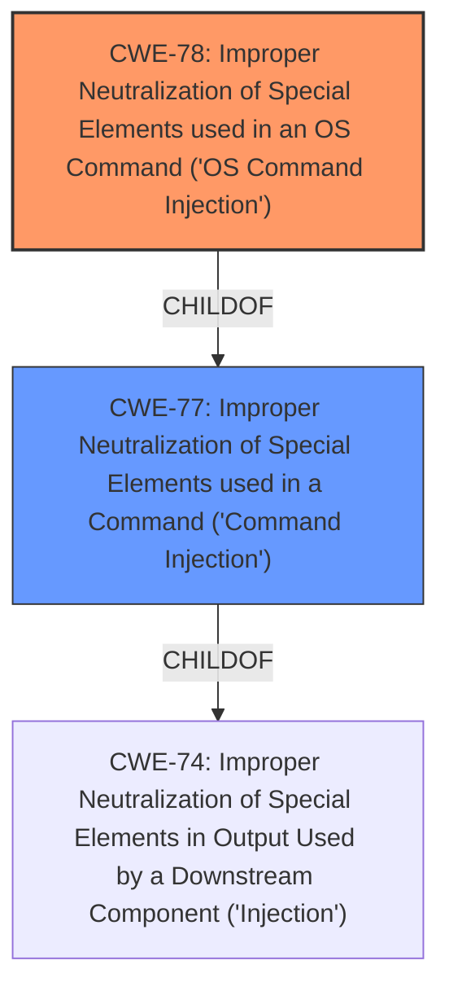

# Analysis Report for CVE-2022-26580

# Vulnerability Analysis Report: CVE-2022-26580

## Description


## Analysis (with Relationship Data)

# Summary
| CWE ID | CWE Name | Confidence | CWE Abstraction Level | CWE Vulnerability Mapping Label | CWE-Vulnerability Mapping Notes |
|---|---|---|---|---|---|
| CWE-78 | Improper Neutralization of Special Elements used in an OS Command ('OS Command Injection') | 1.0 | Base | Allowed | Primary CWE |
| CWE-77 | Improper Neutralization of Special Elements used in a Command ('Command Injection') | 0.7 | Class | Allowed-with-Review | Secondary Candidate |

## Evidence and Confidence

*   **Confidence Score:** 1.0
*   **Evidence Strength:** HIGH

## Relationship Analysis
The primary CWE is CWE-78, which is a Base level CWE and a child of the Class level CWE-77. CWE-78 is more specific, referring to OS commands, while CWE-77 is more general, referring to any command. Since the vulnerability description specifies command injection in the ADB daemon shell service, CWE-78 is the more appropriate choice.



## Vulnerability Chain
The vulnerability chain consists of:
1.  **ROOT CAUSE:** Improper neutralization of special elements used in an OS command (CWE-78).
2.  **IMPACT:** Execution of specific commands.

## Summary of Analysis
The initial analysis focused on identifying the **command injection** vulnerability in the ADB daemon shell service. The vulnerability description and CVE reference links content summary clearly point to **improper neutralization of special elements used in an OS command**.

The Retriever Results listed CWE-77 and CWE-78 as top candidates. Given the specific mention of "OS command" in the CVE details, CWE-78 is the more accurate and specific classification. CWE-77 is a more general case of command injection.

The evidence from the CVE Reference Links Content Summary states: "Root Cause of Vulnerability: - Improper neutralization of special elements used in an OS command, leading to command injection. Weaknesses/Vulnerabilities Present: - Command Injection (CWE-78) in the ADB daemon shell service."

The chosen CWE, CWE-78, is at the Base level of abstraction, which is the preferred level for mapping. It accurately represents the weakness and its potential impact.

Relevant CWE Information:

# Enhanced Context (25 CWEs)

## Vulnerability Description
PAX A930 device with PayDroid_7.1.1_Virgo_V04.3.26T1_20210419 can allow the execution of specific **command injection**s on selected binaries in the ADB daemon shell service. The attacker must have physical USB access to the device in order to exploit this vulnerability.

### Vulnerability Description Key Phrases
-   **weakness:** **command injection**
-   **impact:** execute specific commands
-   **product:** PAX A930 device
-   **version:** PayDroid_7.1.1_Virgo_V04.3.26T1_20210419
-   **component:** ADB daemon shell service

## CVE Reference Links Content Summary
Based on the provided content, here's the breakdown of CVE-2022-26580:

**Root Cause of Vulnerability:**
- Improper neutralization of special elements used in an OS command, leading to command injection.

**Weaknesses/Vulnerabilities Present:**
- Command Injection (CWE-78) in the ADB daemon shell service.

**Impact of Exploitation:**
- The attacker can execute arbitrary OS commands.
- Limited impact to confidentiality, integrity, and availability as the CVSS score indicates low impact.

**Attack Vectors:**
- Physical USB access to the device is required.

**Required Attacker Capabilities/Position:**
- The attacker needs physical access to the device via USB.
- No special privileges are required for exploitation.

## Retriever Results

### Top Combined Results

| Rank | CWE ID | Name | Abstraction | Usage  | Retrievers | Individual Scores |
|---|---|---|---|---|---|---|
| 1 | 77 | Improper Neutralization of Special Elements used in a Command ('Command Injection') | Class | Allowed-with-Review | alternate_terms | 1.000 |
| 2 | 78 | Improper Neutralization of Special Elements used in an OS Command ('OS Command Injection') | Base | Allowed | alternate_terms | 0.700 |
| 3 | 912 | Hidden Functionality | Class | Allowed-with-Review | sparse | 0.288 |
| 4 | 250 | Execution with Unnecessary Privileges | Base | Allowed | sparse | 0.231 |
| 5 | 20 | Improper Input Validation | Class | Discouraged | sparse | 0.223 |
| 6 | 94 | Improper Control of Generation of Code ('Code Injection') | Base | Allowed-with-Review | dense | 0.514 |
| 7 | 73 | External Control of File Name or Path | Base | Allowed | graph | 0.002 |
| 8 | 138 | Improper Neutralization of Special Elements | Class | Discouraged | sparse | 0.222 |
| 9 | 306 | Missing Authentication for Critical Function | Base | Allowed | sparse | 0.217 |
| 10 | 22 | Improper Limitation of a Pathname to a Restricted Directory ('Path Traversal') | Base | Allowed | sparse | 0.216 |

### Considered but not used:
*   CWE-77: Improper Neutralization of Special Elements used in a Command ('Command Injection') - Although this is a high-scoring candidate, it is a class-level CWE. Since the description specifically mentions OS command injection, the more specific CWE-78 is more appropriate.
*   CWE-912: Hidden Functionality - This CWE relates to undocumented functionality. There's no evidence in the description to suggest hidden functionality.
*   CWE-250: Execution with Unnecessary Privileges - This CWE is not relevant as the vulnerability isn't about unnecessary privileges, but about **command injection**.
*   CWE-20: Improper Input Validation - While input validation could be a contributing factor, the core issue is the **improper neutralization of special elements** leading to command injection, making CWE-78 more accurate.
*   CWE-94: Improper Control of Generation of Code ('Code Injection') - This CWE relates to code injection, while the vulnerability description refers to **command injection**.
*   CWE-73: External Control of File Name or Path - There is no file name or path manipulation mentioned, so this is not applicable.
*   CWE-138: Improper Neutralization of Special Elements - This is a class-level CWE, and CWE-78 is a more specific and appropriate base-level CWE.
*   CWE-306: Missing Authentication for Critical Function - This is not relevant as the vulnerability isn't about missing authentication, but about **command injection**.
*   CWE-22: Improper Limitation of a Pathname to a Restricted Directory ('Path Traversal') - There is no path traversal mentioned, so this is not applicable.


## CWE Relationship Analysis

Current CWEs represent these abstraction levels: .


### Vulnerability Chain Analysis

**Chain starting from CWE-306:**
- 306 (Missing Authentication for Critical Function) - ROOT


**Chain starting from CWE-250:**
- 250 (Execution with Unnecessary Privileges) - ROOT


### CWE Relationship Diagram

```mermaid
graph TD
    classDef primary fill:#f96,stroke:#333,stroke-width:2px
    classDef secondary fill:#69f,stroke:#333
    classDef tertiary fill:#9e9,stroke:#333
```


*Report generated on 2025-03-30 14:45:50*
