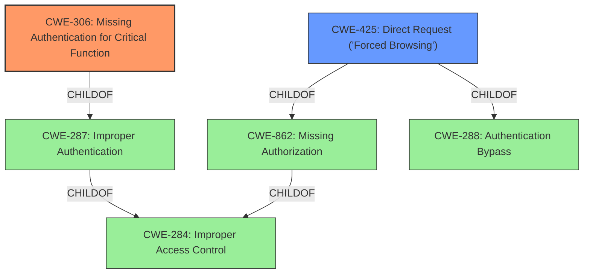

# Enhanced Analysis for CVE-2022-26591

# Summary
| CWE ID | CWE Name | Confidence | CWE Abstraction Level | CWE Vulnerability Mapping Label | CWE-Vulnerability Mapping Notes |
|---|---|---|---|---|---|
| CWE-306 | Missing Authentication for Critical Function | 0.9 | Base | Allowed | Primary CWE |
| CWE-425 | Direct Request ('Forced Browsing') | 0.7 | Base | Allowed | Secondary Candidate |

## Evidence and Confidence

*   **Confidence Score:** 0.8
*   **Evidence Strength:** MEDIUM

## Relationship Analysis
The primary relationship that influenced the selection was the ChildOf relationship between CWE-306 and CWE-287 (Improper Authentication). While CWE-284 (Improper Access Control) is a Pillar and too general, CWE-306 accurately captures the **missing authentication** aspect of the vulnerability. CWE-425 is a child of CWE-862 (Missing Authorization) and CWE-288, which shows the potential for authorization bypass after the **missing authentication** is exploited.



## Vulnerability Chain
The vulnerability chain starts with the **missing authentication** (CWE-306) for accessing files. This allows unauthenticated attackers to directly request and download arbitrary files, effectively bypassing access controls (CWE-425).
  - **Root Cause:** Missing Authentication (CWE-306)
  - **Weakness:** Direct Request ('Forced Browsing') (CWE-425)
  - **Impact:** Access and download arbitrary files

## Summary of Analysis
The initial assessment focused on the **missing authentication** aspect, which led to the selection of CWE-306. The vulnerability description explicitly mentions "unauthenticated attackers" being able to "access and download arbitrary files," highlighting the **lack of authentication** for a critical function, file access.

"FANTEC GmbH MWiD25-DS Firmware v2.000.030 allows unauthenticated attackers to access and download arbitrary files via a crafted GET request."

CWE-306 is a base level CWE that accurately describes the vulnerability. Other considered CWEs like CWE-22 (Improper Limitation of a Pathname to a Restricted Directory ('Path Traversal')) and CWE-23 (Relative Path Traversal) were not chosen because the vulnerability doesn't inherently involve path manipulation; it's about the **lack of authentication** allowing access regardless of the path.

The choice of CWE-306 is at the optimal level of specificity because it directly addresses the root cause - the **absence of authentication** for a critical function. CWE-425 is a secondary consequence, where the lack of access control is exposed due to the missing authentication.

Relevant CWE Information:

# Enhanced Context (25 CWEs)

## CWE-306: Missing Authentication for Critical Function
**Abstraction:** Base
**Similarity Score**: 0.031

**Description**:
The product does not perform any authentication for functionality that requires a provable user identity or consumes a significant amount of resources.

**Mapping Guidance**:
- Usage: Allowed
- Rationale: This CWE entry is at the Base level of abstraction, which is a preferred level of abstraction for mapping to the root causes of vulnerabilities.
## CWE-425: Direct Request ('Forced Browsing')
**Abstraction:** Base
**Similarity Score**: 0.036

**Description**:
The web application does not adequately enforce appropriate authorization on all restricted URLs, scripts, or files.

**Mapping Guidance**:
- Usage: Allowed
- Rationale: This CWE entry is at the Base level of abstraction, which is a preferred level of abstraction for mapping to the root causes of vulnerabilities.


## CWE Relationship Analysis

Current CWEs represent these abstraction levels: .


### Vulnerability Chain Analysis

**Chain starting from CWE-862:**
- 862 (Missing Authorization) - ROOT


**Chain starting from CWE-425:**
- 425 (Direct Request ('Forced Browsing')) - ROOT


### CWE Relationship Diagram

```mermaid
graph TD
    classDef primary fill:#f96,stroke:#333,stroke-width:2px
    classDef secondary fill:#69f,stroke:#333
    classDef tertiary fill:#9e9,stroke:#333
```