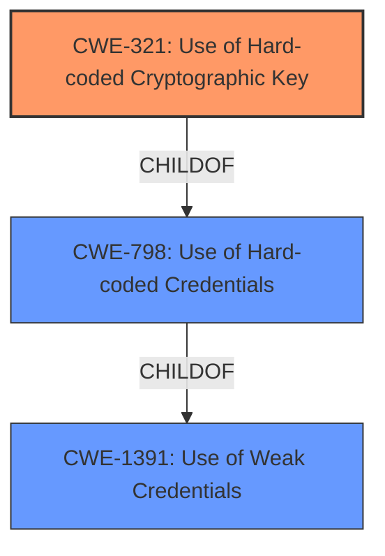

# Raw Analyzer Response for CVE-2022-2660

# Summary
| CWE ID | CWE Name | Confidence | CWE Abstraction Level | CWE Vulnerability Mapping Label | CWE-Vulnerability Mapping Notes |
|---|---|---|---|---|---|
| CWE-321 | Use of Hard-coded Cryptographic Key | 1.0 | Variant | Allowed | Primary CWE |
| CWE-798 | Use of Hard-coded Credentials | 0.7 | Base | Allowed | Secondary Candidate |
| CWE-1391 | Use of Weak Credentials | 0.5 | Class | Allowed-with-Review | Secondary Candidate |

## Evidence and Confidence

*   **Confidence Score:** 0.9
*   **Evidence Strength:** HIGH

## Relationship Analysis
The primary CWE selected was CWE-321 which is a variant of CWE-798 (Use of Hard-coded Credentials). CWE-798 is a child of CWE-1391 (Use of Weak Credentials). We chose the most specific variant, CWE-321, because the vulnerability specifically mentions a hard-coded cryptographic key.

## Vulnerability Chain
The chain of root cause and weaknesses that followed for the Vulnerability Description:
  - The root cause is the **hard-coded cryptographic key** (CWE-321).
  - An attacker can decrypt sensitive data because of the hardcoded key.
  - The impact is the compromise of the machine.

## Summary of Analysis
The primary weakness identified is CWE-321 (Use of Hard-coded Cryptographic Key). This is based on the vulnerability description stating: "Delta Industrial Automation DIALink versions 1.4.0.0 and prior are vulnerable to the use of a **hard-coded cryptographic key** which could allow an attacker to decrypt sensitive data and compromise the machine." The **Vulnerability Description Key Phrases** also include "**rootcause:** **hard-coded cryptographic key**". The **CVE Reference Links Content Summary** states: "The vulnerability is due to the use of a hard-coded cryptographic key within the Delta Industrial Automation DIALink software" and "Weaknesses/vulnerabilities present: Hard-coded cryptographic key (CWE-321)."

CWE-321 is a Variant of CWE-798 (Use of Hard-coded Credentials), which is a Base CWE. CWE-798 is a child of CWE-1391 (Use of Weak Credentials), which is a Class CWE.

I considered other CWEs, but they were not as specific or relevant:

*   CWE-798 (Use of Hard-coded Credentials): While this is a parent of CWE-321, CWE-321 is more specific to the type of credential.
*   CWE-1391 (Use of Weak Credentials): This is a more general class of weakness and less descriptive of the specific issue.
*   CWE-259 (Use of Hard-coded Password): This is specific to passwords, not cryptographic keys.
*   CWE-916 (Use of Password Hash With Insufficient Computational Effort): This is specific to password hashing, which is not relevant in this case.
*   CWE-326 (Inadequate Encryption Strength): This is related to the strength of the encryption algorithm itself, not the key.
*   CWE-184 (Incomplete List of Disallowed Inputs): This is not relevant to the use of hard-coded cryptographic keys.
*   CWE-327 (Use of a Broken or Risky Cryptographic Algorithm): This is related to the algorithm, not the key.
*   CWE-657 (Violation of Secure Design Principles): This is too general.
*   CWE-656 (Reliance on Security Through Obscurity): This is not the primary issue, although it could be a contributing factor.

The choice of CWE-321 is the most specific and accurate representation of the vulnerability based on the provided information.