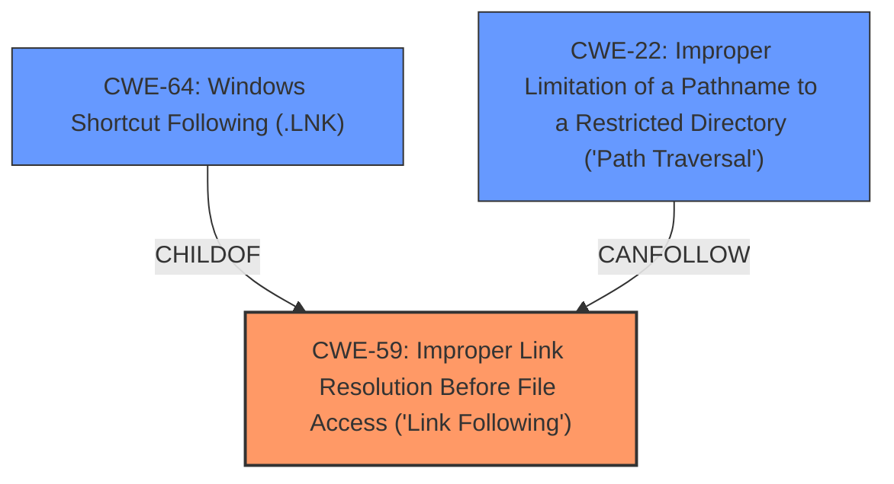

# Analysis Report for CVE-2022-26612

# Vulnerability Analysis Report: CVE-2022-26612

## Description


## Analysis (with Relationship Data)

# Summary
| CWE ID | CWE Name | Confidence | CWE Abstraction Level | CWE Vulnerability Mapping Label | CWE-Vulnerability Mapping Notes |
|---|---|---|---|---|---|
| CWE-59 | Improper Link Resolution Before File Access ('Link Following') | 0.9 | Base | Allowed | Primary CWE. The vulnerability involves **improper handling of symbolic links** during file extraction, leading to files being written outside the intended directory. |
| CWE-64 | Windows Shortcut Following (.LNK) | 0.7 | Variant | Allowed | Secondary CWE. This variant applies specifically to Windows, where the **improper handling of symbolic links** occurs due to how Windows resolves shortcuts. |
| CWE-22 | Improper Limitation of a Pathname to a Restricted Directory ('Path Traversal') | 0.6 | Base | Allowed | Secondary CWE. The vulnerability allows writing outside the expected base directory on Windows, which can be considered a form of path traversal. |

## Evidence and Confidence

*   **Confidence Score:** 0.8
*   **Evidence Strength:** HIGH

## Relationship Analysis
The analysis focuses on the **improper handling of symbolic links** on Windows leading to potential path traversal.

-   **CWE-59** is the primary root cause, representing the fundamental flaw of **improper link resolution**.
-   **CWE-64** is a variant of **CWE-59** specific to Windows shortcut files (.LNK), aligning with the vulnerability's occurrence on Windows systems due to how Windows resolves symbolic links.
-   **CWE-22** arises as a consequence, where the ability to write outside the intended directory equates to a form of path traversal.



## Vulnerability Chain
The vulnerability chain begins with the **improper handling of symbolic links** (**CWE-59**), which on Windows manifests as **improper handling of Windows shortcuts** (**CWE-64**). This leads to the ability to write files outside the intended directory, effectively resulting in path traversal (**CWE-22**).

## Summary of Analysis
The initial analysis identified the core issue as **improper handling of symbolic links** during TAR extraction on Windows.

The evidence from the vulnerability description states:
"As a result, a TAR entry may create a **symlink** under the expected extraction directory which points to an external directory. A subsequent TAR entry may extract an arbitrary file into the external directory using the **symlink** name. This however would be caught by the same targetDirPath check on Unix because of the getCanonicalPath call. However on Windows, getCanonicalPath doesnt resolve symbolic links, which bypasses the check. unpackEntries during TAR extraction follows symbolic links which allows writing outside expected base directory on Windows."

This highlights the **improper resolution of symbolic links** on Windows, leading to path traversal. The graph relationships show how **CWE-64** is a specific case of **CWE-59** applicable to Windows, and how **CWE-22** can result from **CWE-59**.

The selected CWEs are at the optimal level of specificity. **CWE-59** captures the general issue of **improper link resolution**, while **CWE-64** pinpoints the Windows-specific implementation using .LNK files. **CWE-22** describes the resulting path traversal.

Relevant CWE Information:

# Enhanced Context (25 CWEs)
The following CWEs were identified as potentially relevant to this vulnerability:

## CWE-59: Improper Link Resolution Before File Access ('Link Following')
**Abstraction Level**: Base
**Similarity Score**: 0.79
**Source**: dense

**Description**:
The product attempts to access a file based on the filename, but it does not properly prevent that filename from identifying a link or shortcut that resolves to an unintended resource.

**Mapping Guidance**:
- Usage: Allowed
- Rationale: This CWE entry is at the Base level of abstraction, which is a preferred level of abstraction for mapping to the root causes of vulnerabilities.

## CWE-64: Windows Shortcut Following (.LNK)
**Abstraction Level**: Variant
**Similarity Score**: 1.00
**Source**: alternate_terms

**Description**:
The product, when opening a file or directory, does not sufficiently handle when the file is a Windows shortcut (.LNK) whose target is outside of the intended control sphere. This could allow an attacker to cause the product to operate on unauthorized files.

**Mapping Guidance**:
- Usage: Allowed
- Rationale: This CWE entry is at the Variant level of abstraction, which is a preferred level of abstraction for mapping to the root causes of vulnerabilities.

## CWE-22: Improper Limitation of a Pathname to a Restricted Directory ('Path Traversal')
**Abstraction Level**: Base
**Similarity Score**: 0.77
**Source**: dense

**Description**:
The product uses external input to construct a pathname that is intended to identify a file or directory that is located underneath a restricted parent directory, but the product does not properly neutralize special elements within the pathname that can cause the pathname to resolve to a location that is outside of the restricted directory.

**Mapping Guidance**:
- Usage: Allowed
- Rationale: This CWE entry is at the Base level of abstraction, which is a preferred level of abstraction for mapping to the root causes of vulnerabilities.

## Other Considered CWEs:
- **CWE-61: UNIX Symbolic Link (Symlink) Following**: While related to symbolic links, this is more specific to UNIX systems and doesn't directly apply to the Windows context of the vulnerability.
- **CWE-73: External Control of File Name or Path**: This CWE is too broad, as the vulnerability specifically involves **improper handling of symbolic links**, rather than general external control of file names.
- **CWE-427: Uncontrolled Search Path Element**: While this could be a contributing factor, the primary issue is the **improper link resolution**, not the search path itself.


## CWE Relationship Analysis

Current CWEs represent these abstraction levels: .


### Vulnerability Chain Analysis

**Chain starting from CWE-427:**
- 427 (Uncontrolled Search Path Element) - ROOT


**Chain starting from CWE-73:**
- 73 (External Control of File Name or Path) - ROOT


### CWE Relationship Diagram

```mermaid
graph TD
    classDef primary fill:#f96,stroke:#333,stroke-width:2px
    classDef secondary fill:#69f,stroke:#333
    classDef tertiary fill:#9e9,stroke:#333
```


*Report generated on 2025-03-31 12:32:08*
