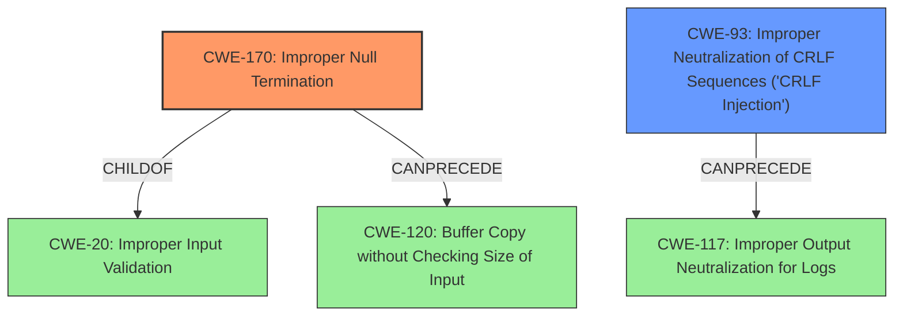

# Analysis Report for CVE-2022-26635

# Vulnerability Analysis Report: CVE-2022-26635

## Description


## Analysis (with Relationship Data)

# Summary
| CWE ID | CWE Name | Confidence | CWE Abstraction Level | CWE Vulnerability Mapping Label | CWE-Vulnerability Mapping Notes |
|---|---|---|---|---|---|
| CWE-170 | Improper Null Termination | 1.0 | Base | Allowed | Primary CWE |
| CWE-93 | Improper Neutralization of CRLF Sequences ('CRLF Injection') | 0.7 | Base | Allowed | Secondary Candidate |

## Evidence and Confidence

*   **Confidence Score:** 0.85
*   **Evidence Strength:** HIGH

## Relationship Analysis
The primary CWE is CWE-170, which is a Base level weakness. It has a child relationship to CWE-20 (Improper Input Validation) and PeerOf relationships to CWE-464 (Missing Data Record Separator) and CWE-463 (Missing начала Meta Character). CWE-170 can lead to CWE-120 (Buffer Copy without Checking Size of Input). The secondary CWE is CWE-93, which is a Base level weakness. CWE-93 can precede CWE-117 (Improper Output Neutralization for Logs).



## Vulnerability Chain
The vulnerability chain starts with **improper NULL termination (CWE-170)**, which leads to **CLRF injection (CWE-93)**, potentially leading to further vulnerabilities.

## Summary of Analysis
The primary weakness is **improper NULL termination**, which directly leads to **CLRF injection**. The vulnerability description explicitly states this relationship.

The evidence from the "Vulnerability Description Key Phrases" section:
- **rootcause:** **improper NULL termination**
- **weakness:** **CLRF injection**

The evidence from the "CVE Reference Links Content Summary" section:
-   **root_cause**: "Improper NULL termination in php-memcached versions 2.2.0 and below."
-   **weaknesses**: ["Improper NULL termination"]
-   **impact**: "Attackers can execute CLRF injection."

CWE-170 (Improper Null Termination) is selected as the primary CWE because the vulnerability description identifies it as the root cause. The description of CWE-170 states: "The product does not terminate or incorrectly terminates a string or array with a null character or equivalent terminator." This aligns perfectly with the vulnerability details. The usage is Allowed.

CWE-93 (Improper Neutralization of CRLF Sequences ('CRLF Injection')) is selected as the secondary CWE because the vulnerability description identifies it as the weakness resulting from the **improper NULL termination**. The description of CWE-93 states: "The product uses CRLF (carriage return line feeds) as a special element, e.g. to separate lines or records, but it does not neutralize or incorrectly neutralizes CRLF sequences from inputs." This aligns with the vulnerability details. The usage is Allowed.

CWE-74 (Improper Neutralization of Special Elements in Output Used by a Downstream Component ('Injection')) was considered but not selected because it is a Class level CWE, and more specific Base level CWEs like CWE-93 are more appropriate. The mapping guidance discourages its use when lower-level weaknesses are more appropriate.

CWE-94 (Improper Control of Generation of Code ('Code Injection')) was considered, but is too broad and doesn't accurately reflect the specific vulnerability of CRLF injection. The mapping guidance advises caution when using this CWE and suggests it might be misused if the technical impact is "code execution".


## CWE Relationship Analysis

Current CWEs represent these abstraction levels: .


### Vulnerability Chain Analysis

**Chain starting from CWE-170:**
- 170 (Improper Null Termination) - ROOT


**Chain starting from CWE-20:**
- 20 (Improper Input Validation) - ROOT


### CWE Relationship Diagram

```mermaid
graph TD
    classDef primary fill:#f96,stroke:#333,stroke-width:2px
    classDef secondary fill:#69f,stroke:#333
    classDef tertiary fill:#9e9,stroke:#333
```


*Report generated on 2025-03-30 16:23:39*
