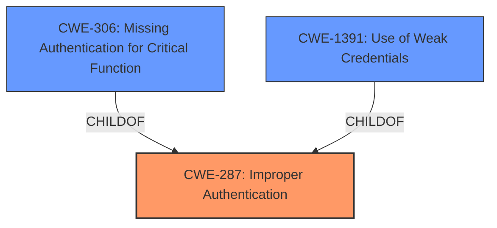

# Raw Analyzer Response for CVE-2022-2664

# Summary
| CWE ID | CWE Name | Confidence | CWE Abstraction Level | CWE Vulnerability Mapping Label | CWE-Vulnerability Mapping Notes |
|---|---|---|---|---|---|
| CWE-287 | Improper Authentication | 1.0 | Class | Primary | Discouraged |
| CWE-306 | Missing Authentication for Critical Function | 0.7 | Base | Secondary | Allowed |
| CWE-1391 | Use of Weak Credentials | 0.6 | Class | Secondary | Allowed-with-Review |

## Evidence and Confidence

*   **Confidence Score:** 1.0
*   **Evidence Strength:** HIGH

## Relationship Analysis
The primary weakness is CWE-287, Improper Authentication, which is a Class-level CWE. CWE-306, Missing Authentication for Critical Function, is a child of CWE-287 and represents a more specific case where authentication is completely absent. CWE-1391, Use of Weak Credentials, is another child of CWE-1390, and also a possible cause of authentication failure. The relationship between these CWEs helps refine the classification, moving from a general authentication problem to more specific causes.

## Vulnerability Chain
The vulnerability chain starts with **improper authentication** (CWE-287), which leads to unauthorized access. The attack bypasses authentication by manipulating the return package.

## Summary of Analysis
The initial analysis pointed towards CWE-287 due to the presence of **improper authentication** as the root cause. The "CVE Reference Links Content Summary" section clearly states: "Root cause of vulnerability: Improper authentication in the `POST Request Handler` component of the Private Cloud Management Platform. The application does not properly verify the identity of an actor claiming a specific identity. Weaknesses/vulnerabilities present: CWE-287 Improper Authentication."

This statement provides strong evidence supporting the selection of CWE-287 as the primary weakness. Furthermore, the description mentions that an attacker can bypass authentication by changing the return package to `code:1000` after entering a password, suggesting a possible missing authentication check (CWE-306) or the use of **weak credentials** (CWE-1391).

CWE-287 is a Class-level CWE, and while it's generally recommended to choose a more specific Base or Variant CWE, the available information does not provide enough detail to pinpoint a more precise cause. CWE-306 and CWE-1391 are considered as secondary candidates because they represent potential causes, but there isn't enough direct evidence to confirm either as the primary issue. The confidence level for CWE-287 is high (1.0) due to the explicit mention in the CVE summary. The confidence levels for CWE-306 and CWE-1391 are lower (0.7 and 0.6 respectively) as they are inferred possibilities.

Other CWEs Considered and Rejected:

*   CWE-79 (Improper Neutralization of Input During Web Page Generation ('Cross-site Scripting')): While this CWE had a high score in the Retriever Results, it is not applicable because the vulnerability does not involve the injection of malicious script into a web page.
*   CWE-89 (Improper Neutralization of Special Elements used in an SQL Command ('SQL Injection')): Not applicable because the vulnerability is not related to SQL injection.
*   CWE-269 (Improper Privilege Management): Discouraged for use, and there is no actual privilege escalation, so not applicable.
*   CWE-613 (Insufficient Session Expiration): Not applicable since the problem is during the authentication phase, not the session management phase.
*   CWE-352 (Cross-Site Request Forgery (CSRF)): Not applicable, as the vulnerability isn't related to CSRF.
*   CWE-208 (Observable Timing Discrepancy): Not applicable because the vulnerability is not related to timing discrepancies.
*   CWE-184 (Incomplete List of Disallowed Inputs): Not applicable because the vulnerability is not related to an incomplete list of disallowed inputs.