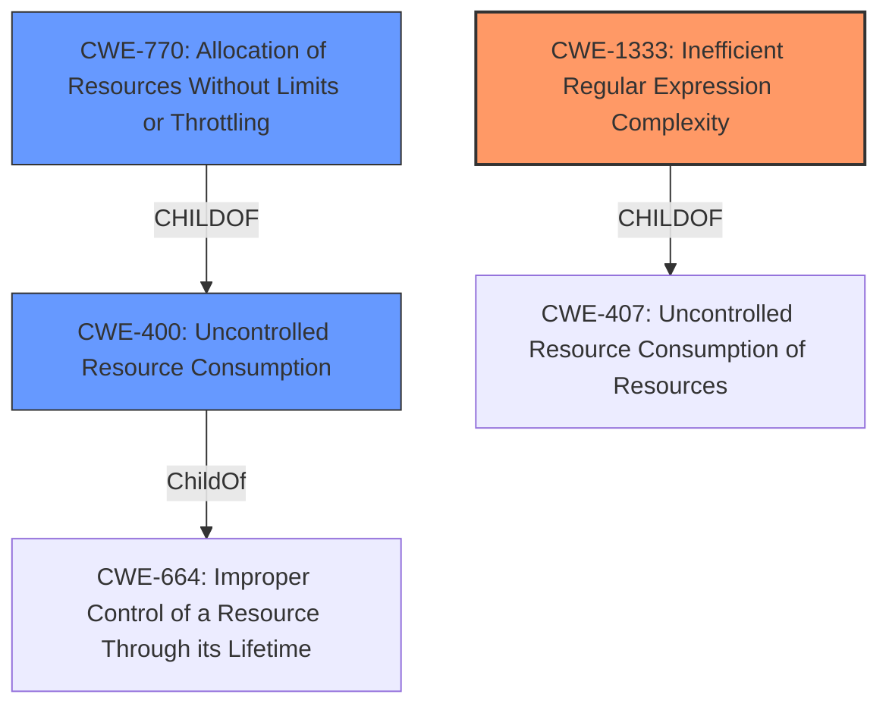

# Analysis Report for CVE-2022-26650

# Vulnerability Analysis Report: CVE-2022-26650

## Description


## Analysis (with Relationship Data)

# Summary
| CWE ID | CWE Name | Confidence | CWE Abstraction Level | CWE Vulnerability Mapping Label | CWE-Vulnerability Mapping Notes |
|---|---|---|---|---|---|
| CWE-1333 | Inefficient Regular Expression Complexity | 0.9 | Base | Allowed | Primary CWE |
| CWE-400 | Uncontrolled Resource Consumption | 0.7 | Class | Discouraged | Secondary Candidate |
| CWE-770 | Allocation of Resources Without Limits or Throttling | 0.6 | Base | Allowed | Secondary Candidate |

## Evidence and Confidence

*   **Confidence Score:** 0.8
*   **Evidence Strength:** HIGH

## Relationship Analysis
The primary weakness, CWE-1333, is a specific type of resource consumption issue. The hierarchical structure shows that CWE-1333 is a child of CWE-407, indicating a more general resource consumption issue. CWE-400 is also a class-level weakness related to resource consumption, but CWE-1333 provides a more precise characterization of the vulnerability involving regular expressions. The relationship between CWE-770 and CWE-400 shows how allocating resources without limits contributes to uncontrolled resource consumption.



## Vulnerability Chain
The vulnerability chain starts with the use of user-controlled regular expressions in `Pattern.matches()`. The **lack of proper validation** of these expressions leads to inefficient complexity and, ultimately, **resource exhaustion**.

Root Cause: **Improperly validated, user-controlled regular expression** (CWE-1333)
Impact: **Resource exhaustion** (CWE-400)

## Summary of Analysis
The primary assessment is based on the vulnerability description and the CVE Reference Links Content Summary. The vulnerability occurs because the application uses `Pattern.matches()` with user-controlled inputs without proper validation. This can lead to an attacker providing malicious regular expressions that cause excessive CPU consumption, leading to a denial of service. The evidence is:

*   "RegexPredicateJudge.java uses Pattern.matches(conditionData.getParamValue(), realData) to make judgments, where both parameters are controllable by the user."
*   "This can cause an attacker pass in malicious regular expressions and characters causing a **resource exhaustion**."
*   "The vulnerability exists due to the use of user-provided regular expressions without proper validation."
*   "An attacker can cause resource exhaustion by providing malicious regular expressions and input strings."

Based on this evidence, CWE-1333, "Inefficient Regular Expression Complexity," is the most appropriate primary CWE. It directly addresses the root cause: the use of a regular expression with potentially exponential complexity due to the user-controlled input.

CWE-400, "Uncontrolled Resource Consumption," is considered as a secondary CWE because it represents the high-level impact of the vulnerability. While resource exhaustion is the result, the root cause is the inefficient regular expression. The mapping guidance for CWE-400 discourages its use when more specific mappings are available, which supports the choice of CWE-1333 as the primary CWE.

CWE-770, "Allocation of Resources Without Limits or Throttling," is also considered as a secondary CWE because the excessive CPU cycles can be considered a resource.

The selected CWEs are at the optimal level of specificity because CWE-1333 directly addresses the root cause related to regular expression complexity, while CWE-400 and CWE-770 represent the resulting impact of resource consumption.

Relevant CWE Information:

# Enhanced Context (25 CWEs)

## CWE-405: Asymmetric Resource Consumption (Amplification)
**Abstraction Level**: Class
**Similarity Score**: 0.76
**Source**: dense

**Description**:
The product does not properly control situations in which an adversary can cause the product to consume or produce excessive resources without requiring the adversary to invest equivalent work or otherwise prove authorization, i.e., the adversary's influence is "asymmetric."

**Mapping Guidance**:
- Usage: Allowed-with-Review
- Rationale: This CWE entry is a Class and might have Base-level children that would be more appropriate

## CWE-99: Improper Control of Resource Identifiers ('Resource Injection')
**Abstraction Level**: Class
**Similarity Score**: 0.75
**Source**: dense

**Description**:
The product receives input from an upstream component, but it does not restrict or incorrectly restricts the input before it is used as an identifier for a resource that may be outside the intended sphere of control.

**Mapping Guidance**:
- Usage: Allowed-with-Review
- Rationale: This CWE entry is a Class and might have Base-level children that would be more appropriate

## CWE-917: Improper Neutralization of Special Elements used in an Expression Language Statement ('Expression Language Injection')
**Abstraction Level**: Base
**Similarity Score**: 0.75
**Source**: dense

**Description**:
The product constructs all or part of an expression language (EL) statement in a framework such as a Java Server Page (JSP) using externally-influenced input from an upstream component, but it does not neutralize or incorrectly neutralizes special elements that could modify the intended EL statement before it is executed.

**Mapping Guidance**:
- Usage: Allowed
- Rationale: This CWE entry is at the Base level of abstraction, which is a preferred level of abstraction for mapping to the root causes of vulnerabilities.

## CWE-664: Improper Control of a Resource Through its Lifetime
**Abstraction Level**: Pillar
**Similarity Score**: 0.74
**Source**: dense

**Description**:
The product does not maintain or incorrectly maintains control over a resource throughout its lifetime of creation, use, and release.

**Mapping Guidance**:
- Usage: Discouraged
- Rationale: This CWE entry is high-level when lower-level children are available.

## CWE-913: Improper Control of Dynamically-Managed Code Resources
**Abstraction Level**: Class
**Similarity Score**: 0.74
**Source**: dense

**Description**:
The product does not properly restrict reading from or writing to dynamically-managed code resources such as variables, objects, classes, attributes, functions, or executable instructions or statements.

**Mapping Guidance**:
- Usage: Allowed-with-Review
- Rationale: This CWE entry is a Class and might have Base-level children that would be more appropriate

## CWE-915: Improperly Controlled Modification of Dynamically-Determined Object Attributes
**Abstraction Level**: Base
**Similarity Score**: 0.74
**Source**: dense

**Description**:
The product receives input from an upstream component that specifies multiple attributes, properties, or fields that are to be initialized or updated in an object, but it does not properly control which attributes can be modified.

**Mapping Guidance**:
- Usage: Allowed
- Rationale: This CWE entry is at the Base level of abstraction, which is a preferred level of abstraction for mapping to the root causes of vulnerabilities.

## CWE-74: Improper Neutralization of Special Elements in Output Used by a Downstream Component ('Injection')
**Abstraction Level**: Class
**Similarity Score**: 0.74
**Source**: dense

**Description**:
The product constructs all or part of a command, data structure, or record using externally-influenced input from an upstream component, but it does not neutralize or incorrectly neutralizes special elements that could modify how it is parsed or interpreted when it is sent to a downstream component.

**Mapping Guidance**:
- Usage: Discouraged
- Rationale: CWE-74 is high-level and often misused when lower-level weaknesses are more appropriate.

## CWE-799: Improper Control of Interaction Frequency
**Abstraction Level**: Class
**Similarity Score**: 0.74
**Source**: dense

**Description**:
The product does not properly limit the number or frequency of interactions that it has with an actor, such as the number of incoming requests.

**Mapping Guidance**:
- Usage: Allowed-with-Review
- Rationale: This CWE entry is a Class and might have Base-level children that would be more appropriate

## CWE-184: Incomplete List of Disallowed Inputs
**Abstraction Level**: Base
**Similarity Score**: 0.73
**Source**: dense

**Description**:
The product implements a protection mechanism that relies on a list of inputs (or properties


## CWE Relationship Analysis

Current CWEs represent these abstraction levels: .


### Vulnerability Chain Analysis

**Chain starting from CWE-400:**
- 400 (Uncontrolled Resource Consumption) - ROOT


**Chain starting from CWE-913:**
- 913 (Improper Control of Dynamically-Managed Code Resources) - ROOT


### CWE Relationship Diagram

```mermaid
graph TD
    classDef primary fill:#f96,stroke:#333,stroke-width:2px
    classDef secondary fill:#69f,stroke:#333
    classDef tertiary fill:#9e9,stroke:#333
```


*Report generated on 2025-03-31 06:34:51*
