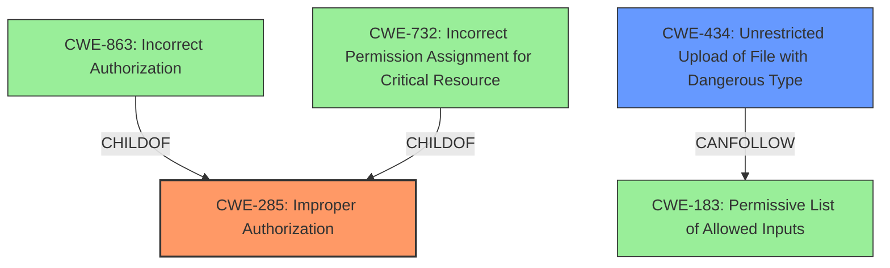

# Enhanced Analysis for CVE-2022-26676

# Summary
| CWE ID | CWE Name | Confidence | CWE Abstraction Level | CWE Vulnerability Mapping Label | CWE-Vulnerability Mapping Notes |
|---|---|---|---|---|---|
| CWE-285 | Improper Authorization | 0.8 | Class | Primary | Allowed-with-Review |
| CWE-434 | Unrestricted Upload of File with Dangerous Type | 0.7 | Base | Secondary | Allowed |

## Evidence and Confidence

*   **Confidence Score:** 0.75
*   **Evidence Strength:** HIGH

## Relationship Analysis
The primary CWE is CWE-285, which is a Class-level CWE. It has child CWEs such as CWE-863 (Incorrect Authorization) and CWE-732 (Incorrect Permission Assignment for Critical Resource). CWE-434 (Unrestricted Upload of File with Dangerous Type) can follow from a permissive allowlist (CWE-183). The relationship analysis reveals that while the description points to an authorization issue, the impact involves uploading dangerous files. Selecting CWE-285 as the primary CWE aligns with the **inadequate privilege restrictions** at the API level.



## Vulnerability Chain
The vulnerability chain begins with **inadequate privilege restrictions** (CWE-285). This leads to an unauthenticated attacker being able to upload (CWE-434) and execute malicious scripts. The root cause is the **improper authorization**, and the impact is the ability to upload and execute malicious scripts.

## Summary of Analysis
The initial analysis focused on the root cause of the vulnerability, which is **inadequate privilege restrictions**. The description states, "aEnrich a+HRD has **inadequate privilege restrictions**, an unauthenticated remote attacker can use the API function to upload and execute malicious scripts to control the system or disrupt service." This points to an authorization issue.

The retriever results listed CWE-285 (Improper Authorization) and CWE-434 (Unrestricted Upload of File with Dangerous Type) as potential candidates. Given that the primary issue is the lack of proper authorization, CWE-285 is chosen as the primary CWE. The ability to upload and execute scripts is a consequence of the authorization failure, so CWE-434 is a secondary CWE.

The graph relationships confirm that CWE-285 is a high-level class, and more specific authorization CWEs could be children. However, given the information available, CWE-285 provides the best overall classification of the vulnerability.

CWE-285 is selected because the vulnerability description and CVE summary clearly state an **inadequate privilege restrictions** issue. CWE-434 is selected because it is an impact of the **improper authorization**, since the attacker is able to upload and execute a malicious script. The selected CWEs are at the optimal level of specificity based on the available evidence.

Relevant CWE Information:

# Enhanced Context (25 CWEs)

## CWE-274: Improper Handling of Insufficient Privileges
**Abstraction Level**: Base
**Similarity Score**: 0.77
**Source**: dense

**Description**:
The product does not handle or incorrectly handles when it has insufficient privileges to perform an operation, leading to resultant weaknesses.

**Mapping Guidance**:
- Usage: Discouraged
- Rationale: This CWE entry could be deprecated in a future version of CWE.

*Not Selected:* This CWE focuses on the product's handling of insufficient privileges during an operation. The current vulnerability is about the lack of authorization to begin with, not the handling of insufficient privileges during an authorized operation.

## CWE-280: Improper Handling of Insufficient Permissions or Privileges 
**Abstraction Level**: Base
**Similarity Score**: 0.77
**Source**: dense

**Description**:
The product does not handle or incorrectly handles when it has insufficient privileges to access resources or functionality as specified by their permissions. This may cause it to follow unexpected code paths that may leave the product in an invalid state.

**Mapping Guidance**:
- Usage: Allowed
- Rationale: This CWE entry is at the Base level of abstraction, which is a preferred level of abstraction for mapping to the root causes of vulnerabilities.

*Not Selected:* Similar to CWE-274, this CWE focuses on the handling of insufficient privileges, not the lack of authorization itself.

## CWE-266: Incorrect Privilege Assignment
**Abstraction Level**: Base
**Similarity Score**: 0.76
**Source**: dense

**Description**:
A product incorrectly assigns a privilege to a particular actor, creating an unintended sphere of control for that actor.

**Mapping Guidance**:
- Usage: Allowed
- Rationale: This CWE entry is at the Base level of abstraction, which is a preferred level of abstraction for mapping to the root causes of vulnerabilities.

*Not Selected:* The description points to a lack of privilege restrictions rather than an incorrect assignment of privileges.

## CWE-653: Improper Isolation or Compartmentalization
**Abstraction Level**: Class
**Similarity Score**: 0.76
**Source**: dense

**Description**:
The product does not properly compartmentalize or isolate functionality, processes, or resources that require different privilege levels, rights, or permissions.

**Mapping Guidance**:
- Usage: Allowed
- Rationale: This CWE entry is at the Base level of abstraction, which is a preferred level of abstraction for mapping to the root causes of vulnerabilities.

*Not Selected:* The description does not provide evidence of improper isolation or compartmentalization.

## CWE-1220: Insufficient Granularity of Access Control
**Abstraction Level**: Base
**Similarity Score**: 0.75
**Source**: dense

**Description**:
The product implements access controls via a policy or other feature with the intention to disable or restrict accesses (reads and/or writes) to assets in a system from untrusted agents. However, implemented access controls lack required granularity, which renders the control policy too broad because it allows accesses from unauthorized agents to the security-sensitive assets.

**Mapping Guidance**:
- Usage: Allowed
- Rationale: This CWE entry is at the Base level of abstraction, which is a preferred level of abstraction for mapping to the root causes of vulnerabilities.

*Not Selected:* The vulnerability is due to a lack of access control rather than insufficient granularity.

## CWE-267: Privilege Defined With Unsafe Actions
**Abstraction Level**: Base
**Similarity Score**: 0.75
**Source**: dense

**Description**:
A particular privilege, role, capability, or right can be used to perform unsafe actions that were not intended, even when it is assigned to the correct entity.

**Mapping Guidance**:
- Usage: Allowed
- Rationale: This CWE entry is at the Base level of abstraction, which is a preferred level of abstraction for mapping to the root causes of vulnerabilities.

*Not Selected:* The vulnerability is not about a privilege that can be used to perform unsafe actions but about the lack of authorization in the first place.

## CWE-404: Improper Resource Shutdown or Release
**Abstraction Level**: Class
**Similarity Score**: 0.75
**Source**: dense

**Description**:
The product does not release or incorrectly releases a resource before it is made available for re-use.

**Mapping Guidance**:
- Usage: Allowed-with-Review
- Rationale: This CWE entry is a Class and might have Base-level children that would be more appropriate

*Not Selected:* This CWE is irrelevant to the vulnerability.

## CWE-668: Exposure of Resource to Wrong Sphere
**Abstraction Level**: Class
**Similarity Score**: 0.74
**Source**: dense

**Description**:
The product exposes a resource to the wrong control sphere, providing unintended actors with inappropriate access to the resource.

**Mapping Guidance**:
- Usage: Discouraged
- Rationale: CWE-668 is high-level and is often misused as a catch-all when lower-level CWE IDs might be applicable. It is sometimes used for low-information vulnerability reports [REF-1287]. It is a level-1 Class (i.e., a child of a Pillar). It is not useful for trend analysis.

*Not Selected:* While this could be applicable, it's too general and doesn't capture the specific lack of authorization.

## CWE-664: Improper Control of a Resource Through its Lifetime
**Abstraction Level**: Pillar
**


## CWE Relationship Analysis

Current CWEs represent these abstraction levels: .


### Vulnerability Chain Analysis

**Chain starting from CWE-434:**
- 434 (Unrestricted Upload of File with Dangerous Type) - ROOT


**Chain starting from CWE-280:**
- 280 (Improper Handling of Insufficient Permissions or Privileges ) - ROOT


### CWE Relationship Diagram

```mermaid
graph TD
    classDef primary fill:#f96,stroke:#333,stroke-width:2px
    classDef secondary fill:#69f,stroke:#333
    classDef tertiary fill:#9e9,stroke:#333
```