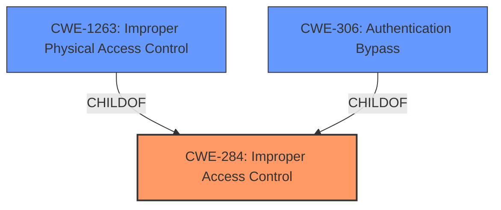

# Analysis for CVE-2022-26703

# Summary
| CWE ID | CWE Name | Confidence | CWE Abstraction Level | CWE Vulnerability Mapping Label | CWE-Vulnerability Mapping Notes |
|---|---|---|---|---|---|
| CWE-284 | Improper Access Control | 0.8 | Class | Primary | Allowed-with-Review |
| CWE-1263 | Improper Physical Access Control | 0.6 | Class | Secondary | Allowed-with-Review |
| CWE-306 | Authentication Bypass | 0.5 | Class | Secondary | Discouraged |

## Evidence and Confidence

*   **Confidence Score:** 0.7
*   **Evidence Strength:** MEDIUM

## Relationship Analysis
The primary relationship is between CWE-284 (Improper Access Control) and CWE-1263 (Improper Physical Access Control), where CWE-1263 is a child of CWE-284. CWE-306 (Authentication Bypass) is also related as physical access bypasses authentication. The abstraction levels influenced the choice, favoring the more specific CWE-1263 when physical access is involved, but acknowledging that CWE-284 encompasses broader access control issues.

## Vulnerability Chain
The vulnerability chain starts with an **authorization issue** (root cause), leading to **insufficient state management** (weakness), and finally results in a person with physical access being able to **access photos from the lock screen** (impact).

## Summary of Analysis
The analysis is primarily based on the provided vulnerability description and the CVE Reference Links Content Summary. The description highlights an **authorization issue** and **insufficient state management** which allowed someone with physical access to bypass the lock screen and view photos.

The graph relationships show that CWE-1263 is a child of CWE-284, making CWE-284 a broader category. Given the vulnerability specifically mentions physical access, CWE-1263 is a relevant secondary classification.

CWE-284 (Improper Access Control) is selected as the primary CWE because the root cause is an authorization issue. The "CVE Reference Links Content Summary" explicitly states: "**Root cause:** An authorization issue was present." This directly aligns with the description of CWE-284, which covers cases where a product "does not perform or incorrectly performs an authorization check."
CWE-1263 (Improper Physical Access Control) is included as a secondary CWE because the vulnerability requires physical access to the device. The vulnerability description states: "A person with physical access to an iOS device may be able to access photos from the lock screen." CWE-1263's description states: "The product is designed with access restricted to certain information, but it does not sufficiently protect against an unauthorized actor with physical access to these areas." This aligns with the scenario where physical access bypasses the intended access controls.

CWE-306 (Authentication Bypass) is considered because physical access effectively bypasses the authentication mechanism of the lock screen. However, it's a less direct fit than CWE-1263, as the core issue is more about access control than authentication per se.

The selected CWEs are at the optimal level of specificity. CWE-284 captures the general authorization problem, while CWE-1263 and CWE-306 provide additional context about the physical access and authentication bypass aspects of the vulnerability.

The primary decision to select CWE-284 is strongly supported by the explicit mention of an "authorization issue" in the CVE Reference Links Content Summary.

Relevant CWE Information:

# Enhanced Context (25 CWEs)
The following CWEs were identified as potentially relevant to this vulnerability:

## CWE-1289: Improper Validation of Unsafe Equivalence in Input
**Abstraction Level**: Base
**Similarity Score**: 0.81
**Source**: dense

**Description**:
The product receives an input value that is used as a resource identifier or other type of reference, but it does not validate or incorrectly validates that the input is equivalent to a potentially-unsafe value.

**Mapping Guidance**:
- Usage: Allowed
- Rationale: This CWE entry is at the Base level of abstraction, which is a preferred level of abstraction for mapping to the root causes of vulnerabilities.

## CWE-807: Reliance on Untrusted Inputs in a Security Decision
**Abstraction Level**: Base
**Similarity Score**: 0.78
**Source**: dense

**Description**:
The product uses a protection mechanism that relies on the existence or values of an input, but the input can be modified by an untrusted actor in a way that bypasses the protection mechanism.

**Mapping Guidance**:
- Usage: Allowed
- Rationale: This CWE entry is at the Base level of abstraction, which is a preferred level of abstraction for mapping to the root causes of vulnerabilities.

## CWE-183: Permissive List of Allowed Inputs
**Abstraction Level**: Base
**Similarity Score**: 0.77
**Source**: dense

**Description**:
The product implements a protection mechanism that relies on a list of inputs (or properties of inputs) that are explicitly allowed by policy because the inputs are assumed to be safe, but the list is too permissive - that is, it allows an input that is unsafe, leading to resultant weaknesses.

**Mapping Guidance**:
- Usage: Allowed
- Rationale: This CWE entry is at the Base level of abstraction, which is a preferred level of abstraction for mapping to the root causes of vulnerabilities.

## CWE-1288: Improper Validation of Consistency within Input
**Abstraction Level**: Base
**Similarity Score**: 0.77
**Source**: dense

**Description**:
The product receives a complex input with multiple elements or fields that must be consistent with each other, but it does not validate or incorrectly validates that the input is actually consistent.

**Mapping Guidance**:
- Usage: Allowed
- Rationale: This CWE entry is at the Base level of abstraction, which is a preferred level of abstraction for mapping to the root causes of vulnerabilities.

## CWE-179: Incorrect Behavior Order: Early Validation
**Abstraction Level**: Base
**Similarity Score**: 0.76
**Source**: dense

**Description**:
The product validates input before applying protection mechanisms that modify the input, which could allow an attacker to bypass the validation via dangerous inputs that only arise after the modification.

**Mapping Guidance**:
- Usage: Allowed
- Rationale: This CWE entry is at the Base level of abstraction, which is a preferred level of abstraction for mapping to the root causes of vulnerabilities.

## CWE-184: Incomplete List of Disallowed Inputs
**Abstraction Level**: Base
**Similarity Score**: 0.76
**Source**: dense

**Description**:
The product implements a protection mechanism that relies on a list of inputs (or properties of inputs) that are not allowed by policy or otherwise require other action to neutralize before additional processing takes place, but the list is incomplete.

**Mapping Guidance**:
- Usage: Allowed
- Rationale: This CWE entry is at the Base level of abstraction, which is a preferred level of abstraction for mapping to the root causes of vulnerabilities.

## CWE-226: Sensitive Information in Resource Not Removed Before Reuse
**Abstraction Level**: Base
**Similarity Score**: 0.76
**Source**: dense

**Description**:
The product releases a resource such as memory or a file so that it can be made available for reuse, but it does not clear or "zeroize" the information contained in the resource before the product performs a critical state transition or makes the resource available for reuse by other entities.

**Mapping Guidance**:
- Usage: Allowed
- Rationale: This CWE entry is at the Base level of abstraction, which is a preferred level of abstraction for mapping to the root causes of vulnerabilities.

## CWE-115: Misinterpretation of Input
**Abstraction Level**: Base
**Similarity Score**: 0.76
**Source**: dense

**Description**:
The product misinterprets an input, whether from an attacker or another product, in a security-relevant fashion.

**Mapping Guidance**:
- Usage: Allowed
- Rationale: This CWE entry is at the Base level of abstraction, which is a preferred level of abstraction for mapping to the root causes of vulnerabilities.

## CWE-1286: Improper Validation of Syntactic Correctness of Input
**Abstraction Level**: Base
**Similarity Score**: 0.75
**Source**: dense

**Description**:
The product receives input that is expected to be well-formed - i.e., to comply with a certain syntax - but it does not validate or incorrectly validates that the input complies with the syntax.

**Mapping Guidance**:
- Usage: Allowed
- Rationale: This CWE entry is at the Base level of abstraction, which is a preferred level of abstraction for mapping