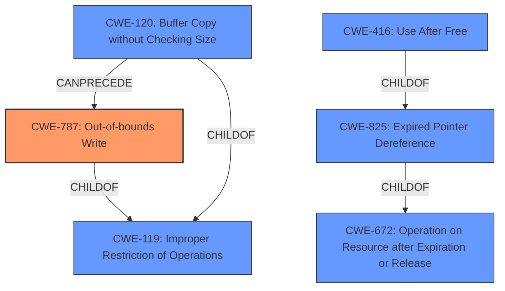

# Enhanced Analysis for CVE-2022-26716

# Summary
| CWE ID | CWE Name | Confidence | CWE Abstraction Level | CWE Vulnerability Mapping Label | CWE-Vulnerability Mapping Notes |
|---|---|---|---|---|---|
| **CWE-787** | Out-of-bounds Write | 1.0 | Base | Primary | Allowed |

## Evidence and Confidence

*   **Confidence Score:** 1.0
*   **Evidence Strength:** HIGH

## Relationship Analysis
The primary CWE selected is CWE-787 **Out-of-bounds Write**, which is a base level CWE. It is part of a hierarchy with CWE-119 **Improper Restriction of Operations within the Bounds of a Memory Buffer** as its parent. This indicates the vulnerability involves writing data outside the intended buffer. The related CWEs such as CWE-120 **Buffer Copy without Checking Size** and CWE-416 **Use After Free** were considered but not selected because they don't directly match the provided vulnerability description of a **memory corruption** issue.



## Vulnerability Chain
The vulnerability chain starts with **memory corruption** due to improper state management in WebKit, leading to an out-of-bounds write (CWE-787) that allows arbitrary code execution. The chain can be described as follows:

1.  **Improper State Management**: The initial **flaw** is in how WebKit manages its internal state.
2.  **Memory Corruption**: This leads to **memory corruption**.
3.  **Out-of-bounds Write (CWE-787)**: The **memory corruption** manifests as an out-of-bounds write, where data is written to an unintended memory location.
4.  **Arbitrary Code Execution**: Exploiting the out-of-bounds write allows an attacker to execute arbitrary code.

## Summary of Analysis
The analysis focused on identifying the root cause of the vulnerability. The vulnerability description indicates a **memory corruption** issue due to improper state management. The CVE reference links content summary confirms a **memory corruption** issue due to improper state management in WebKit. The primary CWE match for similar CVE descriptions is CWE-787 **Out-of-bounds Write**.

The selection of CWE-787 is further supported by the Retriever Results, which lists CWE-787 as the top combined result with a score of 1.0. The mapping guidance for CWE-787 allows its usage and states that it is at the Base level of abstraction, which is preferred.

The description of CWE-787 matches the vulnerability because it involves writing data past the end or before the beginning of the intended buffer, which is consistent with **memory corruption**.

The other CWEs from the Complete CWE Specifications were considered but not used for the following reasons:

*   CWE-843 **Access of Resource Using Incompatible Type ('Type Confusion')**: While type confusion can lead to memory corruption, the description does not specifically mention type confusion.
*   CWE-665 **Improper Initialization**: The description does not indicate an initialization issue.
*   CWE-415 **Double Free**: The description does not indicate a double free condition.
*   CWE-20 **Improper Input Validation**: Although malicious web content is the attack vector, the root cause is memory corruption rather than a failure to validate input.
*   CWE-416 **Use After Free**: The description does not indicate a use-after-free condition.
*   CWE-123 **Write-what-where Condition**: While the vulnerability could lead to a write-what-where condition, CWE-787 is more specific to the out-of-bounds write itself.
*   CWE-119 **Improper Restriction of Operations within the Bounds of a Memory Buffer**: This is a parent of CWE-787, and CWE-787 is more specific.
*   CWE-138 **Improper Neutralization of Special Elements**: This is not relevant to the vulnerability description.
*   CWE-122 **Heap-based Buffer Overflow**: While possible, the description does not specify if the buffer is heap-based; therefore, the more general CWE-787 is preferred.

The final selection of CWE-787 is based on the evidence of memory corruption due to improper state management leading to an out-of-bounds write, and it is at the optimal level of specificity (Base).


## CWE Relationship Analysis

Current CWEs represent these abstraction levels: .


### Vulnerability Chain Analysis

**Chain starting from CWE-825:**
- 825 (Expired Pointer Dereference) - ROOT


**Chain starting from CWE-672:**
- 672 (Operation on a Resource after Expiration or Release) - ROOT


### CWE Relationship Diagram

```mermaid
graph TD
    classDef primary fill:#f96,stroke:#333,stroke-width:2px
    classDef secondary fill:#69f,stroke:#333
    classDef tertiary fill:#9e9,stroke:#333
```