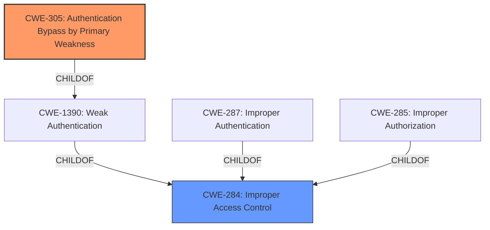

# Analysis for CVE-2022-26724

# Summary
| CWE ID | CWE Name | Confidence | CWE Abstraction Level | CWE Vulnerability Mapping Label | CWE-Vulnerability Mapping Notes |
|---|---|---|---|---|---|
| CWE-305 | Authentication Bypass by Primary Weakness | 0.9 | Base | Allowed | Primary CWE |
| CWE-284 | Improper Access Control | 0.6 | Pillar | Discouraged | Secondary CWE |

## Evidence and Confidence

*   **Confidence Score:** 0.9
*   **Evidence Strength:** HIGH

## Relationship Analysis
The primary CWE is CWE-305, which is a base-level CWE and a child of CWE-1390 (Weak Authentication). CWE-284 is a Pillar that represents a very high-level weakness, and it is the parent of both CWE-287 (Improper Authentication) and CWE-285 (Improper Authorization).

## Vulnerability Chain
The vulnerability chain starts with an **authentication issue** that is caused by **improper state management**. This allows a local user to bypass authentication and enable iCloud Photos without proper authorization.
  - Root Cause: **Improper State Management**
  - Weakness: **Authentication Issue** (CWE-305)
  - Impact: Local user can enable iCloud Photos without authentication

## Summary of Analysis
The vulnerability description clearly states that there is an **authentication issue** that allows a local user to enable iCloud Photos without authentication. The CVE Reference Links Content Summary confirms that the root cause of the vulnerability is an **authentication issue** in AuthKit and that **improper state management** leads to an authentication bypass.

The Retriever Results list several candidate CWEs, including CWE-305 (Authentication Bypass by Primary Weakness), CWE-287 (Improper Authentication), and CWE-285 (Improper Authorization).

CWE-305 (Authentication Bypass by Primary Weakness) is the most appropriate CWE because the vulnerability description specifically mentions an **authentication issue** that leads to an authentication bypass. The CWE description states that "the authentication algorithm is sound, but the implemented mechanism can be bypassed as the result of a separate weakness that is primary to the authentication error." In this case, the **improper state management** is the separate weakness that allows the local user to bypass authentication.

CWE-287 (Improper Authentication) is a Class-level CWE that is discouraged for use because it is too general. The description states that "When an actor claims to have a given identity, the product does not prove or insufficiently proves that the claim is correct." While this description is relevant to the vulnerability, it does not capture the specific details of the authentication bypass.

CWE-285 (Improper Authorization) is also a Class-level CWE that is discouraged for use because it is too general. The description states that "The product does not perform or incorrectly performs an authorization check when an actor attempts to access a resource or perform an action." While the impact of the vulnerability is that a local user can enable iCloud Photos without proper authorization, the root cause of the vulnerability is an **authentication issue**, not an authorization issue.

I am also adding CWE-284 since it is the parent of CWE-287 and CWE-285. However, it is not the primary weakness.

Based on the evidence and the CWE specifications, I have selected CWE-305 (Authentication Bypass by Primary Weakness) as the primary CWE for this vulnerability and CWE-284 as a secondary CWE.