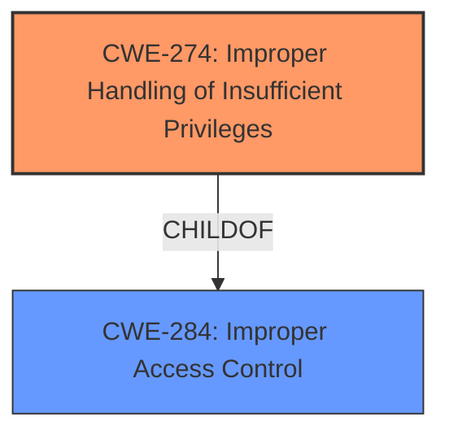

# Analysis Report for CVE-2022-26767

# Vulnerability Analysis Report: CVE-2022-26767

## Description


## Analysis (with Relationship Data)

# Summary
| CWE ID  | CWE Name                                                      | Confidence | CWE Abstraction Level | CWE Vulnerability Mapping Label | CWE-Vulnerability Mapping Notes |
| :------- | :------------------------------------------------------------ | :--------- | :---------------------- | :------------------------------ | :------------------------------ |
| CWE-274 | Improper Handling of Insufficient Privileges                | 0.9        | Base                    | Primary                         | Allowed                       |
| CWE-284 | Improper Access Control                                       | 0.7        | Class                   | Secondary                       | Allowed                       |

## Evidence and Confidence

*   **Confidence Score:** 0.8
*   **Evidence Strength:** HIGH

## Relationship Analysis
The primary CWE is CWE-274 (**Improper Handling of Insufficient Privileges**), which describes the root cause where the application **does not handle or incorrectly handles when it has insufficient privileges**. The secondary CWE is CWE-284 (**Improper Access Control**), which can be seen as a broader category encompassing the specific issue of insufficient privileges. CWE-274 is a child of CWE-284, indicating a hierarchical relationship where the former is a more specific case of the latter. This relationship supports mapping both CWEs to provide a more complete picture of the vulnerability.



## Vulnerability Chain
The vulnerability chain starts with a **lack of proper permission checks** (CWE-274), leading to the **ability of a malicious application to bypass privacy preferences**, which is a violation of access control (CWE-284).
- Root Cause: CWE-274 (**Improper Handling of Insufficient Privileges**) - The application **fails to properly handle situations where it lacks sufficient privileges**, meaning it **does not check** if it has the right to access certain resources or perform certain actions.
- Impact: CWE-284 (**Improper Access Control**) - As a result of the improper handling of privileges, a malicious application can **bypass privacy preferences**, gaining unauthorized access.

## Summary of Analysis
The assessment relies heavily on the provided evidence, particularly the "Vulnerability Description Key Phrases" and "CVE Reference Links Content Summary". The description explicitly states that "The issue was addressed with additional permissions checks," indicating that the initial vulnerability stemmed from the application's failure to properly verify or enforce necessary permissions. The ability of a malicious application to "bypass Privacy preferences" directly implies a breakdown in access control mechanisms.

The retriever results listed several CWEs, but most were not directly relevant. CWE-277 (**Insecure Inherited Permissions**), CWE-187 (**Partial String Comparison**), CWE-787 (**Out-of-bounds Write**), CWE-1263 (**Improper Physical Access Control**), CWE-665 (**Improper Initialization**), CWE-347 (**Improper Verification of Cryptographic Signature**), CWE-825 (**Expired Pointer Dereference**), CWE-282 (**Improper Ownership Management**), CWE-843 (**Access of Resource Using Incompatible Type ('Type Confusion')**), and CWE-667 (**Improper Locking**) were considered but did not match the core issue of insufficient privilege handling leading to bypassed privacy preferences.

CWE-274 and CWE-284 were chosen because they directly address the root cause and impact described in the vulnerability report. The selection of CWE-274 as the primary CWE is justified by its direct relevance to the **lack of permission checks**, while CWE-284 serves as a broader categorization of the access control violation. These CWEs are at the optimal level of specificity, providing a clear and accurate representation of the vulnerability.

Relevant CWE Information:

# Enhanced Context (25 CWEs)

## CWE-667: Improper Locking
**Abstraction Level**: Class
**Similarity Score**: 0.81
**Source**: dense

**Description**:
The product **does not properly acquire or release a lock on a resource, leading to unexpected resource state changes and behaviors.**

**Mapping Guidance**:
- Usage: Allowed-with-Review
- Rationale: This CWE entry is a Class and might have Base-level children that would be more appropriate

## CWE-404: Improper Resource Shutdown or Release
**Abstraction Level**: Class
**Similarity Score**: 0.79
**Source**: dense

**Description**:
The product **does not release or incorrectly releases a resource before it is made available for re-use.**

**Mapping Guidance**:
- Usage: Allowed-with-Review
- Rationale: This CWE entry is a Class and might have Base-level children that would be more appropriate

## CWE-662: Improper Synchronization
**Abstraction Level**: Class
**Similarity Score**: 0.78
**Source**: dense

**Description**:
The product utilizes multiple threads or processes to allow temporary access to a shared resource that can only be exclusive to one process at a time, but it **does not properly synchronize these actions, which might cause simultaneous accesses of this resource by multiple threads or processes.**

**Mapping Guidance**:
- Usage: Discouraged
- Rationale: This CWE entry is a level-1 Class (i.e., a child of a Pillar). It might have lower-level children that would be more appropriate

## CWE-226: Sensitive Information in Resource Not Removed Before Reuse
**Abstraction Level**: Base
**Similarity Score**: 0.78
**Source**: dense

**Description**:
The product releases a resource such as memory or a file so that it can be made available for reuse, but it **does not clear or "zeroize" the information contained in the resource before the product performs a critical state transition or makes the resource available for reuse by other entities.**

**Mapping Guidance**:
- Usage: Allowed
- Rationale: This CWE entry is at the Base level of abstraction, which is a preferred level of abstraction for mapping to the root causes of vulnerabilities.

## CWE-274: Improper Handling of Insufficient Privileges
**Abstraction Level**: Base
**Similarity Score**: 0.77
**Source**: dense

**Description**:
The product **does not handle or incorrectly handles when it has insufficient privileges to perform an operation, leading to resultant weaknesses.**

**Mapping Guidance**:
- Usage: Discouraged
- Rationale: This CWE entry could be deprecated in a future version of CWE.

## CWE-665: Improper Initialization
**Abstraction Level**: Class
**Similarity Score**: 0.76
**Source**: dense

**Description**:
The product **does not initialize or incorrectly initializes a resource, which might leave the resource in an unexpected state when it is accessed or used.**

**Mapping Guidance**:
- Usage: Discouraged
- Rationale: This CWE entry is a level-1 Class (i.e., a child of a Pillar). It might have lower-level children that would be more appropriate

## CWE-653: Improper Isolation or Compartmentalization
**Abstraction Level**: Class
**Similarity Score**: 0.76
**Source**: dense

**Description**:
The product **does not properly compartmentalize or isolate functionality, processes, or resources that require different privilege levels, rights, or permissions.**

**Mapping Guidance**:
- Usage: Allowed
- Rationale: This CWE entry is at the Base level of abstraction, which is a preferred level of abstraction for mapping to the root causes of vulnerabilities.

## CWE-1289: Improper Validation of Unsafe Equivalence in Input
**Abstraction Level**: Base
**Similarity Score**: 0.76
**Source**: dense

**Description**:
The product receives an input value that is used as a resource identifier or other type of reference, but it **does not validate or incorrectly validates that the input is equivalent to a potentially-unsafe value.**

**Mapping Guidance**:
- Usage: Allowed
- Rationale: This CWE entry is at the Base level of abstraction, which is a preferred level of abstraction for mapping to the root causes of vulnerabilities.

## CWE-843: Access of Resource Using Incompatible Type ('Type Confusion')
**Abstraction Level**: Base
**Similarity Score**: 0.76
**Source**: dense

**Description**:
The product allocates or initializes a resource such as a pointer, object, or variable using one type, but it **later accesses that resource using a type that is incompatible with the original type.**

**Mapping Guidance**:
- Usage: Allowed
- Rationale: This CWE entry is at the Base level of abstraction, which is a preferred level of abstraction for mapping to the root causes of vulnerabilities.

## CWE-664: Improper Control of a Resource Through its Lifetime
**Abstraction Level**: Pillar
**Similarity Score**: 0.76
**Source**: dense

**Description**:
The product **does not maintain or incorrectly maintains control over a resource throughout its lifetime of creation, use, and release.**

**Mapping Guidance**:
- Usage: Discouraged
- Rationale: This CWE entry is high-level when lower-level children


## CWE Relationship Analysis

Current CWEs represent these abstraction levels: .


### Vulnerability Chain Analysis

**Chain starting from CWE-226:**
- 226 (Sensitive Information in Resource Not Removed Before Reuse) - ROOT


**Chain starting from CWE-825:**
- 825 (Expired Pointer Dereference) - ROOT


### CWE Relationship Diagram

```mermaid
graph TD
    classDef primary fill:#f96,stroke:#333,stroke-width:2px
    classDef secondary fill:#69f,stroke:#333
    classDef tertiary fill:#9e9,stroke:#333
```


*Report generated on 2025-03-31 00:24:14*
