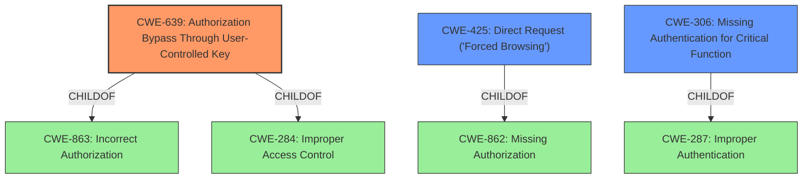

# Analysis for CVE-2022-26777

# Summary
| CWE ID | CWE Name | Confidence | CWE Abstraction Level | CWE Vulnerability Mapping Label | CWE-Vulnerability Mapping Notes |
|---|---|---|---|---|---|
| CWE-639 | Authorization Bypass Through User-Controlled Key | 1.0 | Base | Allowed | Primary CWE |
| CWE-425 | Direct Request ('Forced Browsing') | 0.7 | Base | Allowed | Secondary Candidate |
| CWE-306 | Missing Authentication for Critical Function | 0.6 | Base | Allowed | Secondary Candidate |

## Evidence and Confidence

*   **Confidence Score:** 0.9
*   **Evidence Strength:** HIGH

## Relationship Analysis
The primary CWE, CWE-639, is a child of CWE-863 (Incorrect Authorization) and CWE-284 (Improper Access Control). This hierarchical relationship confirms that the vulnerability stems from an authorization issue. CWE-425 (Direct Request) is related as it describes the mechanism by which unauthorized access is achieved. CWE-306 (Missing Authentication) is also related, as the guest user is authenticated, but there's no authorization check to prevent access to sensitive license details. The base level abstraction of CWE-639 is appropriate because it directly describes the root cause.

## Vulnerability Chain
The vulnerability chain starts with the **missing authorization check** on the `/dcapi/` endpoint. This allows an authenticated 'Guest' user (**attacker**) to directly access the API and retrieve sensitive licensing information (**impact**). The root cause is the **insecure direct object reference (IDOR)**, which leads to **privilege escalation** because the guest user can access information that should be restricted to administrators.

## Summary of Analysis
The analysis is primarily based on the "CVE Reference Links Content Summary" which explicitly states that the root cause is an **Insecure Direct Object Reference (IDOR)** due to a **missing authorization check** on the `/dcapi/` API endpoint. This aligns perfectly with the description of CWE-639, "Authorization Bypass Through User-Controlled Key," where a user can gain access to another user's data by modifying the key value. The description of CWE-639 mentions that "the authorization process would not properly check the data access operation to ensure that the authenticated user performing the operation has sufficient entitlements to perform the requested data access, hence bypassing any other authorization checks present in the system." This accurately describes the vulnerability.

CWE-425, "Direct Request ('Forced Browsing')," was considered because the guest user directly accessed the API endpoint. However, CWE-639 is more specific because it focuses on the authorization bypass aspect related to accessing another user's data (in this case, administrator-level information). Therefore, CWE-639 is the primary weakness, and CWE-425 is a secondary contributing factor.

CWE-306, "Missing Authentication for Critical Function," was also considered. However, the guest user *is* authenticated; the problem is that they are not *authorized* to access the license details. Therefore, while authentication exists, authorization is missing for this specific resource, making CWE-639 a more accurate fit.

The chosen CWEs are at the optimal level of specificity because they directly address the root cause of the vulnerability (authorization bypass) and the mechanism used to exploit it (direct request).

Relevant CWE Information:

# Enhanced Context (25 CWEs)
The following CWEs were identified as potentially relevant to this vulnerability:

## CWE-639: Authorization Bypass Through User-Controlled Key
**CWE-639** is the primary CWE because the **vulnerability is an IDOR.** The "CVE Reference Links Content Summary" section explicitly states the root cause is an **Insecure Direct Object Reference (IDOR)**, and this is also the best match in **Retriever Results**.

## CWE-425: Direct Request ('Forced Browsing')
**CWE-425** is a candidate because it describes how the unauthorized resource was accessed. A guest user was able to directly request the license information via the /dcapi/ endpoint. The "CVE Reference Links Content Summary" highlights the network-based attack vector and how a 'Guest' user can directly send requests to the vulnerable API endpoint. This aligns with CWE-425's description: "The web application does not adequately enforce appropriate authorization on all restricted URLs, scripts, or files."

## CWE-306: Missing Authentication for Critical Function
**CWE-306** is a candidate because the system does not properly authenticate the user for the specific function of accessing license details. The "CVE Reference Links Content Summary" mentions that the application lacked proper authorization checks on the `/dcapi/` API endpoint. However, the user is authenticated as a 'Guest' user.

## Other CWEs Considered and Rejected:
*   CWE-285: Improper Authorization - This is a class-level CWE and less specific than CWE-639.
*   CWE-269: Improper Privilege Management - While privilege escalation is an impact, the root cause is the authorization bypass, making CWE-639 more accurate.
*   CWE-471: Modification of Assumed-Immutable Data (MAID) - Not applicable, as the vulnerability doesn't involve modification of data assumed to be immutable.
*   CWE-918: Server-Side Request Forgery (SSRF) - Not applicable, as the vulnerability doesn't involve the server making requests to other servers based on user input.
*   CWE-330: Use of Insufficiently Random Values - Not applicable, as the vulnerability doesn't involve the use of random values.