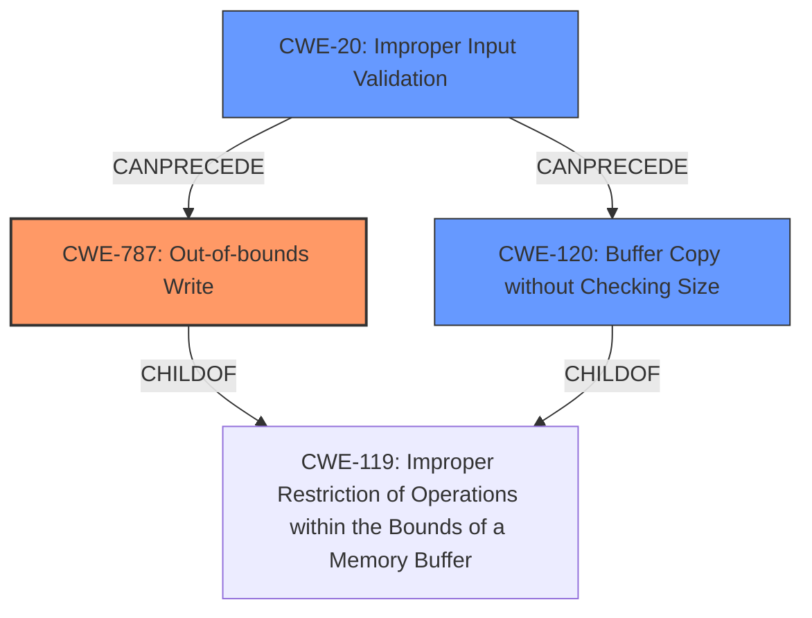

# Raw Analyzer Response for CVE-2022-26780

# Summary
| CWE ID | CWE Name | Confidence | CWE Abstraction Level | CWE Vulnerability Mapping Label | CWE-Vulnerability Mapping Notes |
|---|---|---|---|---|---|
| CWE-787 | Out-of-bounds Write | 0.9 | Base | Allowed | Primary CWE |
| CWE-20 | Improper Input Validation | 0.7 | Class | Discouraged | Secondary Candidate |
| CWE-120 | Buffer Copy without Checking Size of Input ('Classic Buffer Overflow') | 0.6 | Base | Allowed-with-Review | Secondary Candidate |

## Evidence and Confidence

*   **Confidence Score:** 0.8
*   **Evidence Strength:** HIGH

## Relationship Analysis
The primary CWE is CWE-787, which represents the out-of-bounds write caused by the **improper input validation**. CWE-20 is a class-level CWE that broadly describes **improper input validation**, while CWE-787 is a more specific base-level CWE describing the resulting write outside the intended buffer. CWE-120 is also considered as a possible result of the **improper input validation**.

## Vulnerability Chain
The vulnerability chain starts with **improper input validation** (CWE-20), which leads to a buffer overflow due to the `sscanf` function writing beyond the buffer's boundaries (CWE-120), eventually causing an out-of-bounds write (CWE-787) and remote code execution.

## Summary of Analysis
The initial assessment focused on the **improper input validation** as the root cause. However, the analysis of CVE reference links content summary revealed that the `user_define_init` function uses `sscanf` to parse the `service_name` from the `user_define_timeout` variable into a fixed-size buffer. If the `service_name` is longer than 64 bytes, a stack-based buffer overflow occurs, thus resulting in an out-of-bounds write (CWE-787).
The primary weakness is CWE-787 (Out-of-bounds Write) with high confidence (0.9) because the **improper input validation** directly leads to writing beyond the buffer's boundaries. The evidence is present in the "CVE Reference Links Content Summary" section.
>The root cause of the vulnerability is **improper input validation** in the `user_define_init` function of the `httpd` binary, specifically when parsing the `user_define_timeout` nvram variable.
>Stack-based buffer overflow: The `user_define_init` function uses `sscanf` to parse the `service_name` from the `user_define_timeout` variable into a fixed-size buffer of 64 bytes. If the `service_name` is longer than 64 bytes, a stack-based buffer overflow occurs.

CWE-20 is considered as a secondary candidate because the description refers to **improper input validation**, but it's a high-level class. CWE-120 is also considered as a possible consequence of the **improper input validation** since the `sscanf` function copies the input without checking the size.

Relevant CWE Information:

# Enhanced Context (25 CWEs)

## CWE-74: Improper Neutralization of Special Elements in Output Used by a Downstream Component ('Injection')
This CWE was considered but not selected because the vulnerability does not involve the injection of special elements into a downstream component. The issue is primarily an out-of-bounds write due to **improper input validation** and a subsequent buffer overflow.

## CWE-1289: Improper Validation of Unsafe Equivalence in Input
This CWE was considered but not selected because the vulnerability does not specifically involve the validation of equivalence between inputs and unsafe values. The core issue is the lack of proper size checks when copying data into a buffer.

## CWE-943: Improper Neutralization of Special Elements in Data Query Logic
This CWE was considered but not selected because the vulnerability does not involve a data query or the neutralization of special elements within such a query.

## CWE-129: Improper Validation of Array Index
This CWE was considered but not selected because the vulnerability doesn't directly involve array index validation. While a buffer overflow might lead to writing to unintended memory locations, the root cause is the lack of size checking during the buffer copy operation, not an invalid array index.

## CWE-138: Improper Neutralization of Special Elements
This CWE was considered but not selected because the vulnerability does not involve the neutralization of special elements.

## CWE-184: Incomplete List of Disallowed Inputs
This CWE was considered but not selected because the vulnerability doesn't involve an incomplete list of disallowed inputs.

## CWE-170: Improper Null Termination
This CWE was considered but not selected because there is no evidence in the description that the vulnerability is related to **improper null termination**.

## CWE-80: Improper Neutralization of Script-Related HTML Tags in a Web Page (Basic XSS)
This CWE was considered but not selected because the vulnerability does not involve cross-site scripting (XSS) or the improper neutralization of HTML tags.

## CWE-807: Reliance on Untrusted Inputs in a Security Decision
This CWE was considered but not selected because the vulnerability doesn't involve making security decisions based on untrusted inputs. The issue is a buffer overflow due to missing size checks.

## CWE-917: Improper Neutralization of Special Elements used in an Expression Language Statement ('Expression Language Injection')
This CWE was considered but not selected because the vulnerability does not involve expression language injection.

## CWE-190: Integer Overflow or Wraparound
This CWE was considered but not selected because the vulnerability doesn't involve integer overflow or wraparound.

## CWE-1284: Improper Validation of Specified Quantity in Input
This CWE was considered but not selected because the vulnerability is not directly related to the validation of quantity, though the lack of size validation of the input does contribute to the overflow.

## CWE-125: Out-of-bounds Read
This CWE was considered but not selected because the vulnerability primarily involves an out-of-bounds write, not a read.

## CWE-789: Memory Allocation with Excessive Size Value
This CWE was considered but not selected because the vulnerability does not directly involve memory allocation with an excessive size value.

## CWE-116: Improper Encoding or Escaping of Output
This CWE was considered but not selected because the vulnerability does not involve encoding or escaping of output.

## CWE-843: Access of Resource Using Incompatible Type ('Type Confusion')
This CWE was considered but not selected because the vulnerability does not involve type confusion.

## CWE-823: Use of Out-of-range Pointer Offset
This CWE was considered but not selected because the vulnerability doesn't explicitly involve out-of-range pointer offsets, but rather a buffer overflow due to the `sscanf` function.

## CWE-123: Write-what-where Condition
This CWE was considered but not selected because although an out-of-bounds write occurs, the primary issue is the lack of input validation leading to the buffer overflow.

## CWE-120: Buffer Copy without Checking Size of Input ('Classic Buffer Overflow')
This CWE was considered because the vulnerability involves a buffer copy (`sscanf`) without checking the size of the input, which can lead to a classic buffer overflow. It is a possible candidate but less descriptive than CWE-787.

## CWE-131: Incorrect Calculation of Buffer Size
This CWE was considered but not selected because the vulnerability isn't about an incorrect calculation of the buffer size. The buffer size is fixed, and the problem is the missing check on the input size before copying data into the buffer.

## CWE-681: Incorrect Conversion between Numeric Types
This CWE was considered but not selected because the vulnerability does not involve incorrect conversions between numeric types.

## CWE-22: Improper Limitation of a Pathname to a Restricted Directory ('Path Traversal')
This CWE was considered but not selected because the vulnerability does not involve path traversal.

## CWE-1287: Improper Validation of Specified Type of Input
This CWE was considered but not selected because while **improper validation** is present, it leads to an overflow, making CWE-787 and CWE-120 more descriptive.

##