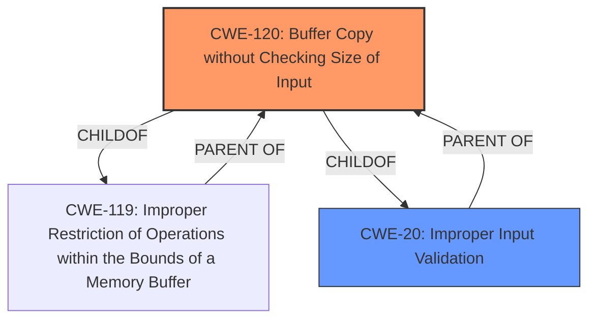

# Raw Analyzer Response for CVE-2022-26781

# Summary
| CWE ID  | CWE Name                                                                      | Confidence | CWE Abstraction Level | CWE Vulnerability Mapping Label | CWE-Vulnerability Mapping Notes |
| :-------- | :----------------------------------------------------------------------------- | :---------- | :---------------------- | :------------------------------ | :------------------------------- |
| CWE-120 | Buffer Copy without Checking Size of Input ('Classic Buffer Overflow') | 0.95      | Base                    | Primary CWE                     | Allowed-with-Review                 |
| CWE-20  | Improper Input Validation                                                        | 0.75       | Class                    | Secondary Candidate             | Discouraged                     |

## Evidence and Confidence

*   **Confidence Score:** 0.85
*   **Evidence Strength:** HIGH

## Relationship Analysis
The primary relationship influencing the selection of CWE-120 is its direct correlation to the **buffer overflow** vulnerability described in the CVE details, specifically the `sprintf` and `strcat` operations without input size validation. CWE-20 is a parent of CWE-120, representing the broader category of **improper input validation**, but CWE-120 provides a more specific characterization of the **buffer copy** issue.

## Vulnerability Chain
The vulnerability chain starts with the **improper input validation** of the `user_define_timeout` nvram variable. This leads to a stack-based **buffer overflow** in the `user_define_print` function due to the use of `sprintf` and `strcat` without proper size checks. The overflow allows an attacker to overwrite the return address and achieve remote code execution.
  - **Root Cause:** **Improper input validation** (`user_define_timeout`)
  - **Weakness:** **Buffer overflow** (`sprintf` and `strcat` in `user_define_print`)
  - **Impact:** Remote code execution (return address overwrite)

## Summary of Analysis
The analysis is based on the provided vulnerability description and CVE details. The key phrase **"improper input validation"** and the description of a **stack-based buffer overflow** in the `user_define_print` function strongly suggest CWE-120.

The CVE Reference Links Content Summary explicitly mentions that the `service_name` (extracted from `user_define_timeout`) is not validated for length, leading to a **buffer overflow** in the `temp_define_timeout` buffer when `sprintf` writes to it. The attacker can overwrite the return address (RA register) to achieve remote code execution.

CWE-20 is a more general class, while CWE-120 specifically describes the **buffer copy** operation without size checking, which is precisely what occurs in the `user_define_print` function. Therefore, CWE-120 is the more specific and appropriate choice.
The Retriever Results support this with CWE-120 as the 3rd match.

CWE-120 is at the Base level of abstraction, which is preferred for mapping root causes. The Mapping Guidance for CWE-120 allows its use with review, specifically cautioning against misuse simply because it mentions "buffer overflow." In this case, the vulnerability description clearly details a classic **buffer copy** scenario, making CWE-120 a valid and accurate classification.

The alternative CWEs considered were:
*   CWE-20: **Improper Input Validation** - While **improper input validation** is a contributing factor, it's a higher-level classification. The specific weakness is the **buffer overflow** resulting from the unchecked copy. Therefore, CWE-120 is more precise.
*   CWE-1287: **Improper Validation of Specified Type of Input** - This CWE is less relevant because the issue isn't about the input type, but about the lack of size validation.
*   CWE-78: **Improper Neutralization of Special Elements used in an OS Command ('OS Command Injection')** - Not relevant as the vulnerability is not related to OS command injection.
*   CWE-170: **Improper Null Termination** - Not relevant as the vulnerability is not related to null termination.
*   CWE-190: **Integer Overflow or Wraparound** - Not relevant as the vulnerability is not related to integer overflow.

Relevant CWE Information:

# Enhanced Context (25 CWEs)
The following CWEs were identified as potentially relevant to this vulnerability:

## CWE-74: Improper Neutralization of Special Elements in Output Used by a Downstream Component ('Injection')
**Abstraction Level**: Class
**Similarity Score**: 0.77
**Source**: dense

**Description**:
The product constructs all or part of a command, data structure, or record using externally-influenced input from an upstream component, but it does not neutralize or incorrectly neutralizes special elements that could modify how it is parsed or interpreted when it is sent to a downstream component.

**Mapping Guidance**:
- Usage: Discouraged
- Rationale: CWE-74 is high-level and often misused when lower-level weaknesses are more appropriate.

## CWE-1289: Improper Validation of Unsafe Equivalence in Input
**Abstraction Level**: Base
**Similarity Score**: 0.76
**Source**: dense

**Description**:
The product receives an input value that is used as a resource identifier or other type of reference, but it does not validate or incorrectly validates that the input is equivalent to a potentially-unsafe value.

**Mapping Guidance**:
- Usage: Allowed
- Rationale: This CWE entry is at the Base level of abstraction, which is a preferred level of abstraction for mapping to the root causes of vulnerabilities.

## CWE-129: Improper Validation of Array Index
**Abstraction Level**: Variant
**Similarity Score**: 0.74
**Source**: dense

**Description**:
The product uses untrusted input when calculating or using an array index, but the product does not validate or incorrectly validates the index to ensure the index references a valid position within the array.

**Mapping Guidance**:
- Usage: Allowed
- Rationale: This CWE entry is at the Variant level of abstraction, which is a preferred level of abstraction for mapping to the root causes of vulnerabilities.

## CWE-943: Improper Neutralization of Special Elements in Data Query Logic
**Abstraction Level**: Class
**Similarity Score**: 0.74
**Source**: dense

**Description**:
The product generates a query intended to access or manipulate data in a data store such as a database, but it does not neutralize or incorrectly neutralizes special elements that can modify the intended logic of the query.

**Mapping Guidance**:
- Usage: Allowed-with-Review
- Rationale: This CWE entry is a Class and might have Base-level children that would be more appropriate

## CWE-138: Improper Neutralization of Special Elements
**Abstraction Level**: Class
**Similarity Score**: 0.74
**Source**: dense

**Description**:
The product receives input from an upstream component, but it does not neutralize or incorrectly neutralizes special elements that could be interpreted as control elements or syntactic markers when they are sent to a downstream component.

**Mapping Guidance**:
- Usage: Discouraged
- Rationale: This CWE entry is a level-1 Class (i.e., a child of a Pillar). It might have lower-level children that would be more appropriate

## CWE-184: Incomplete List of Disallowed Inputs
**Abstraction Level**: Base
**Similarity Score**: 0.74
**Source**: dense

**Description**:
The product implements a protection mechanism that relies on a list of inputs (or properties of inputs) that are not allowed by policy or otherwise require other action to neutralize before additional processing takes place, but the list is incomplete.

**Mapping Guidance**:
- Usage: Allowed
- Rationale: This CWE entry is at the Base level of abstraction, which is a preferred level of abstraction for mapping to the root causes of vulnerabilities.

## CWE-170: Improper Null Termination
**Abstraction Level**: Base
**Similarity Score**: 0.73
**Source**: dense

**Description**:
The product does not terminate or incorrectly terminates a string or array with a null character or equivalent terminator.

**Mapping Guidance**:
- Usage: Allowed
- Rationale: This CWE entry is at the Base level of abstraction, which is a preferred level of abstraction for mapping to the root causes of vulnerabilities.

## CWE-80: Improper Neutralization of Script-Related HTML Tags in a Web Page (Basic XSS)
**Abstraction Level**: Variant
**Similarity Score**: 0.73
**Source**: