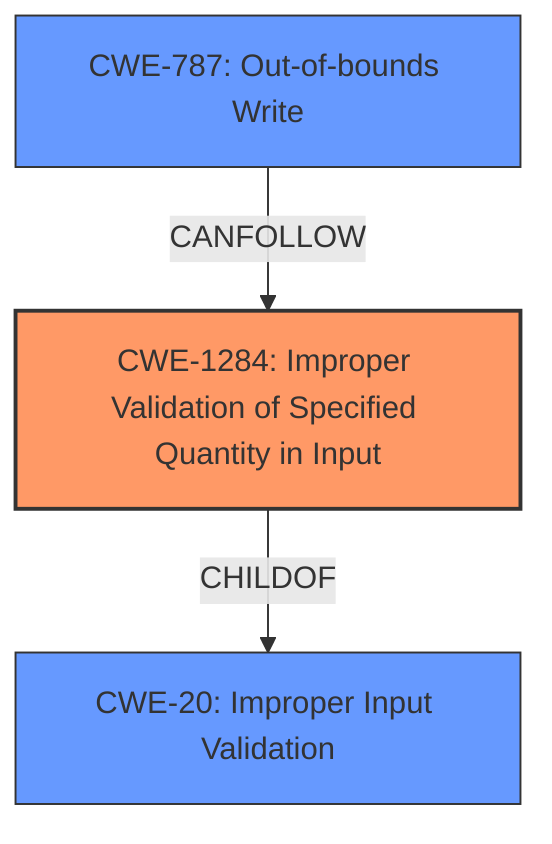

# Analysis Report for CVE-2022-26782

# Vulnerability Analysis Report: CVE-2022-26782

## Description


## Analysis (with Relationship Data)

# Summary
| CWE ID   | CWE Name                                                                                  | Confidence | CWE Abstraction Level | CWE Vulnerability Mapping Label | CWE-Vulnerability Mapping Notes |
| :--------- | :---------------------------------------------------------------------------------------- | :--------- | :---------------------- | :------------------------------ | :-------------------------------- |
| CWE-1284 | Improper Validation of Specified Quantity in Input                                    | 0.95       | Base                    | Primary CWE                     | Allowed                           |
| CWE-787 | Out-of-bounds Write                                                                       | 0.8        | Base                    | Secondary CWE                   | Allowed                           |
| CWE-20   | Improper Input Validation                                                                 | 0.6       | Class                   | Secondary CWE                   | Discouraged                         |

## Evidence and Confidence

*   **Confidence Score:** 0.85
*   **Evidence Strength:** HIGH

## Relationship Analysis
The primary weakness is CWE-1284, as the **improper validation** of the `user_define_timeout` variable's quantity (number of comma-separated entries) directly leads to the vulnerability. CWE-787 (Out-of-bounds Write) results from writing past the end of the `timeout_struct` array due to the missing quantity validation. CWE-20 is a high-level classification that is not as specific as CWE-1284.



## Vulnerability Chain
The vulnerability chain starts with the **improper input validation** of the number of comma-separated entries in the `user_define_timeout` NVRAM variable (CWE-1284). Because the code does not validate the number of entries, an attacker can provide more entries than the `timeout_struct` array can hold, resulting in an out-of-bounds write (CWE-787) on the stack. This leads to remote code execution because the attacker can overwrite the return address on the stack.

## Summary of Analysis
The initial assessment and the retriever results pointed to several potential CWEs, including CWE-20 (Improper Input Validation), CWE-1284 (Improper Validation of Specified Quantity in Input), and CWE-787 (Out-of-bounds Write).

The vulnerability description highlights the **improper input validation** within the `user_define_set_item` function, specifically concerning the `user_define_timeout` NVRAM variable. The CVE Reference Links Content Summary explicitly states that the code **does not properly validate the number of comma-separated entries** in `user_define_timeout`, leading to an out-of-bounds write.

Based on this evidence, CWE-1284 (Improper Validation of Specified Quantity in Input) is the most appropriate primary CWE because it directly addresses the root cause of the vulnerability, which is the lack of validation of the number of entries. CWE-787 (Out-of-bounds Write) accurately describes the resulting buffer overflow on the stack, but is a consequence of the **improper input validation**, making it a secondary CWE. While CWE-20 (Improper Input Validation) is a broader classification, CWE-1284 is more specific and accurately reflects the weakness, making it more appropriate.

The CWEs selected are at the optimal level of specificity because CWE-1284 directly describes the missing validation, and CWE-787 accurately describes the consequence of that missing validation.

Relevant CWE Information:

# Enhanced Context (25 CWEs)
The following CWEs were identified as potentially relevant to this vulnerability:

## CWE-74: Improper Neutralization of Special Elements in Output Used by a Downstream Component ('Injection')
**Abstraction Level**: Class
**Similarity Score**: 0.77
**Source**: dense

**Description**:
The product constructs all or part of a command, data structure, or record using externally-influenced input from an upstream component, but it does not neutralize or incorrectly neutralizes special elements that could modify how it is parsed or interpreted when it is sent to a downstream component.

**Mapping Guidance**:
- Usage: Discouraged
- Rationale: CWE-74 is high-level and often misused when lower-level weaknesses are more appropriate.

*This CWE is not selected as it relates to injection vulnerabilities, which is not the case here.*

## CWE-1289: Improper Validation of Unsafe Equivalence in Input
**Abstraction Level**: Base
**Similarity Score**: 0.76
**Source**: dense

**Description**:
The product receives an input value that is used as a resource identifier or other type of reference, but it does not validate or incorrectly validates that the input is equivalent to a potentially-unsafe value.

**Mapping Guidance**:
- Usage: Allowed
- Rationale: This CWE entry is at the Base level of abstraction, which is a preferred level of abstraction for mapping to the root causes of vulnerabilities.

*This CWE is not selected as it is not about equivalence but about the quantity of inputs.*

## CWE-129: Improper Validation of Array Index
**Abstraction Level**: Variant
**Similarity Score**: 0.74
**Source**: dense

**Description**:
The product uses untrusted input when calculating or using an array index, but the product does not validate or incorrectly validates the index to ensure the index references a valid position within the array.

**Mapping Guidance**:
- Usage: Allowed
- Rationale: This CWE entry is at the Variant level of abstraction, which is a preferred level of abstraction for mapping to the root causes of vulnerabilities.

*This CWE is related, but it more focuses on array indexes and this vulnerability is more about validating the quantity of entries which then indirectly causes an array index issue.*

## CWE-138: Improper Neutralization of Special Elements
**Abstraction Level**: Class
**Similarity Score**: 0.74
**Source**: dense

**Description**:
The product receives input from an upstream component, but it does not neutralize or incorrectly neutralizes special elements that could be interpreted as control elements or syntactic markers when they are sent to a downstream component.

**Mapping Guidance**:
- Usage: Discouraged
- Rationale: This CWE entry is a level-1 Class (i.e., a child of a Pillar). It might have lower-level children that would be more appropriate

*This CWE is not selected as it relates to neutralization of special elements, which is not the case here.*

## CWE-943: Improper Neutralization of Special Elements in Data Query Logic
**Abstraction Level**: Class
**Similarity Score**: 0.74
**Source**: dense

**Description**:
The product generates a query intended to access or manipulate data in a data store such as a database, but it does not neutralize or incorrectly neutralizes special elements that can modify the intended logic of the query.

**Mapping Guidance**:
- Usage: Allowed-with-Review
- Rationale: This CWE entry is a Class and might have Base-level children that would be more appropriate

*This CWE is not selected as it relates to data queries, which is not the case here.*

## CWE-184: Incomplete List of Disallowed Inputs
**Abstraction Level**: Base
**Similarity Score**: 0.74
**Source**: dense

**Description**:
The product implements a protection mechanism that relies on a list of inputs (or properties of inputs) that are not allowed by policy or otherwise require other action to neutralize before additional processing takes place, but the list is incomplete.

**Mapping Guidance**:
- Usage: Allowed
- Rationale: This CWE entry is at the Base level of abstraction, which is a preferred level of abstraction for mapping to the root causes of vulnerabilities.

*This CWE is not selected as it does not apply because the product is not using a list of disallowed inputs.*

## CWE-170: Improper Null Termination
**Abstraction Level**: Base
**Similarity Score**: 0.73
**Source**: dense

**Description**:
The product does not terminate or incorrectly terminates a string or array with a null character or equivalent terminator.

**Mapping Guidance**:
- Usage: Allowed
- Rationale: This CWE entry is at the Base level of abstraction, which is a preferred level of abstraction for mapping to the root causes of vulnerabilities.

*This CWE is not selected as it relates to null termination and not quantity of input.*

## CWE-807: Reliance on Untrusted Inputs in a Security Decision
**Abstraction Level**: Base
**Similarity Score**: 0.73
**Source**: dense

**Description**:
The product uses a protection mechanism that relies on the existence or values of an input, but the input can be modified by an untrusted actor in a way that bypasses the protection mechanism.

**Mapping Guidance**:
- Usage


## CWE Relationship Analysis

Current CWEs represent these abstraction levels: .


### Vulnerability Chain Analysis

**Chain starting from CWE-184:**
- 184 (Incomplete List of Disallowed Inputs) - ROOT


**Chain starting from CWE-170:**
- 170 (Improper Null Termination) - ROOT


### CWE Relationship Diagram

```mermaid
graph TD
    classDef primary fill:#f96,stroke:#333,stroke-width:2px
    classDef secondary fill:#69f,stroke:#333
    classDef tertiary fill:#9e9,stroke:#333
```


*Report generated on 2025-03-31 05:56:58*
