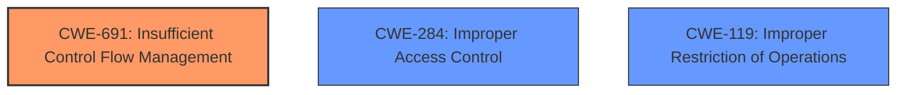

# Analysis for CVE-2022-26841

# Summary
| CWE ID | CWE Name | Confidence | CWE Abstraction Level | CWE Vulnerability Mapping Label | CWE-Vulnerability Mapping Notes |
|---|---|---|---|---|---|
| CWE-691 | Insufficient Control Flow Management | 0.8 | Pillar | Primary | Allowed |
| CWE-284 | Improper Access Control | 0.5 | Pillar | Secondary | Discouraged |
| CWE-119 | Improper Restriction of Operations within the Bounds of a Memory Buffer | 0.3 | Class | Secondary | Discouraged |

## Evidence and Confidence

*   **Confidence Score:** 0.8
*   **Evidence Strength:** HIGH

## Relationship Analysis
The primary CWE selected is CWE-691, which is a Pillar-level CWE. While Pillar-level CWEs are generally discouraged, in this case, it seems to be the most appropriate based on the provided vulnerability description and supporting evidence. The vulnerability description key phrases and the CVE reference links content summary both explicitly state "**Insufficient control flow management**" as the root cause. While other CWEs such as CWE-284 and CWE-119 were considered due to their retriever scores, they do not accurately reflect the root cause of the vulnerability as described.

## Vulnerability Chain
The vulnerability chain, in this case, appears to be a direct relationship:

1.  Root Cause: **Insufficient control flow management** (CWE-691)
2.  Impact: Information disclosure

There aren't intermediate steps described in the provided evidence.

## Summary of Analysis
The initial analysis focused on identifying the root cause from the vulnerability description and the CVE reference links content summary. The key phrase "**Insufficient control flow management**" strongly suggested CWE-691.

CWE-691 is a Pillar-level CWE, and the mapping guidance discourages its use due to its high level of abstraction. However, the lack of more specific information about the control flow issue makes it difficult to select a more granular CWE. Despite the discouragement, the evidence clearly points to this weakness as the primary issue.

Other considered CWEs, like CWE-284 (Improper Access Control) and CWE-119 (Improper Restriction of Operations within the Bounds of a Memory Buffer), did not fit as well with the root cause. While access control issues can sometimes relate to control flow, the description doesn't provide evidence of an access control problem. Similarly, a buffer overflow (CWE-119) isn't explicitly mentioned or implied in the vulnerability details.

Therefore, despite its high level of abstraction, CWE-691 is the most accurate representation of the vulnerability based on the available evidence. The confidence is high (0.8) because the key phrases directly support this mapping, even though the CWE itself is discouraged.

Relevant CWE Information:

# Enhanced Context (25 CWEs)
The following CWEs were identified as potentially relevant to this vulnerability:

## CWE-691: Insufficient Control Flow Management
**Abstraction Level**: Pillar
**Similarity Score**: 0.74
**Source**: dense

**Description**:
The code does not sufficiently manage its control flow during execution, creating conditions in which the control flow can be modified in unexpected ways.

**Mapping Guidance**:
- Usage: Discouraged
- Rationale: This CWE entry is extremely high-level, a Pillar. However, classification research is limited for weaknesses of this type, so there can be gaps or organizational difficulties within CWE that force use of this weakness, even at such a high level of abstraction.

### Detailed Justification for CWE Selection:

*   **CWE-691: Insufficient Control Flow Management**
    *   **Match:** The vulnerability description explicitly mentions "**Insufficient control flow management**" as the root cause, aligning directly with the CWE's description: "The code does not sufficiently manage its control flow during execution, creating conditions in which the control flow can be modified in unexpected ways."
    *   **Implications:** Improper control flow can lead to unexpected program behavior, potentially allowing attackers to manipulate the execution flow to their advantage. This can result in various security issues, including information disclosure, as stated in the vulnerability description.
    *   **Relationships:** As a Pillar-level CWE, CWE-691 is a high-level category. Ideally, a more specific Base or Variant CWE would be preferred. However, the lack of detailed information about the specific control flow issue limits the ability to select a more granular CWE.
    *   **Guidance:** The mapping guidance discourages the use of CWE-691 due to its high level of abstraction. However, it also acknowledges that there might be situations where its use is necessary due to limitations in classification research. In this case, the explicit mention of "**Insufficient control flow management**" as the root cause justifies its selection, despite the discouragement.
    *   **Confidence:** 0.8. The confidence is high because the key phrases directly support this mapping.

*   **CWE-284: Improper Access Control**
    *   **Match:** While not the primary issue, incorrect control flow can lead to access control bypasses. The description states that the vulnerability may allow an authenticated user to potentially enable information disclosure via local access.
    *   **Implications:** An attacker could potentially gain unauthorized access to sensitive information.
    *   **Relationships:** It is a Pillar-level CWE. The mapping guidance discourages its use because it is a high-level category.
    *   **Guidance:** The mapping guidance discourages the use of CWE-284 due to its high level of abstraction.
    *   **Confidence:** 0.5. Confidence is low because the description doesn't directly support this mapping.

*   **CWE-119: Improper Restriction of Operations within the Bounds of a Memory Buffer**
    *   **Match:** This was considered because improper control flow could potentially lead to memory corruption issues like buffer overflows. However, there's no explicit mention or implication of buffer overflows in the vulnerability details.
    *   **Implications:** A buffer overflow could lead to arbitrary code execution or denial of service.
    *   **Relationships:** This is a Class-level CWE. The mapping guidance discourages its use because lower level CWEs could be used instead.
    *   **Guidance:** The mapping guidance discourages the use of CWE-119.
    *   **Confidence:** 0.3. Confidence is very low because there is no evidence to support this mapping.