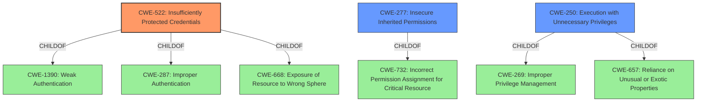

# Analysis Report for CVE-2022-26844

# Vulnerability Analysis Report: CVE-2022-26844

## Description


## Analysis (with Relationship Data)

# Summary
| CWE ID  | CWE Name                                  | Confidence | CWE Abstraction Level | CWE Vulnerability Mapping Label | CWE-Vulnerability Mapping Notes |
|---------|-------------------------------------------|------------|-----------------------|---------------------------------|---------------------------------|
| CWE-522 | Insufficiently Protected Credentials      | 1          | Class                 | Primary CWE                     | Allowed-with-Review            |
| CWE-277 | Insecure Inherited Permissions            | 0.5        | Variant               | Secondary Candidate             | Allowed                        |
| CWE-250 | Execution with Unnecessary Privileges    | 0.4        | Base                  | Secondary Candidate             | Allowed                        |

## Evidence and Confidence

*   **Confidence Score:** 0.8
*   **Evidence Strength:** HIGH

## Relationship Analysis
The primary CWE is CWE-522, which is a Class-level CWE. It has child relationships with CWE-1390 (Weak Authentication), CWE-287 (Improper Authentication), and CWE-668 (Exposure of Resource to Wrong Sphere). CWE-277 is a variant of CWE-732. The relationships influenced the decision by providing context and alternative classifications.



## Vulnerability Chain
The vulnerability chain starts with **insufficiently protected credentials**, leading to a potential escalation of privilege.
  - **Root Cause:** **Insufficiently protected credentials**
  - **Impact:** Escalation of Privilege

## Summary of Analysis
The vulnerability description clearly states that the root cause is **insufficiently protected credentials** in the installation binaries of Intel SEAPI. This directly aligns with the description of CWE-522 (Insufficiently Protected Credentials), which states: "The product transmits or stores authentication credentials, but it uses an insecure method that is susceptible to unauthorized interception and/or retrieval." The impact of this vulnerability is that an authenticated user can potentially escalate their privileges via local access. The "CVE Reference Links Content Summary" also supports this.

CWE-522 is a Class-level CWE, and the mapping guidance suggests examining its children for a better fit. However, none of the children (CWE-1390, CWE-287, CWE-668) are more specific to the root cause, which is the credentials themselves being insufficiently protected.

CWE-277 (Insecure Inherited Permissions) was considered because the **insufficiently protected credentials** might be a result of how permissions are handled during installation. However, the primary issue is the protection of credentials, not necessarily the permissions.

CWE-250 (Execution with Unnecessary Privileges) was considered because escalation of privilege is listed as the impact. However, it is not the root cause.

The final decision is to assign CWE-522 as the primary CWE, as it directly addresses the root cause of the vulnerability.

Relevant CWE Information:

# Enhanced Context (25 CWEs)

## CWE-653: Improper Isolation or Compartmentalization
**Abstraction Level**: Class
**Similarity Score**: 0.77
**Source**: dense
Not selected because the vulnerability is not about isolating functionality, processes, or resources.

## CWE-274: Improper Handling of Insufficient Privileges
**Abstraction Level**: Base
**Similarity Score**: 0.76
**Source**: dense
Not selected because the vulnerability is not about handling insufficient privileges, but rather about the credentials themselves being **insufficiently protected**.

## CWE-664: Improper Control of a Resource Through its Lifetime
**Abstraction Level**: Pillar
**Similarity Score**: 0.75
**Source**: dense
Not selected because it's too generic. The issue is specifically about credential protection.

## CWE-691: Insufficient Control Flow Management
**Abstraction Level**: Pillar
**Similarity Score**: 0.75
**Source**: dense
Not selected because control flow management isn't the core issue.

## CWE-668: Exposure of Resource to Wrong Sphere
**Abstraction Level**: Class
**Similarity Score**: 0.75
**Source**: dense
Not selected because while the credentials are exposed, the core issue is the lack of protection, not simply the exposure.

## CWE-1220: Insufficient Granularity of Access Control
**Abstraction Level**: Base
**Similarity Score**: 0.75
**Source**: dense
Not selected because it is not about access control granularity.

## CWE-807: Reliance on Untrusted Inputs in a Security Decision
**Abstraction Level**: Base
**Similarity Score**: 0.75
**Source**: dense
Not selected because it is not about relying on untrusted inputs.

## CWE-693: Protection Mechanism Failure
**Abstraction Level**: Pillar
**Similarity Score**: 0.74
**Source**: dense
Not selected because too general. The specific failure is related to credential protection.

## CWE-404: Improper Resource Shutdown or Release
**Abstraction Level**: Class
**Similarity Score**: 0.74
**Source**: dense
Not selected because it does not relate to resource shutdown or release.

## CWE-280: Improper Handling of Insufficient Permissions or Privileges
**Abstraction Level**: Base
**Similarity Score**: 0.74
**Source**: dense
Not selected because it is not about handling permissions or privileges.

## CWE-863: Incorrect Authorization
**Abstraction Level**: Class
**Similarity Score**: 4801.14
**Source**: sparse
Not selected because it is not about incorrect authorization.

## CWE-668: Exposure of Resource to Wrong Sphere
**Abstraction Level**: Class
**Similarity Score**: 4782.57
**Source**: sparse
Not selected because while exposure is a consequence, the core issue is the lack of protection on the credentials.

## CWE-639: Authorization Bypass Through User-Controlled Key
**Abstraction Level**: Base
**Similarity Score**: 4747.68
**Source**: sparse
Not selected because it is not about authorization bypass through user-controlled key.

## CWE-1390: Weak Authentication
**Abstraction Level**: Class
**Similarity Score**: 4698.47
**Source**: sparse
Not selected because it is not explicitly about weak authentication, but rather the **insufficient protection** of the credentials themselves.

## CWE-285: Improper Authorization
**Abstraction Level**: Class
**Similarity Score**: 4663.93
**Source**: sparse
Not selected because it is not about authorization.

## CWE-613: Insufficient Session Expiration
**Abstraction Level**: base
**Similarity Score**: 4.33
**Source**: graph
Not selected because it is not about session expiration.

## CWE-322: Key Exchange without Entity Authentication
**Abstraction Level**: base
**Similarity Score**: 3.57
**Source**: graph
Not selected because it is not about key exchange without entity authentication.

## CWE-911: Improper Update of Reference Count
**Abstraction Level**: base
**Similarity Score**: 2.87
**Source**: graph
Not selected because it is not about reference counts.

## CWE-193: Off-by-one Error
**Abstraction Level**: base
**Similarity Score**: 2.82
**Source**: graph
Not selected because it is not about off-by-one errors.

## CWE-295: Improper Certificate Validation
**Abstraction Level**: base
**Similarity Score**: 2


## CWE Relationship Analysis

Current CWEs represent these abstraction levels: .


### Vulnerability Chain Analysis

**Chain starting from CWE-522:**
- 522 (Insufficiently Protected Credentials) - ROOT


**Chain starting from CWE-668:**
- 668 (Exposure of Resource to Wrong Sphere) - ROOT


### CWE Relationship Diagram

```mermaid
graph TD
    classDef primary fill:#f96,stroke:#333,stroke-width:2px
    classDef secondary fill:#69f,stroke:#333
    classDef tertiary fill:#9e9,stroke:#333
```


*Report generated on 2025-03-30 15:11:53*
