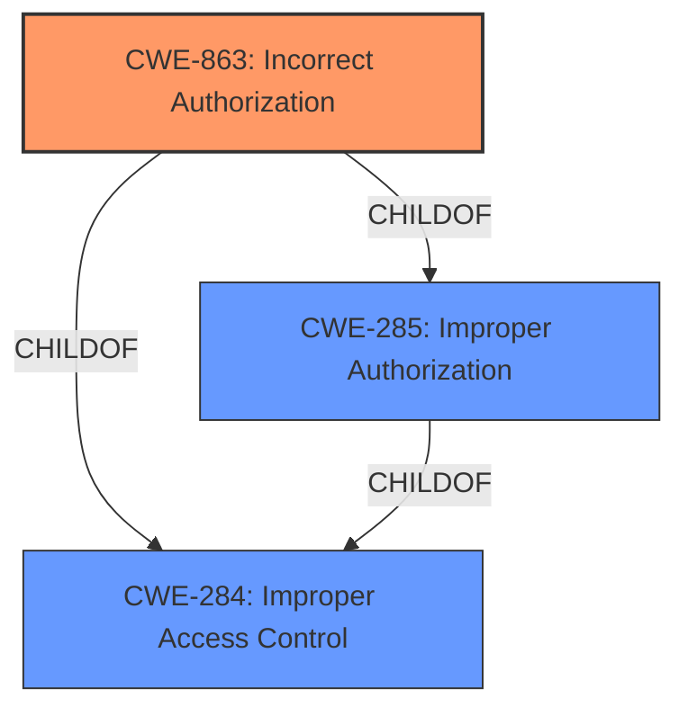

# Raw Analyzer Response for CVE-2022-26857

# Summary
| CWE ID | CWE Name | Confidence | CWE Abstraction Level | CWE Vulnerability Mapping Label | CWE-Vulnerability Mapping Notes |
|---|---|---|---|---|---|
| CWE-863 | Incorrect Authorization | 0.9 | Class | Primary | Allowed-with-Review |
| CWE-285 | Improper Authorization | 0.7 | Class | Secondary | Discouraged |
| CWE-284 | Improper Access Control | 0.5 | Pillar | Secondary | Discouraged |

## Evidence and Confidence

*   **Confidence Score:** 0.9
*   **Evidence Strength:** HIGH

## Relationship Analysis
The primary CWE selected is CWE-863, "Incorrect Authorization," which is a child of both CWE-285 "Improper Authorization" and CWE-284 "Improper Access Control." CWE-285 is a Class-level CWE, while CWE-284 is a Pillar-level CWE. The selection of CWE-863 is based on the description indicating that an authorization check is performed but **incorrectly** implemented. The relationship analysis guided the selection of a more specific CWE (CWE-863) over its broader parents (CWE-285 and CWE-284).

## Vulnerability Chain
The vulnerability chain starts with **improper authorization**, leading to the bypass of blocked functionalities and the performance of unauthorized actions.

**Root Cause:** **Improper Authorization** (CWE-863)
**Impact:** Bypass of blocked functionalities and performance of unauthorized actions.

## Summary of Analysis
The initial analysis focused on identifying the root cause of the vulnerability and its impact. The vulnerability description clearly indicates an **improper authorization** issue, where a low-privileged user can bypass intended restrictions and perform unauthorized actions.

The evidence from the vulnerability description is: "Dell OpenManage Enterprise Versions 3.8.3 and prior contain an **improper authorization** vulnerability. A remote authenticated malicious user with low privileges may potentially exploit this vulnerability to bypass blocked functionalities and perform unauthorized actions."

The retriever results also pointed to CWE-285 (**Improper Authorization**) and CWE-863 (**Incorrect Authorization**).

Based on the description and the retriever results, CWE-863 was selected as the primary CWE because the vulnerability involves performing authorization checks, but these checks are **incorrectly** performed, as a low-privileged user can bypass them. CWE-285 was considered, but it is less specific, as it only states that the product does not perform or **incorrectly** performs an authorization check. CWE-284 (**Improper Access Control**) was also considered, but it is a very high-level (Pillar) CWE and not specific enough.

The selection of CWE-863 aligns with the MITRE mapping guidance, which suggests using more specific CWEs when available. The confidence level is high (0.9) due to the clear evidence in the vulnerability description and the retriever results.