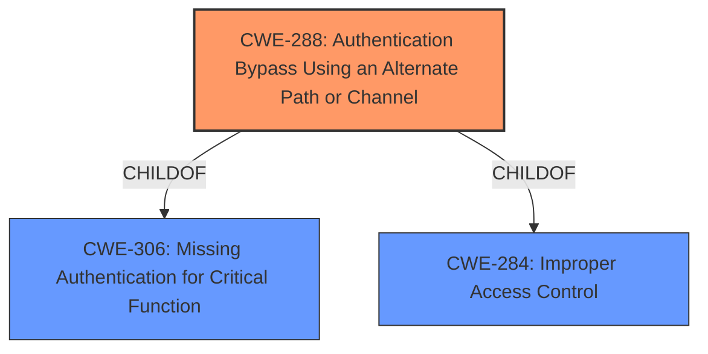

# Analysis Report for CVE-2022-26858

# Vulnerability Analysis Report: CVE-2022-26858

## Description


## Analysis (with Relationship Data)

# Summary
| CWE ID  | CWE Name                                                                         | Confidence | CWE Abstraction Level | CWE Vulnerability Mapping Label | CWE-Vulnerability Mapping Notes |
| :-------- | :------------------------------------------------------------------------------- | :---------- | :----------------------- | :------------------------------ | :------------------------------ |
| CWE-288   | Authentication Bypass Using an Alternate Path or Channel                        | 0.85        | Base                     | Allowed                         | Primary CWE                     |
| CWE-287   | Improper Authentication                                                          | 0.65        | Class                    | Discouraged                      | Secondary Candidate            |

## Evidence and Confidence

*   **Confidence Score:** 0.80
*   **Evidence Strength:** HIGH

## Relationship Analysis
The primary CWE selected is CWE-288 (Authentication Bypass Using an Alternate Path or Channel), which is a child of CWE-306 (Missing Authentication for Critical Function) and CWE-284 (Improper Access Control). The description explicitly states that the vulnerability allows bypassing security controls via malicious input to an SMI, which aligns well with the alternate path or channel aspect of CWE-288. While CWE-287 (Improper Authentication) is also considered, CWE-288 provides a more precise description of the bypass mechanism.



## Vulnerability Chain
The chain of events is as follows:
1.  **Root Cause:** **Improper Authentication** (as noted in the vulnerability description) which leads to CWE-288 (Authentication Bypass Using an Alternate Path or Channel).
2.  A locally authenticated malicious user sends malicious input to an SMI.
3.  The malicious input bypasses security controls.
4.  **Impact:** The system is compromised, affecting confidentiality and integrity.

## Summary of Analysis
The initial analysis strongly pointed towards **Improper Authentication** as the root cause, and the Retriever results also suggested CWE-287 (Improper Authentication). However, upon closer examination of the vulnerability description and the CVE Reference Links Content Summary, it became clear that the vulnerability involves an **authentication bypass** through a specific channel (malicious input to an SMI). This aligned more closely with CWE-288 (Authentication Bypass Using an Alternate Path or Channel).

The vulnerability description states: "Dell BIOS versions contain an **Improper Authentication** vulnerability. A locally authenticated malicious user could potentially exploit this vulnerability by sending malicious input to an SMI in order to bypass security controls." The key phrase here is "bypass security controls," which suggests an alternate path or channel that circumvents the intended authentication mechanism. The "CVE Reference Links Content Summary" further supports this by stating that the **weakness** is an "**improper authentication**, allowing bypass of security controls."

CWE-288 is at the Base level of abstraction, which is preferred for mapping root causes. It accurately captures the essence of the vulnerability, where an attacker can bypass authentication through a specific attack vector (malicious input to SMI). Therefore, CWE-288 is the most appropriate CWE for this vulnerability.

CWE-287 (Improper Authentication) was considered but not selected as the primary CWE because it is a more general classification. While the vulnerability involves improper authentication, the specific mechanism of bypassing authentication through an alternate channel makes CWE-288 a more precise and informative mapping.

Relevant CWE Information:

# Enhanced Context (25 CWEs)
The following CWEs were identified as potentially relevant to this vulnerability:

## CWE-1289: Improper Validation of Unsafe Equivalence in Input
**Abstraction Level**: Base
**Similarity Score**: 0.75
**Source**: dense

**Description**:
The product receives an input value that is used as a resource identifier or other type of reference, but it does not validate or incorrectly validates that the input is equivalent to a potentially-unsafe value.

**Mapping Guidance**:
- Usage: Allowed
- Rationale: This CWE entry is at the Base level of abstraction, which is a preferred level of abstraction for mapping to the root causes of vulnerabilities.

*Not Selected:* Not related to authentication bypass.

## CWE-345: Insufficient Verification of Data Authenticity
**Abstraction Level**: Class
**Similarity Score**: 0.75
**Source**: dense

**Description**:
The product does not sufficiently verify the origin or authenticity of data, in a way that causes it to accept invalid data.

**Mapping Guidance**:
- Usage: Discouraged
- Rationale: This CWE entry is a level-1 Class (i.e., a child of a Pillar). It might have lower-level children that would be more appropriate

*Not Selected:* While related to data authenticity, it doesn't capture the specific bypass mechanism.

## CWE-807: Reliance on Untrusted Inputs in a Security Decision
**Abstraction Level**: Base
**Similarity Score**: 0.74
**Source**: dense

**Description**:
The product uses a protection mechanism that relies on the existence or values of an input, but the input can be modified by an untrusted actor in a way that bypasses the protection mechanism.

**Mapping Guidance**:
- Usage: Allowed
- Rationale: This CWE entry is at the Base level of abstraction, which is a preferred level of abstraction for mapping to the root causes of vulnerabilities.

*Not Selected:* Could be relevant, but CWE-288 is more specific to authentication bypass.

## CWE-274: Improper Handling of Insufficient Privileges
**Abstraction Level**: Base
**Similarity Score**: 0.74
**Source**: dense

**Description**:
The product does not handle or incorrectly handles when it has insufficient privileges to perform an operation, leading to resultant weaknesses.

**Mapping Guidance**:
- Usage: Discouraged
- Rationale: This CWE entry could be deprecated in a future version of CWE.

*Not Selected:* Not directly related to authentication bypass.

## CWE-703: Improper Check or Handling of Exceptional Conditions
**Abstraction Level**: Pillar
**Similarity Score**: 0.73
**Source**: dense

**Description**:
The product does not properly anticipate or handle exceptional conditions that rarely occur during normal operation of the product.

**Mapping Guidance**:
- Usage: Discouraged
- Rationale: This CWE entry is extremely high-level, a Pillar.

*Not Selected:* Too abstract.

## CWE-657: Violation of Secure Design Principles
**Abstraction Level**: Class
**Similarity Score**: 0.73
**Source**: dense

**Description**:
The product violates well-established principles for secure design.

**Mapping Guidance**:
- Usage: Discouraged
- Rationale: This CWE entry is a level-1 Class (i.e., a child of a Pillar). It might have lower-level children that would be more appropriate

*Not Selected:* Too abstract.

## CWE-667: Improper Locking
**Abstraction Level**: Class
**Similarity Score**: 0.73
**Source**: dense

**Description**:
The product does not properly acquire or release a lock on a resource, leading to unexpected resource state changes and behaviors.

**Mapping Guidance**:
- Usage: Allowed-with-Review
- Rationale: This CWE entry is a Class and might have Base-level children that would be more appropriate

*Not Selected:* Not related to authentication.

## CWE-404: Improper Resource Shutdown or Release
**Abstraction Level**: Class
**Similarity Score**: 0.73
**Source**: dense

**Description**:
The product does not release or incorrectly releases a resource before it is made available for re-use.

**Mapping Guidance**:
- Usage: Allowed-with-Review
- Rationale: This CWE entry is a Class and might have Base-level children that would be more appropriate

*Not Selected:* Not related to authentication.

## CWE-303: Incorrect Implementation of Authentication Algorithm
**Abstraction Level**: Base
**Similarity Score**: 0.73
**Source**: dense

**Description**:
The requirements for the product dictate the use of an established authentication algorithm, but the implementation of the algorithm is incorrect.

**Mapping Guidance**:
- Usage: Allowed
- Rationale: This CWE entry is at the Base level of abstraction, which is a preferred level of abstraction for mapping to the root causes of vulnerabilities.

*Not Selected:* The vulnerability description indicates an **authentication bypass**, not an incorrect implementation.

## CWE-280: Improper Handling of Insufficient Permissions or Privileges
**Abstraction Level**: Base
**Similarity Score**: 0.73
**Source**: dense

**Description**:
The product does not handle or incorrectly handles when it has insufficient privileges to access resources or functionality as specified by their permissions. This may cause it to follow unexpected code paths that may leave the product in an invalid state.


## CWE Relationship Analysis

Current CWEs represent these abstraction levels: .


### Vulnerability Chain Analysis

**Chain starting from CWE-280:**
- 280 (Improper Handling of Insufficient Permissions or Privileges ) - ROOT


**Chain starting from CWE-807:**
- 807 (Reliance on Untrusted Inputs in a Security Decision) - ROOT


### CWE Relationship Diagram

```mermaid
graph TD
    classDef primary fill:#f96,stroke:#333,stroke-width:2px
    classDef secondary fill:#69f,stroke:#333
    classDef tertiary fill:#9e9,stroke:#333
```


*Report generated on 2025-03-30 18:49:06*
