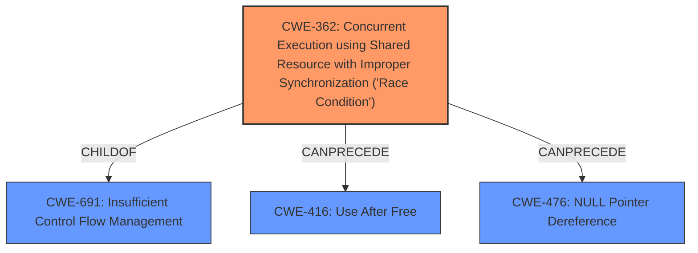

# Enhanced Analysis for CVE-2022-26859

# Summary
| CWE ID | CWE Name | Confidence | CWE Abstraction Level | CWE Vulnerability Mapping Label | CWE-Vulnerability Mapping Notes |
|---|---|---|---|---|---|
| CWE-362 | Concurrent Execution using Shared Resource with Improper Synchronization ('**Race Condition**') | 1.0 | Class | Allowed-with-Review | Primary CWE |

## Evidence and Confidence

*   **Confidence Score:** 1.0
*   **Evidence Strength:** HIGH

## Relationship Analysis
The primary CWE is CWE-362 (**Race Condition**), is a Class-level CWE that is a child of CWE-691 (Insufficient Control Flow Management). It can precede CWE-416 (Use After Free) and CWE-476 (NULL Pointer Dereference).



## Vulnerability Chain
The vulnerability chain starts with a **race condition** (CWE-362) in the Dell BIOS, which allows a local attacker to bypass security checks during SMM. The final impact is a compromise of the system with low confidentiality and high integrity impact.

## Summary of Analysis
The initial assessment strongly points to CWE-362 (**Race Condition**) as the primary weakness. The vulnerability description explicitly mentions a **race condition** in the Dell BIOS, which aligns directly with the definition of CWE-362. The retriever results also confirm that CWE-362 is the top match with a score of 1.0.

*   **Vulnerability Description**: "Dell BIOS contains a **race condition** vulnerability."
*   **Vulnerability Description Key Phrases**: "rootcause: **race condition**"
*   **CVE Reference Links Content Summary**: "**Root cause of vulnerability**: The Dell BIOS contains a **race condition** vulnerability."

CWE-362 is at the Class level, and the mapping guidance suggests examining its children for a better fit. However, none of the children CWEs provide a more specific description of the vulnerability, since the vulnerability is a **race condition**. Therefore, CWE-362 is the most appropriate choice.

Relevant CWE Information:
* CWE-362: Concurrent Execution using Shared Resource with Improper Synchronization (**'Race Condition'**): The product contains a concurrent code sequence that requires temporary, exclusive access to a shared resource, but a timing window exists in which the shared resource can be modified by another code sequence operating concurrently.


## CWE Relationship Analysis

Current CWEs represent these abstraction levels: .


### Vulnerability Chain Analysis

**Chain starting from CWE-476:**
- 476 (NULL Pointer Dereference) - ROOT


**Chain starting from CWE-416:**
- 416 (Use After Free) - ROOT


### CWE Relationship Diagram

```mermaid
graph TD
    classDef primary fill:#f96,stroke:#333,stroke-width:2px
    classDef secondary fill:#69f,stroke:#333
    classDef tertiary fill:#9e9,stroke:#333
```