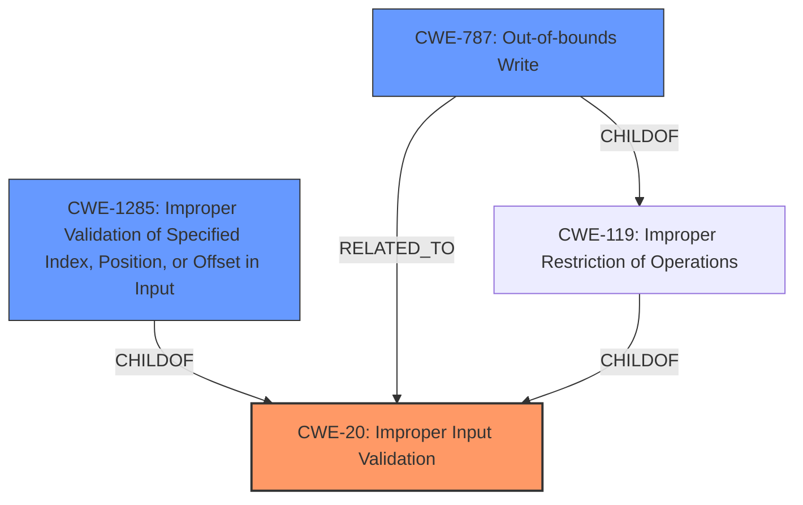

# Analysis Report for CVE-2022-26862

# Vulnerability Analysis Report: CVE-2022-26862

## Description


## Analysis (with Relationship Data)

# Summary
| CWE ID | CWE Name | Confidence | CWE Abstraction Level | CWE Vulnerability Mapping Label | CWE-Vulnerability Mapping Notes |
|---|---|---|---|---|---|
| CWE-20 | Improper Input Validation | 0.8 | Class | Primary | Discouraged |
| CWE-1285 | Improper Validation of Specified Index, Position, or Offset in Input | 0.6 | Base | Secondary | Allowed |
| CWE-787 | Out-of-bounds Write | 0.4 | Base | Secondary | Allowed |

## Evidence and Confidence

*   **Confidence Score:** 0.7
*   **Evidence Strength:** MEDIUM

## Relationship Analysis
The primary relationship influencing the decision is the parent-child relationship between CWE-20, CWE-1285, and CWE-787. CWE-20 is a class-level CWE, while CWE-1285 and CWE-787 are base-level CWEs providing more specific details. While CWE-20 is the primary match based on the description, the potential for out-of-bounds write due to improper validation is also considered. The retriever results also influenced this by listing CWE-1285 and CWE-787 high up in the results.



## Vulnerability Chain
The vulnerability chain starts with **Improper Input Validation (CWE-20)**, which allows a locally authenticated user to send malicious input to an SMI. This can lead to bypassing security controls in SMM and potentially an **Out-of-bounds Write (CWE-787)** if the malicious input is crafted to overwrite memory. Or **Improper Validation of Specified Index, Position, or Offset in Input (CWE-1285)** if the input is used as an index that is not validated.

## Summary of Analysis
The analysis is primarily based on the provided vulnerability description, which highlights an **Input Validation vulnerability** in Dell BIOS. The description states that a locally authenticated malicious user can send malicious input to an SMI to bypass security controls in SMM.

The evidence is:
- Vulnerability Description Key Phrases: **rootcause:** **Input Validation vulnerability**
- CVE Reference Links Content Summary: The root cause of the vulnerability is an Input Validation issue in prior versions of Dell BIOS.

Given this information, **CWE-20 (Improper Input Validation)** is the most appropriate primary CWE, as it directly reflects the **root cause** described in the vulnerability. However, the usage of CWE-20 is discouraged because it's a Class-level CWE. The retriever suggested considering lower-level children. Therefore, I also considered **CWE-1285 (Improper Validation of Specified Index, Position, or Offset in Input)** and **CWE-787 (Out-of-bounds Write)** as secondary CWEs, as the malicious input might be crafted to cause an out-of-bounds write. However, the evidence to support these two is not as strong as for **CWE-20**.

CWE-119 was considered because CWE-787 is a childof CWE-119, however, there is no indication of improper restriction of operations so CWE-119 was not selected.

CWE-20 is selected as the primary CWE because it aligns directly with the provided description of the **Input Validation vulnerability**. While the other CWEs are plausible given the context, the evidence is insufficient to elevate them to primary status.

Relevant CWE Information:
- **CWE-20: Improper Input Validation**
  - The product receives input or data, but it does not validate or incorrectly validates that the input has the properties that are required to process the data safely and correctly.
  - The vulnerability description explicitly mentions an "Input Validation vulnerability," making this CWE a direct match.
  - This weakness is primary in the vulnerability.
  - MITRE Mapping Guidance: Discouraged, consider lower-level children.

- **CWE-1285: Improper Validation of Specified Index, Position, or Offset in Input**
  - The product receives input that is expected to specify an index, position, or offset into an indexable resource such as a buffer or file, but it does not validate or incorrectly validates that the specified index/position/offset has the required properties.
  - This is a plausible scenario if the input is used as an index.
  - This weakness is secondary in the vulnerability.
  - MITRE Mapping Guidance: Allowed.

- **CWE-787: Out-of-bounds Write**
  - The product writes data past the end, or before the beginning, of the intended buffer.
  - The malicious input *could* lead to an out-of-bounds write if it's crafted to overwrite memory.
  - This weakness is secondary in the vulnerability.
  - MITRE Mapping Guidance: Allowed.

Other CWEs Considered but Not Used:
- **CWE-119: Improper Restriction of Operations within the Bounds of a Memory Buffer:** While related to buffer overflows, the description doesn't explicitly state that the vulnerability involves operations outside the bounds of a memory buffer.

I am selecting CWE-20 as the primary CWE and CWE-1285 and CWE-787 as secondary CWEs because they represent the most likely root cause and potential consequences of the vulnerability based on the available information. This selection attempts to balance specificity and accuracy given the limited details in the vulnerability description.


## CWE Relationship Analysis

Current CWEs represent these abstraction levels: .


### Vulnerability Chain Analysis

**Chain starting from CWE-787:**
- 787 (Out-of-bounds Write) - ROOT


**Chain starting from CWE-119:**
- 119 (Improper Restriction of Operations within the Bounds of a Memory Buffer) - ROOT


### CWE Relationship Diagram

```mermaid
graph TD
    classDef primary fill:#f96,stroke:#333,stroke-width:2px
    classDef secondary fill:#69f,stroke:#333
    classDef tertiary fill:#9e9,stroke:#333
```


*Report generated on 2025-03-31 10:16:20*
