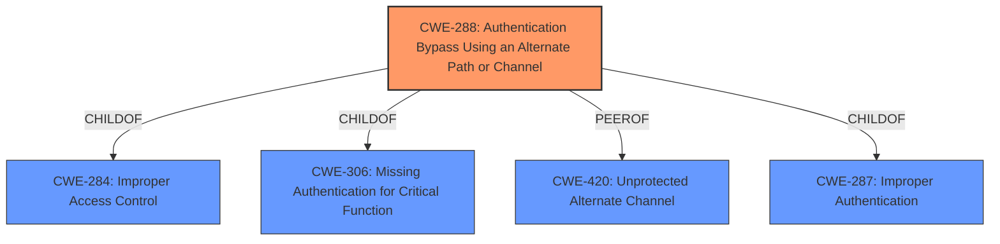

# Analysis Report for CVE-2022-26865

# Vulnerability Analysis Report: CVE-2022-26865

## Description


## Analysis (with Relationship Data)

# Summary
| CWE ID | CWE Name | Confidence | CWE Abstraction Level | CWE Vulnerability Mapping Label | CWE-Vulnerability Mapping Notes |
|---|---|---|---|---|---|
| CWE-288 | Authentication Bypass Using an Alternate Path or Channel | 0.9 | Base | Allowed | Primary CWE |
| CWE-287 | Improper Authentication | 0.6 | Class | Discouraged | Secondary Candidate |

## Evidence and Confidence

*   **Confidence Score:** 0.9
*   **Evidence Strength:** HIGH

## Relationship Analysis
The primary CWE selected is CWE-288, Authentication Bypass Using an Alternate Path or Channel, a Base level CWE. It is related to CWE-284, Improper Access Control (Pillar), and CWE-306, Missing Authentication for Critical Function (Base), as a ChildOf. CWE-420 Unprotected Alternate Channel (Base) is a peer.
CWE-287, Improper Authentication, is a Class level CWE and a parent of CWE-288. Because the description provides enough detail to warrant a Base level CWE, CWE-288 is preferred.



## Vulnerability Chain
The vulnerability chain involves an **authentication bypass** due to an alternate path or channel, ultimately leading to the ability to run arbitrary code on the system as an administrator.
- **Root Cause:** **Authentication Bypass** via alternate channel (CWE-288)
- **Impact:** Ability to run arbitrary code with administrator privileges.

## Summary of Analysis
The vulnerability description clearly indicates an **authentication bypass** vulnerability in Dell Support Assist OS Recovery versions before 5.5.2. An unauthenticated attacker with physical access to the system can bypass OS Recovery authentication to run arbitrary code on the system as Administrator.

The selection of CWE-288 (Authentication Bypass Using an Alternate Path or Channel) as the primary CWE is based on the following evidence:

*   The **Vulnerability Description Key Phrases** section explicitly identifies "**Authentication Bypass**" as a **weakness**.
*   The **CVE Reference Links Content Summary** confirms the presence of an **authentication bypass**.
*   The attacker can bypass the OS Recovery authentication and run arbitrary code on the system with Administrator privileges.
*   The **Retriever Results** identifies CWE-288 as the top combined result.

CWE-288 aligns with the vulnerability description because it specifically addresses situations where a product requires authentication but has an alternate path or channel that does not require authentication. In this case, an attacker with physical access can bypass the OS Recovery authentication process, which is the intended authentication mechanism. The impact of this bypass is significant, as it allows the attacker to run arbitrary code with administrator privileges.

CWE-287 (Improper Authentication) was considered but not chosen as the primary CWE because it is a more general class of weakness. While the vulnerability does involve improper authentication, the specific mechanism of the bypass through an alternate path or channel is better captured by CWE-288. Also, the MITRE mapping guidance discourages the use of CWE-287 when lower-level CWE entries are applicable.

The confidence level in the mapping is high (0.9) due to the explicit mention of **authentication bypass** in the vulnerability description and the alignment of CWE-288 with the identified attack vector and impact.


## CWE Relationship Analysis

Current CWEs represent these abstraction levels: .


### Vulnerability Chain Analysis

**Chain starting from CWE-420:**
- 420 (Unprotected Alternate Channel) - ROOT


**Chain starting from CWE-287:**
- 287 (Improper Authentication) - ROOT


### CWE Relationship Diagram

```mermaid
graph TD
    classDef primary fill:#f96,stroke:#333,stroke-width:2px
    classDef secondary fill:#69f,stroke:#333
    classDef tertiary fill:#9e9,stroke:#333
```


*Report generated on 2025-03-30 11:16:20*
