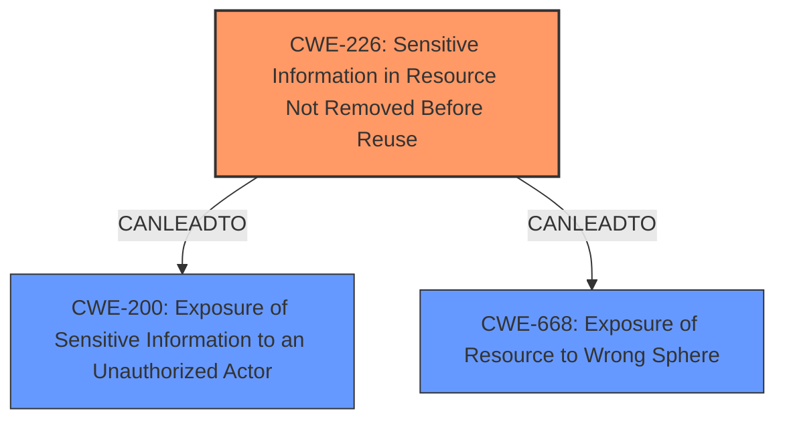

# Analysis for CVE-2022-26869

# Summary
| CWE ID | CWE Name | Confidence | CWE Abstraction Level | CWE Vulnerability Mapping Label | CWE-Vulnerability Mapping Notes |
|---|---|---|---|---|---|
| CWE-226 | Sensitive Information in Resource Not Removed Before Reuse | 0.7 | Base | Allowed | Primary CWE |

## Evidence and Confidence

*   **Confidence Score:** 0.7
*   **Evidence Strength:** MEDIUM

## Relationship Analysis
The primary CWE identified is CWE-226, which focuses on resources not being properly cleared before reuse. While other CWEs like CWE-668 (Exposure of Resource to Wrong Sphere) and CWE-200 (Exposure of Sensitive Information to an Unauthorized Actor) relate to exposure of information, CWE-226 directly addresses the **root cause** of sensitive data lingering in reused resources. The relationship between these CWEs is that CWE-226 can lead to CWE-200 or CWE-668 if the uncleared resource is exposed.

## Vulnerability Chain
The vulnerability chain starts with the **open port**, which allows access to resources. If sensitive information is present in those resources and is not cleared before reuse (CWE-226), it can lead to information disclosure. The arbitrary code execution component suggests a deeper vulnerability, possibly stemming from how the **open port** is handled or the services exposed through it.

## Summary of Analysis
The initial analysis identified the **open port** as a primary concern, leading to potential information disclosure. After reviewing the retriever results and the complete CWE specifications, the focus shifted to the **root cause** of the information disclosure, which is likely due to sensitive information not being cleared from resources before reuse (CWE-226). This is supported by the vulnerability description mentioning information disclosure, and the "CVE Reference Links Content Summary" indicating the **weakness** is an **open port** leading to information disclosure.

The selection of CWE-226 is based on the evidence suggesting that the **open port** allows access to resources containing sensitive information that is not properly cleared. This aligns with CWE-226's description of releasing a resource without clearing sensitive information. This decision reflects the need to identify the most specific **root cause** weakness rather than just the impact (information disclosure). The confidence score is 0.7 because the evidence directly supports the presence of an **open port** and information disclosure, but the specific mechanism of resource reuse and lack of clearing is inferred.

Relevant CWE Information:

# Enhanced Context (25 CWEs)

## CWE-226: Sensitive Information in Resource Not Removed Before Reuse
**Abstraction Level**: Base
**Similarity Score**: 0.77
**Source**: dense

**Description**:
The product releases a resource such as memory or a file so that it can be made available for reuse, but it does not clear or "zeroize" the information contained in the resource before the product performs a critical state transition or makes the resource available for reuse by other entities.

**Mapping Guidance**:
- Usage: Allowed
- Rationale: This CWE entry is at the Base level of abstraction, which is a preferred level of abstraction for mapping to the root causes of vulnerabilities.