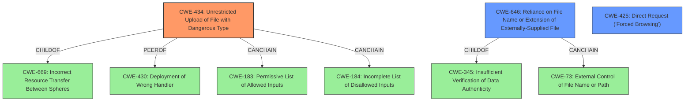

# Raw Analyzer Response for CVE-2022-26871

# Summary
| CWE ID | CWE Name | Confidence | CWE Abstraction Level | CWE Vulnerability Mapping Label | CWE-Vulnerability Mapping Notes |
|---|---|---|---|---|---|
| CWE-434 | Unrestricted Upload of File with Dangerous Type | 1 | Base | Allowed | Primary CWE |
| CWE-646 | Reliance on File Name or Extension of Externally-Supplied File | 0.7 | Variant | Allowed | Secondary Candidate |
| CWE-425 | Direct Request ('Forced Browsing') | 0.6 | Base | Allowed | Secondary Candidate |

## Evidence and Confidence

*   **Confidence Score:** 0.9
*   **Evidence Strength:** HIGH

## Relationship Analysis
The primary CWE selected, CWE-434 [Unrestricted Upload of File with Dangerous Type], stands as a base-level weakness. Its relationship to CWE-669 [Incorrect Resource Transfer Between Spheres] as a child reinforces the notion of a resource (the uploaded file) being mishandled. The potential for chaining with CWE-183 [Permissive List of Allowed Inputs] or CWE-184 [Incomplete List of Disallowed Inputs] highlights scenarios where attempts to restrict file types are either too lenient or incomplete. The peer relationship with CWE-430 [Deployment of Wrong Handler] suggests possible alternative classifications based on how the uploaded file is processed. Additionally, the variant CWE-646 [Reliance on File Name or Extension of Externally-Supplied File] is a child of CWE-345 [Insufficient Verification of Data Authenticity] and could be chained to CWE-73 [External Control of File Name or Path].

## Vulnerability Chain
The vulnerability chain starts with the **unrestricted file upload** (CWE-434), which then leads to the potential for **arbitrary code execution**. The **improper check for file contents** is the root cause, which allows for the upload of malicious files.

## Summary of Analysis
The initial analysis focused on the **arbitrary file upload** vulnerability and its potential impact, remote code execution. The evidence from the CVE Reference Links Content Summary clearly indicates that the **improper check for file contents** during the file upload process is the root cause.

The provided evidence states: "The vulnerability stems from an **improper check for file contents** during file upload processes" and "The primary weakness is the lack of proper validation of file content during upload. This allows an attacker to upload arbitrary files, including malicious ones."

Based on this evidence and the CWE descriptions, CWE-434 [Unrestricted Upload of File with Dangerous Type] is the most appropriate primary CWE. It accurately describes the vulnerability where the product allows the upload of dangerous file types that are automatically processed within its environment.

CWE-646 [Reliance on File Name or Extension of Externally-Supplied File] was considered because the application might be relying on the file name or extension to determine the appropriate behaviors, which could be exploited by attackers. However, the primary issue is the lack of proper validation of file content, making CWE-434 a more direct fit.

CWE-425 [Direct Request ('Forced Browsing')] was also considered as a possibility. This CWE applies when a web application does not adequately enforce appropriate authorization on all restricted URLs, scripts, or files. While not the primary issue, this could be a contributing factor if the file upload functionality lacks proper access controls.

The selected CWEs are at the optimal level of specificity. CWE-434 is a base-level CWE that directly addresses the root cause of the vulnerability.
Relevant CWE Information:

# Enhanced Context (25 CWEs)
The following CWEs were identified as potentially relevant to this vulnerability:

## CWE-59: Improper Link Resolution Before File Access ('Link Following')
**Abstraction Level**: Base
**Similarity Score**: 0.80
**Source**: dense

**Description**:
The product attempts to access a file based on the filename, but it does not properly prevent that filename from identifying a link or shortcut that resolves to an unintended resource.

**Mapping Guidance**:
- Usage: Allowed
- Rationale: This CWE entry is at the Base level of abstraction, which is a preferred level of abstraction for mapping to the root causes of vulnerabilities.

## CWE-23: Relative Path Traversal
**Abstraction Level**: Base
**Similarity Score**: 0.79
**Source**: dense

**Description**:
The product uses external input to construct a pathname that should be within a restricted directory, but it does not properly neutralize sequences such as ".." that can resolve to a location that is outside of that directory.

**Mapping Guidance**:
- Usage: Allowed
- Rationale: This CWE entry is at the Base level of abstraction, which is a preferred level of abstraction for mapping to the root causes of vulnerabilities.

## CWE-73: External Control of File Name or Path
**Abstraction Level**: Base
**Similarity Score**: 0.78
**Source**: dense

**Description**:
The product allows user input to control or influence paths or file names that are used in filesystem operations.

**Mapping Guidance**:
- Usage: Allowed
- Rationale: This CWE entry is at the Base level of abstraction, which is a preferred level of abstraction for mapping to the root causes of vulnerabilities.

## CWE-41: Improper Resolution of Path Equivalence
**Abstraction Level**: Base
**Similarity Score**: 0.78
**Source**: dense

**Description**:
The product is vulnerable to file system contents disclosure through path equivalence. Path equivalence involves the use of special characters in file and directory names. The associated manipulations are intended to generate multiple names for the same object.

**Mapping Guidance**:
- Usage: Allowed
- Rationale: This CWE entry is at the Base level of abstraction, which is a preferred level of abstraction for mapping to the root causes of vulnerabilities.

## CWE-1386: Insecure Operation on Windows Junction / Mount Point
**Abstraction Level**: Base
**Similarity Score**: 0.78
**Source**: dense

**Description**:
The product opens a file or directory, but it does not properly prevent the name from being associated with a junction or mount point to a destination that is outside of the intended control sphere.

**Mapping Guidance**:
- Usage: Allowed
- Rationale: This CWE entry is at the Base level of abstraction, which is a preferred level of abstraction for mapping to the root causes of vulnerabilities.

## CWE-552: Files or Directories Accessible to External Parties
**Abstraction Level**: Base
**Similarity Score**: 0.77
**Source**: dense

**Description**:
The product makes files or directories accessible to unauthorized actors, even though they should not be.

**Mapping Guidance**:
- Usage: Allowed
- Rationale: This CWE entry is at the Base level of abstraction, which is a preferred level of abstraction for mapping to the root causes of vulnerabilities.

## CWE-427: Uncontrolled Search Path Element
**Abstraction Level**: Base
**Similarity Score**: 0.77
**Source**: dense

**Description**:
The product uses a fixed or controlled search path to find resources, but one or more locations in that path can be under the control of unintended actors.

**Mapping Guidance**:
- Usage: Allowed
- Rationale: This CWE entry is at the Base level of abstraction, which is a preferred level of abstraction for mapping to the root causes of vulnerabilities.

## CWE-668: Exposure of Resource to Wrong Sphere
**Abstraction Level**: