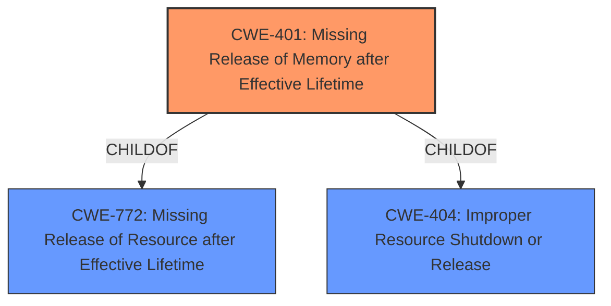

# Raw Analyzer Response for CVE-2022-26878

# Summary

| CWE ID  | CWE Name                                            | Confidence | CWE Abstraction Level | CWE Vulnerability Mapping Label | CWE-Vulnerability Mapping Notes |
| :-------- | :-------------------------------------------------- | :--------- | :---------------------- | :------------------------------ | :------------------------------ |
| CWE-401 | Missing Release of Memory after Effective Lifetime | 1.0        | Variant                 | Allowed                       | Primary CWE                   |

## Evidence and Confidence

*   **Confidence Score:** 1.0
*   **Evidence Strength:** HIGH

## Relationship Analysis

The primary relationship identified is that CWE-401 is a variant of both CWE-772 (Missing Release of Resource after Effective Lifetime) and CWE-404 (Improper Resource Shutdown or Release). Selecting CWE-401 provides a more specific classification of the memory leak vulnerability compared to its parents.

## Vulnerability Chain

The vulnerability chain consists of a **memory leak** due to missing release of memory, leading to potential resource exhaustion and denial of service.

## Summary of Analysis

The analysis strongly supports the classification of the vulnerability as CWE-401 (Missing Release of Memory after Effective Lifetime).

*   The vulnerability description explicitly mentions a **memory leak**. The key phrase extracted was "**weakness:** **memory leak**".
*   The CVE Reference Links Content Summary provides detailed information about the root cause, confirming that the `virtbt_rx_handle()` function in the Linux VirtIO Bluetooth driver **fails to free allocated socket buffers** when packets with invalid types are received. This directly aligns with the description of CWE-401, which states that the product does not sufficiently track and release allocated memory after it has been used.
*   The "Retriever Results" list CWE-401 as the top match with a score of 1.0.
*   CWE-401 is a Variant, which is a preferred level of abstraction.

Based on the evidence, the vulnerability is a classic memory leak scenario, making CWE-401 the most appropriate and specific classification.

**CWEs Considered But Not Used:**

*   CWE-226 (Sensitive Information in Resource Not Removed Before Reuse): This CWE was considered but deemed less appropriate because the vulnerability is primarily about failing to release memory, not about sensitive information being left in memory.
*   CWE-362 (Concurrent Execution using Shared Resource with Improper Synchronization ('Race Condition')): This CWE was considered but is not applicable as the vulnerability does not involve concurrent execution or synchronization issues.
*   CWE-909 (Missing Initialization of Resource): This CWE was considered, but it's about failing to initialize a resource, while the current vulnerability is about failing to release it after use.
*   CWE-911 (Improper Update of Reference Count): This CWE was considered but is not applicable as the vulnerability doesn't involve reference counting.
*   CWE-126 (Buffer Over-read): This CWE was considered but is not relevant as the vulnerability is about memory leaks, not reading beyond buffer boundaries.
*   CWE-908 (Use of Uninitialized Resource): This CWE was considered but is about using an uninitialized resource, while the current vulnerability is about failing to release a resource after use.
*   CWE-415 (Double Free): This CWE was considered but is about freeing the same memory twice, which is distinct from a memory leak where memory is not freed at all.
*   CWE-822 (Untrusted Pointer Dereference): This CWE was considered but is about dereferencing pointers from untrusted sources, which is not related to the described memory leak.
*   CWE-476 (NULL Pointer Dereference): This CWE was considered, but the vulnerability is not about dereferencing NULL pointers.