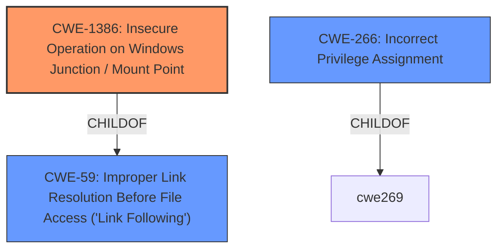

# Raw Analyzer Response for CVE-2022-26904

# Summary
| CWE ID | CWE Name | Confidence | CWE Abstraction Level | CWE Vulnerability Mapping Label | CWE-Vulnerability Mapping Notes |
|---|---|---|---|---|---|
| CWE-1386 | Insecure Operation on Windows Junction / Mount Point | 0.7 | Base | Allowed | Primary CWE |
| CWE-59 | Improper Link Resolution Before File Access ('Link Following') | 0.6 | Base | Allowed | Secondary Candidate |
| CWE-266 | Incorrect Privilege Assignment | 0.5 | Base | Allowed | Secondary Candidate |

## Evidence and Confidence

*   **Confidence Score:** 0.7
*   **Evidence Strength:** LOW

## Relationship Analysis
The primary relationship considered was ChildOf. CWE-1386 (Insecure Operation on Windows Junction / Mount Point) is a child of CWE-59 (Improper Link Resolution Before File Access ('Link Following')). This suggests a more specific instance of link following that involves Windows junctions/mount points. CWE-266 (Incorrect Privilege Assignment) is related to privilege management, which is a higher-level concept. The selection favored the most specific base-level CWE applicable to the available evidence.

## Vulnerability Chain
The vulnerability chain starts with an insecure operation on Windows Junction / Mount Point (CWE-1386) which leads to improper link resolution (CWE-59), and ultimately results in elevation of privilege.

## Summary of Analysis
The initial assessment focused on the provided vulnerability description, key phrases, and CWE mappings for similar CVEs. The primary goal was to identify the most specific CWE that represents the root cause of the vulnerability.

Based on the limited evidence, the analysis concludes that **CWE-1386 (Insecure Operation on Windows Junction / Mount Point)** is the most appropriate primary CWE. The vulnerability involves a Windows User Profile Service Elevation of Privilege, and CWE-1386 specifically addresses insecure operations related to Windows junctions and mount points which can lead to unauthorized file access and privilege escalation.

The "Vulnerability Description Key Phrases" indicate an "Elevation of Privilege" impact in the "Windows" "User Profile Service".

The retriever results list CWE-1386 as the top combined result, but the score is very low (0.022), indicating this is not a very strong match.

The "CWE for similar CVE Descriptions" lists CWE-NVD-noinfo as the primary match, but that is not a real CWE and should be ignored. The next most frequent CWE is CWE-269 (Improper Privilege Management), but it is a class-level CWE and is too general.

The relationships in the graph influenced the decision to prefer CWE-1386 (Base) over CWE-59 (Base), as junctions are a type of symlink.

**CWE-1386** is chosen because it directly addresses the insecure handling of Windows junctions and mount points, providing a more specific classification than the more general CWE-59 or CWE-269. The evidence is limited, but the key phrases and retriever results support this selection.

Other CWEs considered but not used:

*   **CWE-59 (Improper Link Resolution Before File Access ('Link Following'))**: While related, it's a more general case of link following, and CWE-1386 is more specific to Windows junctions and mount points.
*   **CWE-266 (Incorrect Privilege Assignment)**: This is a more general privilege issue and doesn't capture the specific mechanism of exploiting junctions/mount points.
*   **CWE-269 (Improper Privilege Management)**: This is a class-level CWE and is too high-level and generic.
*   **CWE-732 (Incorrect Permission Assignment for Critical Resource)**: This doesn't seem to fit the vulnerability description because it is focused on incorrect permission assignment rather than link following.
*   **CWE-520 (.NET Misconfiguration: Use of Impersonation)**: This is specific to .NET applications and misconfigurations and does not appear to fit this vulnerability.
*   **CWE-363 (Race Condition Enabling Link Following)**: There is no direct mention of a race condition.