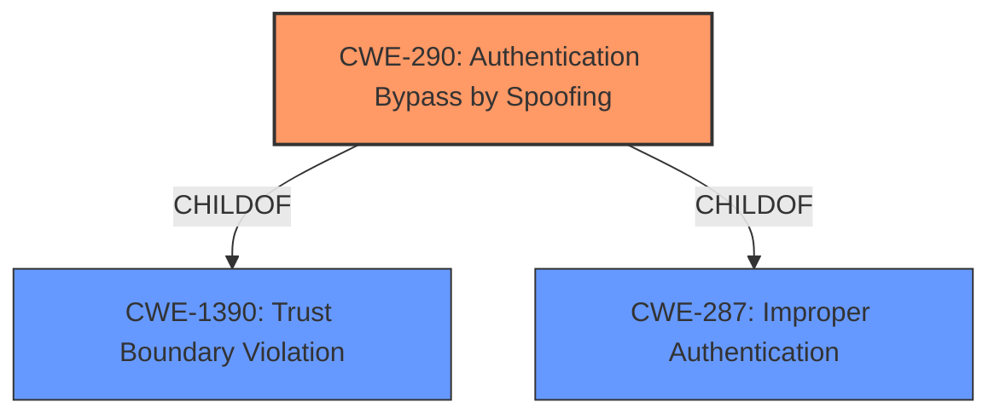

# Raw Analyzer Response for CVE-2022-26925

# Summary
| CWE ID | CWE Name | Confidence | CWE Abstraction Level | CWE Vulnerability Mapping Label | CWE-Vulnerability Mapping Notes |
|---|---|---|---|---|---|
| CWE-290 | Authentication Bypass by Spoofing | 0.7 | Base | Allowed | Primary CWE |

## Evidence and Confidence

*   **Confidence Score:** 0.7
*   **Evidence Strength:** LOW

## Relationship Analysis
The analysis considered the following relationships:
  - CWE-290 is a base-level CWE, making it a suitable candidate.
  - CWE-290 has ChildOf relationships with CWE-1390 and CWE-287, indicating potential further refinement, but the provided information doesn't support a more specific classification.

## Vulnerability Chain
The vulnerability chain appears to be:
  - **Root Cause:** Likely **improper authentication**, possibly due to a **trust boundary violation**, leading to
  - **Weakness:** Authentication Bypass by Spoofing.

## Summary of Analysis
Based on the limited information provided, the vulnerability is classified as CWE-290, Authentication Bypass by Spoofing. The description indicates a Windows LSA Spoofing Vulnerability, suggesting that an attacker can **spoof** the LSA (Local Security Authority) to bypass authentication.

The primary evidence is the vulnerability title "Windows LSA Spoofing Vulnerability".

The Retriever Results also highlight CWE-290 as a potential match.

CWE-290 is a base-level CWE, which is a preferred level of abstraction.

Other CWEs were considered:
*   CWE-295 (Improper Certificate Validation) and CWE-297 (Improper Validation of Certificate with Host Mismatch) were considered but deemed less relevant as the description does not mention certificate-related issues.
*   CWE-494 (Download of Code Without Integrity Check) was also considered, but it does not align with the vulnerability description.
*   CWE-79 (Improper Neutralization of Input During Web Page Generation ('Cross-site Scripting')) was deemed irrelevant since the vulnerability is not related to web page generation or input neutralization.

The selection of CWE-290 is based on the evidence available, the retriever results and the definition of the CWE. The confidence level is moderate (0.7) due to the limited information provided in the vulnerability description.