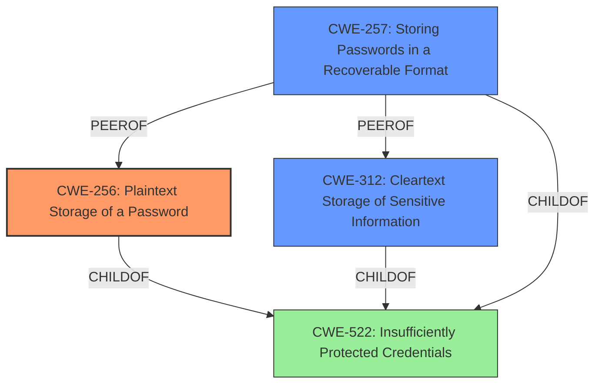

# Raw Analyzer Response for CVE-2022-26948

# Summary
| CWE ID | CWE Name | Confidence | CWE Abstraction Level | CWE Vulnerability Mapping Label | CWE-Vulnerability Mapping Notes |
|---|---|---|---|---|---|
| CWE-256 | Plaintext Storage of a Password | 0.9 | Base | Allowed | Primary CWE. Matches the **insecure credential storage** rootcause. |
| CWE-312 | Cleartext Storage of Sensitive Information | 0.7 | Base | Allowed | Secondary candidate. Addresses the **insecure credential storage** and aligns with the description of storing sensitive information in cleartext. |
| CWE-257 | Storing Passwords in a Recoverable Format | 0.6 | Base | Allowed | Secondary candidate. Addresses the **insecure credential storage**, although "recoverable" is less precise than "plaintext". |
| CWE-522 | Insufficiently Protected Credentials | 0.5 | Class | Allowed-with-Review | Secondary candidate. A more general class of the vulnerability. |

## Evidence and Confidence

*   **Confidence Score:** 0.8
*   **Evidence Strength:** HIGH

## Relationship Analysis
The primary CWE is CWE-256, a Base level weakness, which is a child of CWE-522, a Class level weakness. The vulnerability description focuses on **insecure credential storage**, with a clear indication of the credentials being stored in a way that allows unauthorized access. CWE-256 specifically deals with passwords stored in plaintext, which is the most direct and specific match, thus a base level. CWE-312, while also relevant, is more general, covering cleartext storage of any sensitive information. Therefore, CWE-256 is more precise. CWE-257 addresses recoverable format, which is less specific than plaintext.

## Vulnerability Chain
The chain of the vulnerability is as follows:
1.  Root Cause: **Insecure credential storage** (CWE-256).
2.  Impact: A malicious attacker may obtain access to credential information.

## Summary of Analysis
The analysis identified that the root cause of the vulnerability is the **insecure credential storage**, leading to the potential for a malicious attacker to obtain access to credential information.

The primary CWE selected is CWE-256, which directly addresses the **plaintext storage of a password**. The evidence from the vulnerability description clearly states **insecure credential storage**, which aligns perfectly with the definition of CWE-256.

The graph relationships indicate that CWE-256 is a child of CWE-522 (Insufficiently Protected Credentials). While CWE-522 is a broader category, CWE-256 provides a more specific classification. Other considered CWEs, such as CWE-312 (Cleartext Storage of Sensitive Information) and CWE-257 (Storing Passwords in a Recoverable Format), were deemed less precise than CWE-256, since the vulnerability description implies direct plaintext storage.

The final selection of CWE-256 is at the optimal level of specificity because it directly reflects the root cause presented in the vulnerability description.

Relevant CWE Information:

# Enhanced Context (25 CWEs)

## CWE-1220: Insufficient Granularity of Access Control
**Abstraction Level**: Base
**Similarity Score**: 0.77
**Source**: dense

**Description**:
The product implements access controls via a policy or other feature with the intention to disable or restrict accesses (reads and/or writes) to assets in a system from untrusted agents. However, implemented access controls lack required granularity, which renders the control policy too broad because it allows accesses from unauthorized agents to the security-sensitive assets.

**Mapping Guidance**:
- Usage: Allowed
- Rationale: This CWE entry is at the Base level of abstraction, which is a preferred level of abstraction for mapping to the root causes of vulnerabilities.

This CWE is not applicable as the description doesn't mention anything about access control granularity.

## CWE-807: Reliance on Untrusted Inputs in a Security Decision
**Abstraction Level**: Base
**Similarity Score**: 0.77
**Source**: dense

**Description**:
The product uses a protection mechanism that relies on the existence or values of an input, but the input can be modified by an untrusted actor in a way that bypasses the protection mechanism.

**Mapping Guidance**:
- Usage: Allowed
- Rationale: This CWE entry is at the Base level of abstraction, which is a preferred level of abstraction for mapping to the root causes of vulnerabilities.

This CWE is not applicable as the description doesn't mention the use of untrusted inputs in security decisions.

## CWE-639: Authorization Bypass Through User-Controlled Key
**Abstraction Level**: Base
**Similarity Score**: 0.77
**Source**: dense

**Description**:
The system's authorization functionality does not prevent one user from gaining access to another user's data or record by modifying the key value identifying the data.

**Mapping Guidance**:
- Usage: Allowed
- Rationale: This CWE entry is at the Base level of abstraction, which is a preferred level of abstraction for mapping to the root causes of vulnerabilities.

This CWE is not applicable as the description doesn't mention authorization bypass through user-controlled keys.

## CWE-274: Improper Handling of Insufficient Privileges
**Abstraction Level**: Base
**Similarity Score**: 0.76
**Source**: dense

**Description**:
The product does not handle or incorrectly handles when it has insufficient privileges to perform an operation, leading to resultant weaknesses.

**Mapping Guidance**:
- Usage: Discouraged
- Rationale: This CWE entry could be deprecated in a future version of CWE.

This CWE is not applicable as the description doesn't mention anything about insufficient privileges.

## CWE-312: Cleartext Storage of Sensitive Information
**Abstraction Level**: Base
**Similarity Score**: 0.75
**Source**: dense

**Description**:
The product stores sensitive information in cleartext within a resource that might be accessible to another control sphere.

**Mapping Guidance**:
- Usage: Allowed
- Rationale: This CWE entry is at the Base level of abstraction, which is a preferred level of abstraction for mapping to the root causes of vulnerabilities.

This is a candidate since the **insecure credential storage** may be the result of storing information in cleartext.

## CWE-552: Files or Directories Accessible to External Parties
**Abstraction Level**: Base
**Similarity Score**: 0.75
**Source**: dense

**Description**:
The product makes files or directories accessible to unauthorized actors, even though they should not be.

**Mapping Guidance**:
- Usage: Allowed
- Rationale: This CWE entry is at the Base level of abstraction, which is a preferred level of abstraction for mapping to the root causes of vulnerabilities.

This CWE is not applicable because the description doesn't specifically state files or directories accessible to external parties.

## CWE-653: Improper Isolation or Compartmentalization
**Abstraction Level**: Class
**Similarity Score**: 0.75
**Source**: dense

**Description**:
The product does not properly compartmentalize or isolate functionality, processes, or resources that require different privilege levels, rights, or permissions.

**Mapping Guidance**:
- Usage: Allowed
- Rationale: This CWE entry is at the Base level of abstraction, which is a preferred level of abstraction for mapping to the root causes of vulnerabilities.

This CWE is not applicable because the description doesn't specifically relate to compartmentalization or isolation.

## CWE-280: Improper Handling of Insufficient Permissions or Privileges
**Abstraction Level**: Base
**Similarity Score**: 0.75
**Source**: dense

**Description**:
The product does not handle or incorrectly handles when it has insufficient privileges to access resources or functionality as specified by their permissions. This may cause it to follow unexpected code paths that may leave the product in an invalid state.

**Mapping Guidance**:
- Usage: Allowed
- Rationale: This CWE entry is at the Base level of abstraction, which is a preferred level of abstraction for mapping to the root causes of vulnerabilities.

This CWE is not applicable as the description doesn't mention anything about insufficient permissions or privileges.

## CWE-668: Exposure of Resource to Wrong Sphere
**