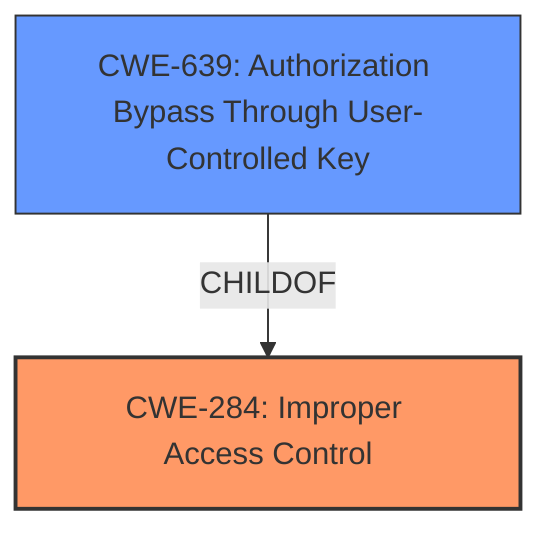

# Raw Analyzer Response for CVE-2022-26949

# Summary
| CWE ID | CWE Name | Confidence | CWE Abstraction Level | CWE Vulnerability Mapping Label | CWE-Vulnerability Mapping Notes |
|---|---|---|---|---|---|
| CWE-284 | Improper Access Control | 0.7 | Pillar | Primary | Discouraged |
| CWE-639 | Authorization Bypass Through User-Controlled Key | 0.6 | Base | Secondary | Allowed |

## Evidence and Confidence

*   **Confidence Score:** 0.7
*   **Evidence Strength:** MEDIUM

## Relationship Analysis
The primary CWE chosen is CWE-284, **Improper Access Control**, a Pillar-level CWE. While it is discouraged, the description clearly indicates an access control issue. CWE-639, **Authorization Bypass Through User-Controlled Key**, is also considered as a secondary CWE because it's a Base level that could be possible if the access control issue involves bypassing authorization through a user-controlled key. The relationship between CWE-639 and CWE-284 is that CWE-639 is a ChildOf CWE-284.

## Vulnerability Chain
The chain begins with **improper access control** (CWE-284) which then could lead to an **authorization bypass** (CWE-639), ultimately resulting in a malicious user gaining access to restricted files.

## Summary of Analysis
The initial analysis identified **improper access control** as the root cause, as stated in the Vulnerability Description Key Phrases. The Retriever Results also indicated CWE-284 as a possible candidate. However, CWE-284 is a Pillar level CWE and is discouraged. As such, more specific Base level CWEs that are related to Improper Access Control were considered.

The vulnerability description states: "A remote authenticated malicious user could potentially exploit this vulnerability to gain access to files that should only be allowed by extra privileges." This suggests that the authentication process is working, but the authorization process is flawed. Therefore, authorization-related CWEs are more suitable.

CWE-639, **Authorization Bypass Through User-Controlled Key**, is a base level CWE, and it describes a scenario where authorization is bypassed via a user-controlled key. It is a ChildOf CWE-284. This CWE could be relevant if the access to restricted files is achieved through manipulating a user-controlled key.

CWE-284, **Improper Access Control**, is selected as the primary CWE with a confidence of 0.7 because the vulnerability description explicitly mentions "improper access control." Even though it is a Pillar and discouraged, it is the most direct representation of the described weakness.

CWE-639, **Authorization Bypass Through User-Controlled Key**, is selected as a secondary candidate with a confidence of 0.6 because it's a possible attack vector if the access control is flawed.

The final selection is based on the provided evidence and the relationships between CWEs, favoring the most direct representation of the weakness while also acknowledging a potential attack vector.

Relevant CWE Information:

# Enhanced Context (25 CWEs)
The following CWEs were identified as potentially relevant to this vulnerability:

## CWE-274: Improper Handling of Insufficient Privileges
**Abstraction Level**: Base
**Similarity Score**: 0.77
**Source**: dense

**Description**:
The product does not handle or incorrectly handles when it has insufficient privileges to perform an operation, leading to resultant weaknesses.

**Mapping Guidance**:
- Usage: Discouraged
- Rationale: This CWE entry could be deprecated in a future version of CWE.

*This CWE was not selected because the vulnerability description does not focus on the product's handling of insufficient privileges, but rather the **improper access control**.*

## CWE-538: Insertion of Sensitive Information into Externally-Accessible File or Directory
**Abstraction Level**: Base
**Similarity Score**: 0.77
**Source**: dense

**Description**:
The product places sensitive information into files or directories that are accessible to actors who are allowed to have access to the files, but not to the sensitive information.

**Mapping Guidance**:
- Usage: Allowed
- Rationale: This CWE entry is at the Base level of abstraction, which is a preferred level of abstraction for mapping to the root causes of vulnerabilities.

*This CWE was not selected because the vulnerability description does not mention the insertion of sensitive information.*

## CWE-668: Exposure of Resource to Wrong Sphere
**Abstraction Level**: Class
**Similarity Score**: 0.77
**Source**: dense

**Description**:
The product exposes a resource to the wrong control sphere, providing unintended actors with inappropriate access to the resource.

**Mapping Guidance**:
- Usage: Discouraged
- Rationale: CWE-668 is high-level and is often misused as a catch-all when lower-level CWE IDs might be applicable. It is sometimes used for low-information vulnerability reports [REF-1287]. It is a level-1 Class (i.e., a child of a Pillar). It is not useful for trend analysis.

*This CWE was not selected because it is too general, and the vulnerability description points more towards **improper access control**.*

## CWE-552: Files or Directories Accessible to External Parties
**Abstraction Level**: Base
**Similarity Score**: 0.77
**Source**: dense

**Description**:
The product makes files or directories accessible to unauthorized actors, even though they should not be.

**Mapping Guidance**:
- Usage: Allowed
- Rationale: This CWE entry is at the Base level of abstraction, which is a preferred level of abstraction for mapping to the root causes of vulnerabilities.

*This CWE was not selected because it focuses on the accessibility of files and directories, but the root cause is **improper access control**.*

## CWE-280: Improper Handling of Insufficient Permissions or Privileges
**Abstraction Level**: Base
**Similarity Score**: 0.76
**Source**: dense

**Description**:
The product does not handle or incorrectly handles when it has insufficient privileges to access resources or functionality as specified by their permissions. This may cause it to follow unexpected code paths that may leave the product in an invalid state.

**Mapping Guidance**:
- Usage: Allowed
- Rationale: This CWE entry is at the Base level of abstraction, which is a preferred level of abstraction for mapping to the root causes of vulnerabilities.

*This CWE was not selected because the vulnerability is about **improper access control**, not about handling insufficient privileges.*

## CWE-497: Exposure of Sensitive System Information to an Unauthorized Control Sphere
**Abstraction Level**: Base
**Similarity Score**: 0.76
**Source**: dense

**Description**:
The product does not properly prevent sensitive system-level information from being accessed by unauthorized actors who do not have the same level of access to the underlying system as the product does.

**Mapping Guidance**:
- Usage: Allowed
- Rationale: This CWE entry is at the Base level of abstraction, which is a preferred level of abstraction for mapping to the root causes of vulnerabilities.

*This CWE was not selected because it focuses on exposure of sensitive system information, which is not the primary concern in the vulnerability description.*

## CWE-807: Reliance on Untrusted Inputs in a Security Decision
**Abstraction Level**: Base
**Similarity Score**: 0.76
**Source**: dense

**Description**:
The product uses a protection mechanism that relies on the existence or values of an input, but the input can be modified by an untrusted actor in a way that bypasses the protection mechanism.

**Mapping Guidance**:
- Usage: Allowed
- Rationale: This CWE entry is at the Base level of abstraction, which is a preferred level of abstraction for mapping to the root causes of vulnerabilities.

*This CWE was not selected because it focuses on reliance on untrusted inputs in a security decision, which is not explicitly mentioned in the vulnerability description.*

## CWE-212: Improper Removal of Sensitive Information Before Storage or Transfer
**Abstraction Level**: Base
**Similarity Score**: 0.76
**Source**: dense

**Description**:
The product stores, transfers, or shares a resource that contains sensitive information, but it does not properly remove that information before the product makes the resource available to unauthorized actors.

**Mapping Guidance**:
- Usage: Allowed
- Rationale: This CWE entry is at the Base level of abstraction, which is a preferred level of abstraction for mapping to the root causes of vulnerabilities.

*This CWE was not selected because it focuses on the improper removal of sensitive information, which is not the primary concern in the vulnerability description.*

## CWE-226: Sensitive Information in Resource Not Removed Before Reuse
**Abstraction Level**: Base
**Similarity Score**: 0.76
**Source**: dense

**Description**:
The product releases a resource such as memory or a file so that it can be made available for reuse, but it does not clear or "zeroize" the