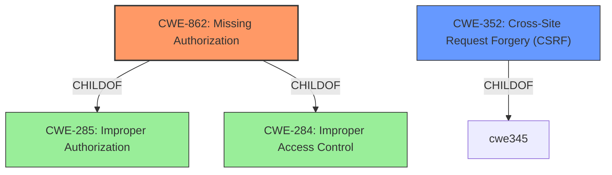

# Analysis Report for CVE-2022-2696

# Vulnerability Analysis Report: CVE-2022-2696

## Description


## Analysis (with Relationship Data)

# Summary
| CWE ID | CWE Name | Confidence | CWE Abstraction Level | CWE Vulnerability Mapping Label | CWE-Vulnerability Mapping Notes |
|---|---|---|---|---|---|
| CWE-862 | Missing Authorization | 1.0 | Class | Allowed-with-Review | Primary CWE: The product does not perform an authorization check when an actor attempts to access a resource or perform an action. |
| CWE-352 | Cross-Site Request Forgery (CSRF) | 0.8 | Compound | Allowed | Secondary CWE: The web application does not, or can not, sufficiently verify whether a well-formed, valid, consistent request was intentionally provided by the user who submitted the request due to **missing nonce validation**. |

## Evidence and Confidence

*   **Confidence Score:** 0.9
*   **Evidence Strength:** HIGH

## Relationship Analysis
The primary weakness is **CWE-862 (Missing Authorization)**, a Class-level CWE. It is a child of **CWE-285 (Improper Authorization)** and **CWE-284 (Improper Access Control)**. **CWE-352 (Cross-Site Request Forgery (CSRF))** is a Compound weakness related to the **missing nonce validation** aspect of the vulnerability.



## Vulnerability Chain
The vulnerability chain starts with **missing capability checks** (**CWE-862**) in AJAX actions, allowing authenticated attackers with minimal permissions to bypass authorization and modify plugin settings.  The **missing nonce validation** can allow **CWE-352 (Cross-Site Request Forgery (CSRF))** attacks.

## Summary of Analysis
The vulnerability description clearly states "**missing capability checks and missing nonce validation**" as the root cause for authorization bypass. This aligns directly with **CWE-862 (Missing Authorization)**, which describes a scenario where the product does not perform an authorization check when an actor attempts to access a resource or perform an action. The additional **missing nonce validation** aligns with **CWE-352 (Cross-Site Request Forgery (CSRF))**.

The evidence from the "CVE Reference Links Content Summary" further strengthens this assessment, highlighting insufficient capability checks and **missing nonce validation** as the weaknesses that allow attackers to modify plugin settings and ordering system preferences.

The selection of **CWE-862** is at the optimal level of specificity because it directly addresses the **missing authorization** aspect. While **CWE-285 (Improper Authorization)** and **CWE-284 (Improper Access Control)** are parent CWEs, they are more general and less descriptive of the specific vulnerability. The **missing nonce validation** directly relates to **CWE-352 (Cross-Site Request Forgery (CSRF))**.

CWEs Considered but Not Used:

*   CWE-863 (Incorrect Authorization): While related to authorization, the vulnerability is due to **missing authorization checks**, not an incorrect implementation of checks.
*   CWE-639 (Authorization Bypass Through User-Controlled Key): This CWE is more specific to bypassing authorization by modifying key values, which is not the case here.
*   CWE-472 (External Control of Assumed-Immutable Web Parameter): While there might be parameters involved, the core issue is the **missing authorization check**, not the external control of parameters.
*   CWE-306 (Missing Authentication for Critical Function): The vulnerability involves authenticated users bypassing authorization, not a complete lack of authentication.
*   CWE-20 (Improper Input Validation): Although inputs might be involved, the root cause is the **missing authorization**, not necessarily the improper validation of input.


## CWE Relationship Analysis

Current CWEs represent these abstraction levels: .


### Vulnerability Chain Analysis

**Chain starting from CWE-862:**
- 862 (Missing Authorization) - ROOT


**Chain starting from CWE-472:**
- 472 (External Control of Assumed-Immutable Web Parameter) - ROOT


### CWE Relationship Diagram

```mermaid
graph TD
    classDef primary fill:#f96,stroke:#333,stroke-width:2px
    classDef secondary fill:#69f,stroke:#333
    classDef tertiary fill:#9e9,stroke:#333
```


*Report generated on 2025-03-31 02:45:14*
