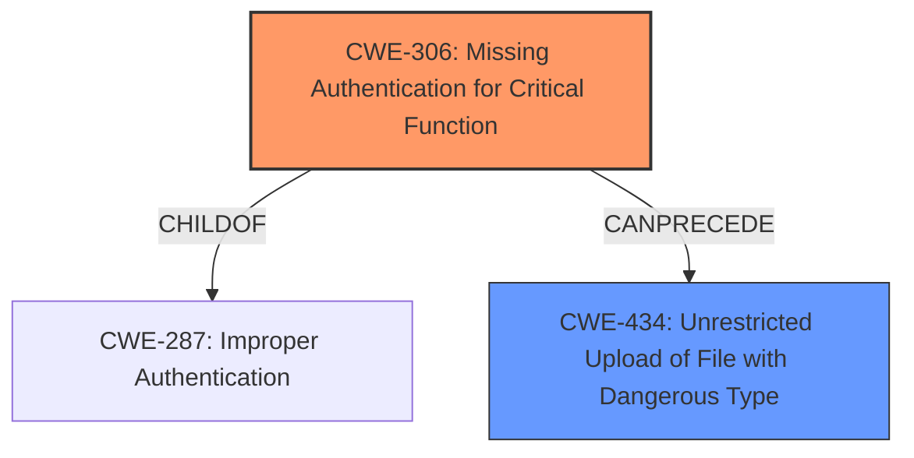

# Enhanced Analysis for CVE-2022-26971

# Summary
| CWE ID  | CWE Name                                                                        | Confidence | CWE Abstraction Level | CWE Vulnerability Mapping Label | CWE-Vulnerability Mapping Notes |
| :-------- | :------------------------------------------------------------------------------ | :--------- | :---------------------- | :------------------------------ | :------------------------------ |
| CWE-306 | Missing Authentication for Critical Function                                    | 0.9        | Base                    | Primary                           | Allowed                         |
| CWE-434 | Unrestricted Upload of File with Dangerous Type                               | 0.8        | Base                    | Secondary                         | Allowed                         |

## Evidence and Confidence

*   **Confidence Score:** 0.85
*   **Evidence Strength:** HIGH

## Relationship Analysis
The primary weakness is the **missing authentication** which directly leads to the ability to upload files without any checks. CWE-306 is a base level CWE and is a child of CWE-287 (Improper Authentication). The secondary weakness is the **unrestricted file upload** which could lead to code execution or other malicious activities. CWE-434 is a base level CWE. The relationship between CWE-306 and CWE-434 is that the missing authentication (CWE-306) allows an attacker to perform an unrestricted file upload (CWE-434).



## Vulnerability Chain
The chain of events is as follows:
1.  Missing Authentication (CWE-306)
2.  Unrestricted Upload of File with Dangerous Type (CWE-434)

## Summary of Analysis
The vulnerability description clearly states that the Barco Control Room Management Suite web application has a license file upload mechanism that can be executed without authentication. This directly aligns with CWE-306 (**Missing Authentication for Critical Function**). The ability to upload files without any authentication is a critical security flaw.

Additionally, since the vulnerability description mentions a "license file upload mechanism", the unrestricted upload of a file with a dangerous type could allow an attacker to upload a malicious file (e.g., a script or executable) that could compromise the system. This aligns with CWE-434 (**Unrestricted Upload of File with Dangerous Type**).

The relationship graph shows that CWE-306 can precede CWE-434, meaning that the **missing authentication** makes the **unrestricted file upload** possible.

The retriever results also support this assessment, with CWE-306 and CWE-434 being among the top CWEs identified.

```
Vulnerability Description:
Barco Control Room Management Suite web application, which is part of TransForm N before 3.14, is exposing a license file upload mechanism. This upload can be executed without authentication.
```

The selected CWEs are at the optimal level of specificity, as they directly address the root cause of the vulnerability (missing authentication) and the immediate consequence (unrestricted file upload).

Other CWEs Considered:

*   CWE-425 (**Direct Request ('Forced Browsing')**): While direct request could be related, the primary issue is the **lack of authentication** rather than bypassing authorization checks.
*   CWE-305 (**Authentication Bypass by Primary Weakness**): The vulnerability description does not indicate that there is an authentication mechanism that is being bypassed due to another weakness. Instead, there is simply **no authentication** required for the file upload function.
*   CWE-22 (**Improper Limitation of a Pathname to a Restricted Directory ('Path Traversal')**): Path traversal might be a consequence of the file upload, but it is not the primary weakness. The core issue is the ability to upload files without authentication.
*   CWE-78 (**Improper Neutralization of Special Elements used in an OS Command ('OS Command Injection')**): OS command injection is not directly mentioned in the vulnerability description. This is a potential consequence of uploading a malicious file, but it is not the root cause.
*   CWE-611 (**Improper Restriction of XML External Entity Reference**): This is not applicable as the vulnerability description does not involve XML processing or external entities.
*   CWE-285 (**Improper Authorization**): Since there is no authentication required, authorization is not a factor.
*   CWE-471 (**Modification of Assumed-Immutable Data (MAID)**): This is not applicable as the vulnerability description does not involve modification of assumed-immutable data.
*   CWE-290 (**Authentication Bypass by Spoofing**): This is not applicable as there is no authentication to spoof.


## CWE Relationship Analysis

Current CWEs represent these abstraction levels: .


### Vulnerability Chain Analysis

**Chain starting from CWE-425:**
- 425 (Direct Request ('Forced Browsing')) - ROOT


**Chain starting from CWE-434:**
- 434 (Unrestricted Upload of File with Dangerous Type) - ROOT


### CWE Relationship Diagram

```mermaid
graph TD
    classDef primary fill:#f96,stroke:#333,stroke-width:2px
    classDef secondary fill:#69f,stroke:#333
    classDef tertiary fill:#9e9,stroke:#333
```