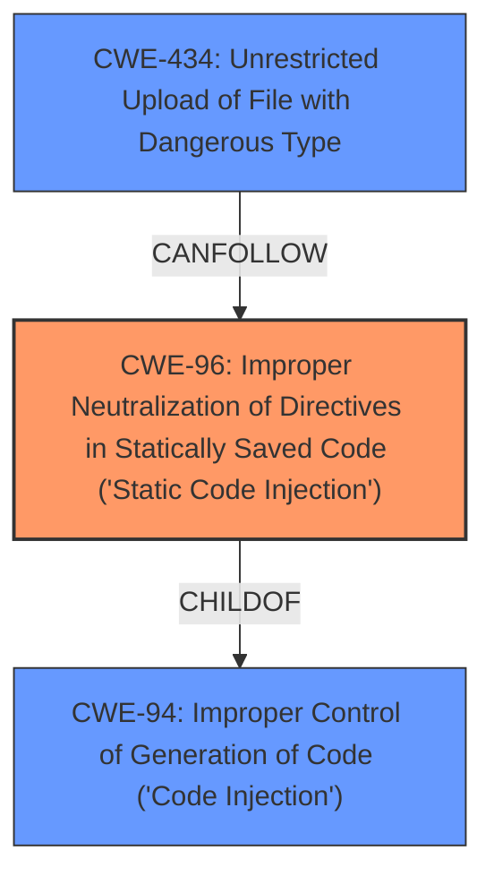

# Analysis Report for CVE-2022-26982

# Vulnerability Analysis Report: CVE-2022-26982

## Description


## Analysis (with Relationship Data)

# Summary

| CWE ID | CWE Name | Confidence | CWE Abstraction Level | CWE Vulnerability Mapping Label | CWE-Vulnerability Mapping Notes |
|---|---|---|---|---|---|
| CWE-96 | Improper Neutralization of Directives in Statically Saved Code ('Static Code Injection') | 0.8 | Base | Allowed | Primary CWE. The vulnerability allows remote authenticated administrators to execute arbitrary code by inserting **vulnerable PHP code** into theme files, which are statically saved. |
| CWE-434 | Unrestricted Upload of File with Dangerous Type | 0.6 | Base | Allowed | Secondary CWE. Although not explicitly stated, the ability to modify themes implies the ability to upload or modify files, potentially including those with dangerous types (e.g., PHP files). |
| CWE-94 | Improper Control of Generation of Code ('Code Injection') | 0.5 | Base | Allowed-with-Review | Secondary CWE.  The administrator's ability to insert PHP code into theme files could be considered a form of code injection, as the code segment is being constructed using externally influenced input. However, this is a less precise fit than CWE-96. |

## Evidence and Confidence

*   **Confidence Score:** 0.7
*   **Evidence Strength:** MEDIUM

## Relationship Analysis
The primary relationship influencing the CWE selection is the parent-child relationship between CWE-94 (Improper Control of Generation of Code) and CWE-96 (Improper Neutralization of Directives in Statically Saved Code). CWE-96 is a more specific variant of CWE-94, as it deals with static code injection. Since the vulnerability involves injecting code into statically saved theme files, CWE-96 is the more appropriate choice.



## Vulnerability Chain
The vulnerability chain starts with the **lack of proper input sanitization** and **validation** of theme file modifications, leading to the ability to inject **vulnerable PHP code**. This then leads to the **execution of arbitrary code**.
  - CWE-96: Improper Neutralization of Directives in Statically Saved Code ('Static Code Injection') is the root cause.
  - The impact is Remote Code Execution (RCE).

## Summary of Analysis
The initial analysis focused on code injection vulnerabilities, given the ability to insert PHP code. The Retriever Results highlighted CWE-96, CWE-94, and CWE-79 as potential candidates. The final decision was based on the specific context of the vulnerability, which involves injecting code into statically saved theme files.
  - CWE-96 is the most specific and appropriate CWE because it directly addresses the issue of injecting code into statically saved files.
  - The selection is justified by the vulnerability description, which states that administrators can insert **vulnerable PHP code** into theme files.
  - The graph relationships support this decision, as CWE-96 is a child of CWE-94, indicating a more specific form of code injection.
  - The evidence to support this is from "CVE Reference Links Content Summary" which states: "The vulnerability exists because Simple Machines Forum (SMF) allows authenticated administrators to modify theme files, including PHP templates. This enables them to insert arbitrary PHP code."

Relevant CWE Information:

# Enhanced Context (25 CWEs)

## CWE-96: Improper Neutralization of Directives in Statically Saved Code ('Static Code Injection')
**Abstraction:** Base
**Similarity Score**: 0.509 (Retriever Results)
**Source**: sparse

**Description**:
The product receives input from an upstream component, but it does not neutralize or incorrectly neutralizes code syntax before inserting the input into an executable resource, such as a library, configuration file, or template.

**Mapping Guidance**:
- Usage: Allowed
- Rationale: This CWE entry is at the Base level of abstraction, which is a preferred level of abstraction for mapping to the root causes of vulnerabilities.

## CWE-434: Unrestricted Upload of File with Dangerous Type
**Abstraction:** Base
**Similarity Score**: 0.002 (Retriever Results)
**Source**: graph

**Description**:
The product allows the upload or transfer of dangerous file types that are automatically processed within its environment.

**Mapping Guidance**:
- Usage: Allowed
- Rationale: This CWE entry is at the Base level of abstraction, which is a preferred level of abstraction for mapping to the root causes of vulnerabilities.

## CWE-94: Improper Control of Generation of Code ('Code Injection')
**Abstraction:** Base
**Similarity Score**: 0.357 (Retriever Results)
**Source**: sparse

**Description**:
The product constructs all or part of a code segment using externally-influenced input from an upstream component, but it does not neutralize or incorrectly neutralizes special elements that could modify the syntax or behavior of the intended code segment.

**Mapping Guidance**:
- Usage: Allowed-with-Review
- Rationale: This entry is frequently misused for vulnerabilities with a technical impact of "code execution," which does not by itself indicate a root cause weakness, since dozens of weaknesses can enable code execution.

### Other CWEs Considered but Not Used:

*   **CWE-306: Missing Authentication for Critical Function:** While the vulnerability requires authentication, the core issue is code injection, not the absence of authentication.
*   **CWE-88: Improper Neutralization of Argument Delimiters in a Command ('Argument Injection'):** This CWE is not relevant as the vulnerability does not involve argument injection.
*   **CWE-95: Improper Neutralization of Directives in Dynamically Evaluated Code ('Eval Injection'):** This is not a case of dynamic evaluation.
*   **CWE-352: Cross-Site Request Forgery (CSRF):** This CWE is not relevant as the vulnerability does not involve CSRF.
*   **CWE-79: Improper Neutralization of Input During Web Page Generation ('Cross-site Scripting'):** This is not a typical XSS vulnerability.
*   **CWE-1336: Improper Neutralization of Special Elements Used in a Template Engine:** Although themes are used, it is more direct to state this is a static code injection rather than a template engine issue.
*   **CWE-138: Improper Neutralization of Special Elements:** This is too general of a class.
*   **CWE-80, CWE-74, CWE-184, CWE-917, CWE-1336, CWE-1289, CWE-150, CWE-162, CWE-113, CWE-116, CWE-88, CWE-183, CWE-494, CWE-613, CWE-625, CWE-430, CWE-351, CWE-78, CWE-352:** These were not relevant as they are not related to code injection, file upload, or neutralization of directives in static code.


## CWE Relationship Analysis

Current CWEs represent these abstraction levels: .


### Vulnerability Chain Analysis

**Chain starting from CWE-917:**
- 917 (Improper Neutralization of Special Elements used in an Expression Language Statement ('Expression Language Injection')) - ROOT


**Chain starting from CWE-494:**
- 494 (Download of Code Without Integrity Check) - ROOT


### CWE Relationship Diagram

```mermaid
graph TD
    classDef primary fill:#f96,stroke:#333,stroke-width:2px
    classDef secondary fill:#69f,stroke:#333
    classDef tertiary fill:#9e9,stroke:#333
```


*Report generated on 2025-03-30 11:52:47*
