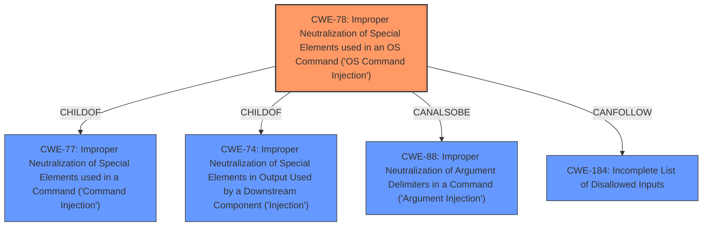

# Analysis Report for CVE-2022-26990

# Vulnerability Analysis Report: CVE-2022-26990

## Description


## Analysis (with Relationship Data)

# Summary
| CWE ID | CWE Name | Confidence | CWE Abstraction Level | CWE Vulnerability Mapping Label | CWE-Vulnerability Mapping Notes |
|---|---|---|---|---|---|
| CWE-78 | Improper Neutralization of Special Elements used in an OS Command ('OS Command Injection') | 1.0 | Base | Allowed | Primary CWE |

## Evidence and Confidence

*   **Confidence Score:** 1.0
*   **Evidence Strength:** HIGH

## Relationship Analysis
The primary relationship that influenced the decision was the ChildOf relationship between CWE-78 and CWE-77. While the description mentions command injection, the specific context of the vulnerability targets OS commands. This distinction aligns with the definitions of CWE-78 and CWE-77, leading to a more precise classification with CWE-78. Other CWEs like CWE-88 (Argument Injection) and CWE-184 (Incomplete List of Disallowed Inputs) are related but less directly applicable as primary causes.



## Vulnerability Chain
The vulnerability chain starts with the **improper neutralization** of special elements in the affected parameters (EmailAddress, SmtpServerName, SmtpUsername, and SmtpPassword). This leads to the ability to inject OS commands, ultimately allowing attackers to execute arbitrary commands.

Root Cause: **Improper Neutralization** of special elements in input parameters.
Weakness: CWE-78, OS Command Injection
Impact: Arbitrary command execution.

## Summary of Analysis
Initially, the description clearly indicates a **command injection** vulnerability, making CWE-77 a plausible candidate. However, the description specifically states that the vulnerability allows attackers to execute *arbitrary commands* which indicates that it is an OS Command.
The **Vulnerability Description Key Phrases** state the **weakness** is **command injection**.
The **Vulnerability Description** states that the vulnerability is a **command injection** vulnerability.
This evidence supports the selection of CWE-78 because it involves the construction of an OS command using externally influenced input and **improper neutralization** of special elements. The "**command injection**" phrase is mentioned, but the CWE description clarifies that the most common usage refers to OS Command Injection (CWE-78).

The decision to use CWE-78 is further supported by the mapping guidance, which allows its usage and states that it is at the Base level of abstraction, which is a preferred level.
```
CWE-78: Improper Neutralization of Special Elements used in an OS Command ('OS Command Injection')
**Abstraction:** Base
**Status:** Stable
**Mapping Guidance:**
Usage: Allowed
Rationale: This CWE entry is at the Base level of abstraction, which is a preferred level of abstraction for mapping to the root causes of vulnerabilities.
```

Other CWEs considered but not selected:

*   CWE-77: While initially considered due to the general "command injection" description, it was deemed less specific than CWE-78 as the vulnerability leads to OS command execution. The mapping guidance for CWE-77 even suggests considering CWE-78 when OS command injection is intended.
*   CWE-88: Argument Injection: This could be a secondary factor, but the primary issue is the lack of neutralization, not just the improper delimiting of arguments.
*   CWE-184: Incomplete List of Disallowed Inputs: This could be a contributing factor if the implemented filter (if any) is incomplete. However, the primary weakness is the **improper neutralization** of special elements, which aligns more directly with CWE-78.
*   CWE-94: Code Injection: This is too broad. The vulnerability specifically involves OS commands, not arbitrary code.


## CWE Relationship Analysis

Current CWEs represent these abstraction levels: .


### Vulnerability Chain Analysis

**Chain starting from CWE-184:**
- 184 (Incomplete List of Disallowed Inputs) - ROOT


**Chain starting from CWE-78:**
- 78 (Improper Neutralization of Special Elements used in an OS Command ('OS Command Injection')) - ROOT


### CWE Relationship Diagram

```mermaid
graph TD
    classDef primary fill:#f96,stroke:#333,stroke-width:2px
    classDef secondary fill:#69f,stroke:#333
    classDef tertiary fill:#9e9,stroke:#333
```


*Report generated on 2025-03-30 19:09:51*
