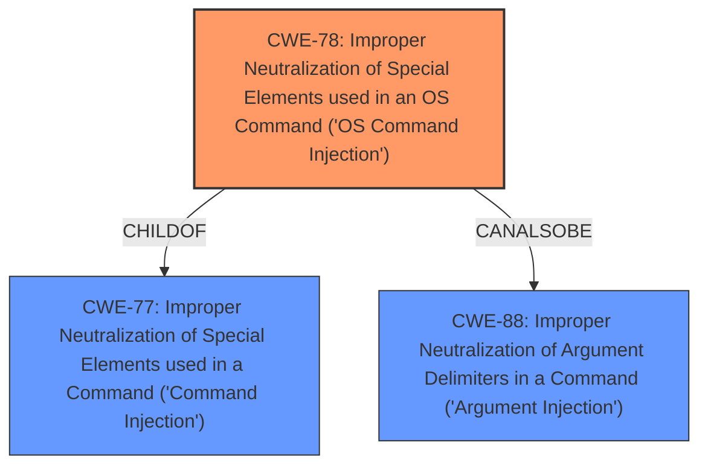

# Analysis Report for CVE-2022-26999

# Vulnerability Analysis Report: CVE-2022-26999

## Description


## Analysis (with Relationship Data)

# Summary
| CWE ID | CWE Name | Confidence | CWE Abstraction Level | CWE Vulnerability Mapping Label | CWE-Vulnerability Mapping Notes |
|---|---|---|---|---|---|
| CWE-78 | Improper Neutralization of Special Elements used in an OS Command ('OS Command Injection') | 1.0 | Base | Allowed | Primary CWE. The vulnerability allows attackers to execute arbitrary commands via crafted requests. This directly aligns with the CWE-78 description. |

## Evidence and Confidence

*   **Confidence Score:** 1.0
*   **Evidence Strength:** HIGH

## Relationship Analysis
The primary relationship that influenced the decision was the ChildOf relationship between CWE-78 and CWE-77. While CWE-77 (Improper Neutralization of Special Elements used in a Command) is a broader class, CWE-78 specifically addresses OS commands, which aligns perfectly with the vulnerability description. CWE-88 (Improper Neutralization of Argument Delimiters in a Command) was considered as a CanAlsoBe relationship with CWE-78, but the description does not provide enough detail to determine if the vulnerability involves argument injection. The Base abstraction level of CWE-78 is appropriate as it's a specific root cause.



## Vulnerability Chain
The chain of events is as follows:
1.  **Root Cause:** **Command Injection** in the static IP settings function due to **improper neutralization** of special elements in the `wan_ip_stat`, `wan_mask_stat`, `wan_gw_stat`, and `wan_dns1_stat` parameters.
2.  **Impact:** Attackers can execute arbitrary commands.

## Summary of Analysis
The analysis is based on the provided vulnerability description, which explicitly states a **command injection** vulnerability. The description notes that attackers can execute arbitrary commands via a crafted request, which is a direct consequence of **improper neutralization** of special elements in the specified parameters. The graph relationships show that CWE-78 is a specific type of command injection, focusing on OS commands.

The vulnerability description states: "Arris TR3300 v1.0.13 was discovered to contain a **command injection** vulnerability in the static ip settings function via the wan_ip_stat, wan_mask_stat, wan_gw_stat, and wan_dns1_stat parameters. This vulnerability allows attackers to execute arbitrary commands via a crafted request."

CWE-78 (Improper Neutralization of Special Elements used in an OS Command ('OS Command Injection')) is the optimal level of specificity because it directly addresses the **command injection** vulnerability and the ability to execute arbitrary commands on the operating system, which is the core issue described.
CWE-77 (Improper Neutralization of Special Elements used in a Command ('Command Injection')) was considered, but CWE-78 is more specific because it explicitly refers to OS commands. The mapping guidance for CWE-77 suggests using CWE-78 when OS command injection is intended.
CWE-88 (Improper Neutralization of Argument Delimiters in a Command ('Argument Injection')) was also considered, but the evidence does not explicitly mention argument delimiters being the cause of the injection. Therefore, CWE-78 is the most accurate representation of the vulnerability.
CWE-94 (Improper Control of Generation of Code ('Code Injection')) was considered but the description mentions command injection not code injection.


## CWE Relationship Analysis

Current CWEs represent these abstraction levels: .


### Vulnerability Chain Analysis

**Chain starting from CWE-78:**
- 78 (Improper Neutralization of Special Elements used in an OS Command ('OS Command Injection')) - ROOT


**Chain starting from CWE-77:**
- 77 (Improper Neutralization of Special Elements used in a Command ('Command Injection')) - ROOT


### CWE Relationship Diagram

```mermaid
graph TD
    classDef primary fill:#f96,stroke:#333,stroke-width:2px
    classDef secondary fill:#69f,stroke:#333
    classDef tertiary fill:#9e9,stroke:#333
```


*Report generated on 2025-03-30 12:38:07*
