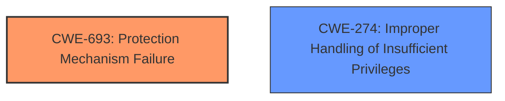

# Analysis Report for CVE-2022-27170

# Vulnerability Analysis Report: CVE-2022-27170

## Description


## Analysis (with Relationship Data)

# Summary
| CWE ID | CWE Name | Confidence | CWE Abstraction Level | CWE Vulnerability Mapping Label | CWE-Vulnerability Mapping Notes |
|---|---|---|---|---|---|
| CWE-693 | Protection Mechanism Failure | 0.8 | Pillar | Primary | Allowed |
| CWE-274 | Improper Handling of Insufficient Privileges | 0.5 | Base | Secondary | Discouraged |

## Evidence and Confidence

*   **Confidence Score:** 0.8
*   **Evidence Strength:** HIGH

## Relationship Analysis
The primary CWE is CWE-693, which is a Pillar. While it's generally better to use a Base or Variant, the information provided doesn't allow for a more specific classification. CWE-693 is a high-level category that represents a failure in the product's defense mechanisms. There aren't any child relationships apparent that would apply in this case.



## Vulnerability Chain
The vulnerability chain is as follows:
1.  **Root Cause:** **Protection mechanism failure** (CWE-693)
2.  **Impact:** Escalation of Privilege

## Summary of Analysis
Initially, the classification seemed challenging due to the high-level nature of the description, which only mentions a **protection mechanism failure** as the root cause. The description contains the key phrase "**protection mechanism failure**". The CVE Reference Links Content Summary confirms that the "**Root cause of vulnerability:** **Protection mechanism failure** in the Intel(R) Media SDK software" and "**Weaknesses/vulnerabilities present:** Failure in protection mechanisms". The Retriever Results also lists CWE-693 as the top match.

Although CWE-693 is a Pillar, the available information doesn't point to a more specific CWE. While it is discouraged to use a Pillar, the description does align with CWE-693's characteristics, indicating that the product either lacks a necessary protection mechanism or uses one incorrectly, leading to a potential escalation of privilege.

CWE-274 was considered as a secondary candidate because it relates to privileges. But the primary issue is with the protection mechanism itself.

Relevant CWE Information:

# Enhanced Context (25 CWEs)

## CWE-693: Protection Mechanism Failure
**Abstraction:** Pillar
**Status:** Draft

### Description
The product does not use or incorrectly uses a **protection mechanism** that provides sufficient defense against directed attacks against the product.

### Extended Description
This weakness covers three distinct situations. A "missing" **protection mechanism** occurs when the application does not define any mechanism against a certain class of attack. An "insufficient" **protection mechanism** might provide some defenses - for example, against the most common attacks - but it does not protect against everything that is intended. Finally, an "ignored" mechanism occurs when a mechanism is available and in active use within the product, but the developer has not applied it in some code path.

### Mapping Guidance
**Usage:** Discouraged
**Rationale:** This CWE entry is extremely high-level, a Pillar.
**Comments:** Consider children or descendants of this entry instead.

## CWE-274: Improper Handling of Insufficient Privileges
**Abstraction Level**: Base
**Similarity Score**: 0.75
**Source**: dense

**Description**:
The product does not handle or incorrectly handles when it has insufficient privileges to perform an operation, leading to resultant weaknesses.


## CWE Relationship Analysis

Current CWEs represent these abstraction levels: .


### Vulnerability Chain Analysis

**Chain starting from CWE-693:**
- 693 (Protection Mechanism Failure) - ROOT


**Chain starting from CWE-274:**
- 274 (Improper Handling of Insufficient Privileges) - ROOT


### CWE Relationship Diagram

```mermaid
graph TD
    classDef primary fill:#f96,stroke:#333,stroke-width:2px
    classDef secondary fill:#69f,stroke:#333
    classDef tertiary fill:#9e9,stroke:#333
```


*Report generated on 2025-03-30 22:36:30*
