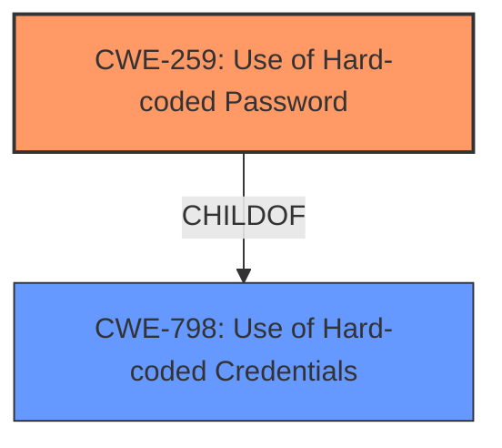

# Enhanced Analysis for CVE-2022-27172

# Summary
| CWE ID | CWE Name | Confidence | CWE Abstraction Level | CWE Vulnerability Mapping Label | CWE-Vulnerability Mapping Notes |
|---|---|---|---|---|---|
| CWE-259 | Use of Hard-coded Password | 1 | Variant | Allowed | Primary CWE |

## Evidence and Confidence

*   **Confidence Score:** 1
*   **Evidence Strength:** HIGH

## Relationship Analysis
The primary relationship that influenced the decision was the ChildOf relationship between CWE-259 and CWE-798. CWE-259 is a variant of CWE-798, making it more specific and appropriate for this case. The Retriever Results also highlighted the relevance of CWE-259.



## Vulnerability Chain
The chain of weaknesses is straightforward: the **hard-coded password** (root cause) directly leads to privileged operation execution (impact).

## Summary of Analysis
The initial analysis strongly pointed to CWE-259, supported by the vulnerability description's key phrases and the CVE reference links content summary. The **rootcause** is explicitly stated as a **hard-coded password**, which aligns perfectly with the definition of CWE-259. The CVE reference summary indicates that the system decrypts a **hardcoded** string, which is then used for authentication. The retriever results also listed CWE-259 as the top candidate.

The evidence from the vulnerability description is very strong: "A **hard-coded password** vulnerability exists". The CVE reference links content summary further reinforces this: "The vulnerability stems from the use of a **hard-coded password** within the `infactory` command".

The graph relationships confirm that CWE-259 is the most specific and accurate representation of the vulnerability.

The selected CWE is at the optimal level of specificity because it directly addresses the **hard-coded password** as the root cause, instead of a more general class of credential issues.

Relevant CWE Information:

# Enhanced Context (25 CWEs)

## CWE-259: Use of Hard-coded Password
**Abstraction:** Variant
**Status:** Draft

### Description
The product contains a **hard-coded password**, which it uses for its own inbound authentication or for outbound communication to external components.

### Extended Description


A **hard-coded password** typically leads to a significant authentication failure that can be difficult for the system administrator to detect. Once detected, it can be difficult to fix, so the administrator may be forced into disabling the product entirely. There are two main variations:

```
		Inbound: the product contains an authentication mechanism that checks for a hard-coded password.
		Outbound: the product connects to another system or component, and it contains hard-coded password for connecting to that component.
```

### Mapping Guidance
**Usage:** Allowed
**Rationale:** This CWE entry is at the Variant level of abstraction, which is a preferred level of abstraction for mapping to the root causes of vulnerabilities.

### Observed Examples
- **CVE-2022-29964:** Distributed Control System (DCS) has **hard-coded password**s for local shell access
- **CVE-2021-37555:** Telnet service for IoT feeder for dogs and cats has **hard-coded password** [REF-1288]

## CWE-321: Use of Hard-coded Cryptographic Key
This CWE was considered but deemed less appropriate than CWE-259 because the vulnerability description specifically mentions a **hard-coded password**, not a cryptographic key.

## CWE-798: Use of Hard-coded Credentials
This CWE was considered, but CWE-259 is a more specific variant of CWE-798 and therefore a better fit.

## CWE-912: Hidden Functionality
This CWE was considered but deemed irrelevant as the vulnerability is a **hard-coded password**, not hidden functionality.

## CWE-120: Buffer Copy without Checking Size of Input ('Classic Buffer Overflow')
This CWE was considered but deemed irrelevant as there is no buffer overflow in this vulnerability.

## CWE-1188: Initialization of a Resource with an Insecure Default
This CWE was considered but deemed irrelevant as the vulnerability is a **hard-coded password**, not insecure initialization of a resource.

## CWE-170: Improper Null Termination
This CWE was considered but deemed irrelevant as there is no improper null termination in this vulnerability.

## CWE-1287: Improper Validation of Specified Type of Input
This CWE was considered but deemed irrelevant as there is no improper validation of input types in this vulnerability.

## CWE-306: Missing Authentication for Critical Function
This CWE was considered but deemed irrelevant as the vulnerability involves using a **hard-coded password** to bypass authentication, rather than a complete absence of authentication.

## CWE-1391: Use of Weak Credentials
This CWE was considered, but CWE-259 is a more specific variant of CWE-798, making it a better fit than the more general CWE-1391.


## CWE Relationship Analysis

Current CWEs represent these abstraction levels: .


### Vulnerability Chain Analysis

**Chain starting from CWE-321:**
- 321 (Use of Hard-coded Cryptographic Key) - ROOT


**Chain starting from CWE-259:**
- 259 (Use of Hard-coded Password) - ROOT


### CWE Relationship Diagram

```mermaid
graph TD
    classDef primary fill:#f96,stroke:#333,stroke-width:2px
    classDef secondary fill:#69f,stroke:#333
    classDef tertiary fill:#9e9,stroke:#333
```