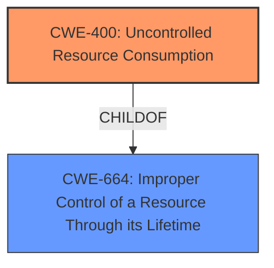

# Analysis for CVE-2022-27181

# Summary

| CWE ID | CWE Name | Confidence | CWE Abstraction Level | CWE Vulnerability Mapping Label | CWE-Vulnerability Mapping Notes |
|---|---|---|---|---|---|
| CWE-400 | Uncontrolled Resource Consumption | 0.8 | Class | Primary | Discouraged, but most appropriate given the information provided. |

## Evidence and Confidence

*   **Confidence Score:** 0.8
*   **Evidence Strength:** MEDIUM

## Relationship Analysis

The primary CWE selected is CWE-400, Uncontrolled Resource Consumption. While this is a Class-level CWE and generally discouraged, the vulnerability description directly mentions an "increase in internal resource utilization," which aligns with the core concept of uncontrolled resource consumption. Given the limited information, a more specific Base or Variant CWE cannot be confidently selected.

## Vulnerability Chain

The vulnerability chain appears to be:

1.  **Undisclosed Requests:** (Trigger)
2.  **APM AAA NTLM Auth (misconfiguration or vulnerability):** (Root Cause - Implicit)
3.  **Increase in Internal Resource Utilization:** (Impact)

The exact root cause within the APM AAA NTLM Auth configuration is not disclosed, making it difficult to pinpoint a more specific CWE.

## Summary of Analysis

The initial assessment identified CWE-400 as the most relevant CWE due to the explicit mention of "increase in internal resource utilization" in the vulnerability description.

The analysis is heavily based on the provided evidence, specifically the "Vulnerability Description Key Phrases" which include "impact: increase in internal resource utilization". Without further details on the specific **WEAKNESS** in the APM AAA NTLM Auth configuration that allows the undisclosed requests to cause resource exhaustion, it is difficult to choose a more specific CWE.

The graph relationships show that CWE-400 is a child of CWE-664 (Improper Control of a Resource Through its Lifetime), indicating a broader category of resource management issues. However, without more specific details, CWE-400 remains the most accurate representation of the vulnerability.

CWE-400, despite being a Class, is the most specific CWE that can be confidently assigned based on the available information. The retriever results also listed it as the top candidate. While ideally, a Base or Variant CWE would be preferred, the lack of root cause information prevents a more granular mapping.

Relevant CWE Information:

# Enhanced Context (25 CWEs)

## Vulnerability Description

On F5 BIG-IP APM 16.1.x versions prior to 16.1.2.2, 15.1.x versions prior to 15.1.5.1, 14.1.x versions prior to 14.1.4.6, 13.1.x versions prior to 13.1.5, and all versions of 12.1.x and 11.6.x, when APM is configured on a virtual server and the associated access profile is configured with APM AAA NTLM Auth, undisclosed requests can cause an **increase in internal resource utilization**. Note Software versions which have reached End of Technical Support (EoTS) are not evaluated

### Vulnerability Description Key Phrases

*   impact: increase in internal resource utilization
*   vector: undisclosed requests
*   product: F5 BIG-IP APM
*   version: 16.1.x, 15.1.x, 14.1.x, 13.1.x, 12.1.x and 11.6.x
*   component: APM

## Retriever Results

### Top Combined Results

| Rank | CWE ID | Name | Abstraction | Usage | Retrievers | Individual Scores |
|---|---|---|---|---|---|---|
| 1 | 400 | Uncontrolled Resource Consumption | Class | Discouraged | sparse | 0.260 |
| 2 | 290 | Authentication Bypass by Spoofing | Base | Allowed | sparse | 0.195 |
| 3 | 269 | Improper Privilege Management | Class | Discouraged | sparse | 0.194 |
| 4 | 732 | Incorrect Permission Assignment for Critical Resource | Class | Allowed-with-Review | sparse | 0.182 |
| 5 | 1176 | Inefficient CPU Computation | Class | Allowed-with-Review | sparse | 0.180 |
| 6 | 410 | Insufficient Resource Pool | Base | Allowed | dense | 0.482 |
| 7 | 22 | Improper Limitation of a Pathname to a Restricted Directory ('Path Traversal') | Base | Allowed | graph | 0.002 |
| 8 | 126 | Buffer Over-read | Variant | Allowed | sparse | 0.174 |
| 9 | 863 | Incorrect Authorization | Class | Allowed-with-Review | sparse | 0.174 |
| 10 | 20 | Improper Input Validation | Class | Discouraged | sparse | 0.173 |

### CWE Considerations

*   **CWE-400 (Uncontrolled Resource Consumption):** The vulnerability description explicitly mentions "increase in internal resource utilization", making this a strong candidate. The description of CWE-400 states: "The product does not properly control the allocation and maintenance of a limited resource, thereby enabling an actor to influence the amount of resources consumed, eventually leading to the exhaustion of available resources." This directly aligns with the observed behavior. Usage is discouraged, but justified given lack of detail.
*   **CWE-290 (Authentication Bypass by Spoofing):** This is a less likely candidate as the description mentions "undisclosed requests" leading to the resource utilization issue, not necessarily an authentication bypass. There is no supporting information on authentication to make this determination.
*   **CWE-269 (Improper Privilege Management):** This is also a less likely candidate as there is no explicit mention of privilege issues. The "undisclosed requests" could potentially be related to privilege escalation, but this is speculative.
*   **CWE-732 (Incorrect Permission Assignment for Critical Resource):** Similar to CWE-269, there is no direct evidence to suggest incorrect permission assignment.
*   **CWE-1176 (Inefficient CPU Computation):** While resource utilization can involve CPU, the description doesn't specifically point to inefficient computations.
*   **CWE-410 (Insufficient Resource Pool):** This is a plausible candidate. It could be that the undisclosed requests are exhausting a limited resource pool. However, CWE-400 is more general and encompasses this scenario.
*   **CWE-22 (Improper Limitation of a Pathname to a Restricted Directory ('Path Traversal')):** This is unrelated to the described vulnerability.
*   **CWE-126 (Buffer Over-read):** This is unrelated to the described vulnerability.
*   **CWE-863 (Incorrect Authorization):** This is a less likely candidate as the description mentions "undisclosed requests" leading to the resource utilization issue, not necessarily an incorrect authorization.
*   **CWE-20 (Improper Input Validation):** While input validation could be a factor, the description doesn't explicitly state that improper input validation is the root cause.

### Other Considered CWEs (From Enhanced Context)
*   Many CWEs related to input validation (CWE-1289, CWE-184, CWE-807, CWE-23, CWE-183, CWE-1284) were considered but rejected. The vulnerability description does not explicitly mention issues with input validation. There's no evidence to support that the "undisclosed requests" contain malicious input.
*   CWEs related to resource management (CWE-404, CWE-668, CWE-664, CWE-770, CWE-410, CWE-789) were considered. CWE-400 was chosen as the most appropriate due to the direct mention of resource utilization. The others were either too specific or too general.

### Conclusion
CWE-400 (Uncontrolled Resource Consumption) is the most appropriate CWE based on the available information. While it's a Class-level CWE and the guidance discourages its use when more specific CWEs are available, the limited details about the root cause make it the most accurate choice. The primary evidence for this decision is the phrase "increase in internal resource utilization" in the vulnerability description.