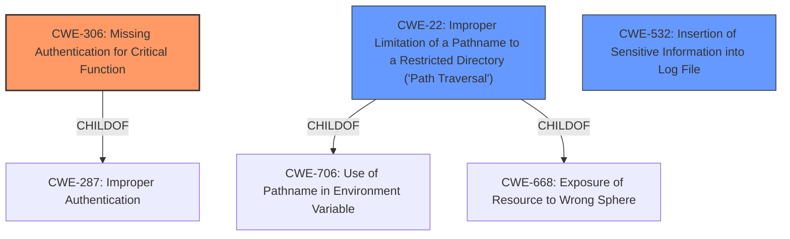

# Raw Analyzer Response for CVE-2022-27192

# Summary
| CWE ID | CWE Name | Confidence | CWE Abstraction Level | CWE Vulnerability Mapping Label | CWE-Vulnerability Mapping Notes |
|---|---|---|---|---|---|
| CWE-306 | Missing Authentication for Critical Function | 1 | Base | Allowed | Primary CWE |
| CWE-22 | Improper Limitation of a Pathname to a Restricted Directory ('Path Traversal') | 0.8 | Base | Allowed | Secondary Candidate |
| CWE-532 | Insertion of Sensitive Information into Log File | 0.7 | Base | Allowed | Secondary Candidate |

## Evidence and Confidence

*   **Confidence Score:** 0.9
*   **Evidence Strength:** HIGH

## Relationship Analysis
The primary CWE is CWE-306, indicating a fundamental **lack of authentication** for a critical function. CWE-22 is a secondary candidate because it describes the **improper limitation of a pathname**, which could be a mechanism by which the unauthorized file download occurs. CWE-532 is considered because of the mention of the inclusion of session tokens in application log files. The relationships show that CWE-306 is a child of CWE-287 (Improper Authentication), and CWE-22 is a child of CWE-706 (Use of Pathname in Environment Variable) and CWE-668 (Exposure of Resource to Wrong Sphere). This hierarchical structure helps refine the selection to the most specific and relevant CWEs.

## Vulnerability Chain
The vulnerability chain starts with the **missing authentication** (CWE-306), which allows an unauthenticated attacker to attempt to download files. The potential for **path traversal** (CWE-22) means the attacker might be able to access arbitrary files on the server. The inclusion of **sensitive information in log files** (CWE-532) further exacerbates the issue by potentially exposing session tokens, which can be used for administrator impersonation.

## Summary of Analysis
The initial analysis focused on the **unauthenticated file download** and the potential for **administrator impersonation**. The retriever results suggested several CWEs, including CWE-425 (Direct Request), CWE-23 (Relative Path Traversal), and CWE-306 (Missing Authentication). After reviewing the complete CWE specifications and considering the vulnerability description, the primary root cause is the **missing authentication** for the file download functionality (CWE-306). The **path traversal** (CWE-22) and **sensitive information logging** (CWE-532) are contributing factors that amplify the risk.

The evidence supporting CWE-306 is strong: "The Reporting module in Aseco Lietuva document management system DVS Avilys before 3.5.58 allows unauthorized file download. An unauthenticated attacker can impersonate an administrator by reading administrative files." This clearly indicates a **lack of authentication** for a critical function.

CWE-22 is a secondary candidate because the description mentions the reading of "administrative files", suggesting the possibility of path traversal to access these files. The phrase "unauthenticated file download of any file on the server" also supports the path traversal idea.

CWE-532 is also a secondary candidate because the "CVE Reference Links Content Summary" mentions that "application log files include session tokens", which is clearly insertion of sensitive information into a log file.

The selected CWEs are at the optimal level of specificity because they directly address the **root cause** (CWE-306) and the contributing factors (CWE-22 and CWE-532) of the vulnerability.

Relevant CWE Information:

# Enhanced Context (25 CWEs)

## CWE-23: Relative Path Traversal
**Abstraction Level**: Base
**Similarity Score**: 0.81
**Source**: dense

**Description**:
The product uses external input to construct a pathname that should be within a restricted directory, but it does not properly neutralize sequences such as ".." that can resolve to a location that is outside of that directory.

**Mapping Guidance**:
- Usage: Allowed
- Rationale: This CWE entry is at the Base level of abstraction, which is a preferred level of abstraction for mapping to the root causes of vulnerabilities.

## CWE-36: Absolute Path Traversal
**Abstraction Level**: Base
**Similarity Score**: 0.80
**Source**: dense

**Description**:
The product uses external input to construct a pathname that should be within a restricted directory, but it does not properly neutralize absolute path sequences such as "/abs/path" that can resolve to a location that is outside of that directory.

**Mapping Guidance**:
- Usage: Allowed
- Rationale: This CWE entry is at the Base level of abstraction, which is a preferred level of abstraction for mapping to the root causes of vulnerabilities.

## CWE-41: Improper Resolution of Path Equivalence
**Abstraction Level**: Base
**Similarity Score**: 0.79
**Source**: dense

**Description**:
The product is vulnerable to file system contents disclosure through path equivalence. Path equivalence involves the use of special characters in file and directory names. The associated manipulations are intended to generate multiple names for the same object.

**Mapping Guidance**:
- Usage: Allowed
- Rationale: This CWE entry is at the Base level of abstraction, which is a preferred level of abstraction for mapping to the root causes of vulnerabilities.

## CWE-73: External Control of File Name or Path
**Abstraction Level**: Base
**Similarity Score**: 0.79
**Source**: dense

**Description**:
The product allows user input to control or influence paths or file names that are used in filesystem operations.

**Mapping Guidance**:
- Usage: Allowed
- Rationale: This CWE entry is at the Base level of abstraction, which is a preferred level of abstraction for mapping to the root causes of vulnerabilities.

## CWE-59: Improper Link Resolution Before File Access ('Link Following')
**Abstraction Level**: Base
**Similarity Score**: 0.79
**Source**: dense

**Description**:
The product attempts to access a file based on the filename, but it does not properly prevent that filename from identifying a link or shortcut that resolves to an unintended resource.

**Mapping Guidance**:
- Usage: Allowed
- Rationale: This CWE entry is at the Base level of abstraction, which is a preferred level of abstraction for mapping to the root causes of vulnerabilities.

## CWE-24: Path Traversal: '../filedir'
**Abstraction Level**: Variant
**Similarity Score**: 0.79
**Source**: dense

**Description**:
The product uses external input to construct a pathname that should be within a restricted directory, but it does not properly neutralize "../" sequences that can resolve to a location that is outside of that directory.

**Mapping Guidance**:
- Usage: Allowed
- Rationale: This CWE entry is at the Variant level of abstraction, which is a preferred level of abstraction for mapping to the root causes of vulnerabilities.

## CWE-552: Files or Directories Accessible to External Parties
**Abstraction Level**: Base
**Similarity Score**: 0.78
**Source**: dense

**Description**:
The product makes files or directories accessible to unauthorized actors, even though they should not be.

**Mapping Guidance**:
- Usage: Allowed
- Rationale: This CWE entry is at the Base level of abstraction, which is a preferred level of abstraction for mapping to the root causes of vulnerabilities.

## CWE-184: Incomplete List of Disallowed Inputs
**Abstraction Level**: Base
**Similarity Score**: 0.78
**Source**: dense

**Description**:
The product implements a protection mechanism that relies on a list of inputs (or properties of inputs) that are not allowed by policy or otherwise require other action to neutralize before additional processing takes place, but the list is incomplete.

**Mapping Guidance**:
- Usage: Allowed
- Rationale: This CWE entry is at the Base level of abstraction, which is a preferred level of abstraction for mapping to the root causes of vulnerabilities.

## CWE-427: Uncontrolled Search Path Element
**Abstraction Level**: Base
**Similarity Score**: 0.78
**Source**: dense

**Description**:
The product uses a fixed or controlled search path to find resources, but one or more locations in that