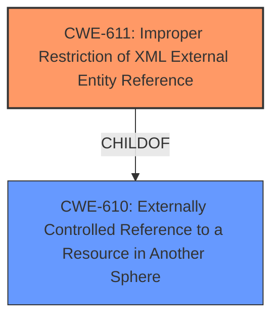

# Enhanced Analysis for CVE-2022-27193

# Summary
| CWE ID | CWE Name | Confidence | CWE Abstraction Level | CWE Vulnerability Mapping Label | CWE-Vulnerability Mapping Notes |
|---|---|---|---|---|---|
| CWE-611 | Improper Restriction of XML External Entity Reference | 1.0 | Base | Allowed | Primary CWE |

## Evidence and Confidence

*   **Confidence Score:** 1.0
*   **Evidence Strength:** HIGH

## Relationship Analysis
The primary relationship that influenced my decision was the ChildOf relationship of CWE-611 to CWE-610 (Externally Controlled Reference to a Resource in Another Sphere). While CWE-610 is a broader class, CWE-611 directly addresses the specific issue of XML External Entity injection, making it a more precise fit. There are no other relationships that were as relevant to this particular vulnerability.



## Vulnerability Chain
The vulnerability chain starts with the **improper XML parsing** which leads to the **XXE** (**XML External Entities**) vulnerability, ultimately resulting in information disclosure.
  - **Root Cause:** Improper XML parsing
  - **Weakness:** XXE (CWE-611)
  - **Impact:** Information Disclosure

## Summary of Analysis
The primary CWE identified is CWE-611 (**Improper Restriction of XML External Entity Reference**).

The vulnerability description states: "CVRF-CSAF-Converter before 1.0.0-rc2 resolves XML External Entities (**XXE**). This leads to the inclusion of arbitrary (local) file content into the generated output document. An attacker can exploit this to disclose information from the system running the converter." The "CVE Reference Links Content Summary" further confirms this: "An XXE (XML External Entities) vulnerability exists in the CVRF-CSAF-Converter... The vulnerability lies in the processing of XML input files, where external entities are not properly sanitized, allowing for inclusion of arbitrary local file content... An attacker can exploit this vulnerability to disclose information."

The description of CWE-611 perfectly matches this scenario: "The product processes an XML document that can contain XML entities with URIs that resolve to documents outside of the intended sphere of control, causing the product to embed incorrect documents into its output."

The "Vulnerability Description Key Phrases" also supports this with the following:
- **rootcause:** **improper XML parsing**
- **weakness:** **XXE**
- **impact:** information disclosure

The retriever results also listed CWE-611 as the top result.

CWE-138 (**Improper Neutralization of Special Elements**) was considered but deemed too general. While XXE does involve special elements, CWE-611 provides a more specific and accurate representation of the vulnerability. The mapping guidance for CWE-138 also discourages its use, suggesting that its children should be examined for a better fit.

Relevant CWE Information:
*   CWE-125: Out-of-bounds Read
*   CWE-538: Insertion of Sensitive Information into Externally-Accessible File or Directory
*   CWE-74: Improper Neutralization of Special Elements in Output Used by a Downstream Component ('Injection')
*   CWE-130: Improper Handling of Length Parameter Inconsistency
*   CWE-41: Improper Resolution of Path Equivalence
*   CWE-73: External Control of File Name or Path
*   CWE-191: Integer Underflow (Wrap or Wraparound)
*   CWE-667: Improper Locking
*   CWE-212: Improper Removal of Sensitive Information Before Storage or Transfer
*   CWE-23: Relative Path Traversal
*   CWE-116: Improper Encoding or Escaping of Output
*   CWE-79: Improper Neutralization of Input During Web Page Generation ('Cross-site Scripting')
*   CWE-611: Improper Restriction of XML External Entity Reference
*   CWE-22: Improper Limitation of a Pathname to a Restricted Directory ('Path Traversal')
*   CWE-138: Improper Neutralization of Special Elements
*   CWE-79: Improper Neutralization of Input During Web Page Generation ('Cross-site Scripting')
*   CWE-22: Improper Limitation of a Pathname to a Restricted Directory ('Path Traversal')
*   CWE-494: Download of Code Without Integrity Check
*   CWE-386: Symbolic Name not Mapping to Correct Object
*   CWE-843: Access of Resource Using Incompatible Type ('Type Confusion')
*   CWE-73: External Control of File Name or Path
*   CWE-787: Out-of-bounds Write
*   CWE-352: Cross-Site Request Forgery (CSRF)
*   CWE-441: Unintended Proxy or Intermediary ('Confused Deputy')
*   CWE-41: Improper Resolution of Path Equivalence


## CWE Relationship Analysis

Current CWEs represent these abstraction levels: .


### Vulnerability Chain Analysis

**Chain starting from CWE-41:**
- 41 (Improper Resolution of Path Equivalence) - ROOT


**Chain starting from CWE-494:**
- 494 (Download of Code Without Integrity Check) - ROOT


### CWE Relationship Diagram

```mermaid
graph TD
    classDef primary fill:#f96,stroke:#333,stroke-width:2px
    classDef secondary fill:#69f,stroke:#333
    classDef tertiary fill:#9e9,stroke:#333
```