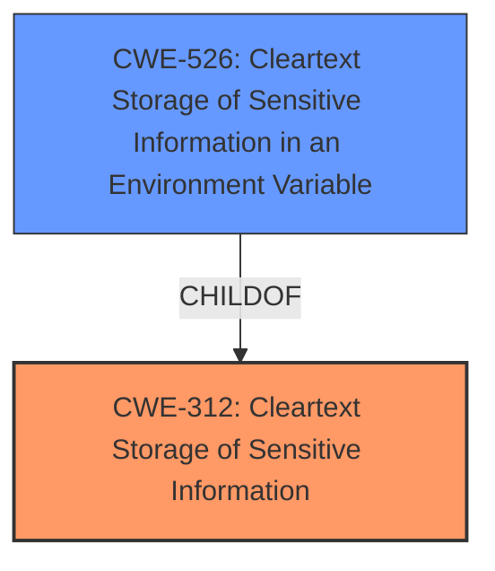

# Analysis Report for CVE-2022-27195

# Vulnerability Analysis Report: CVE-2022-27195

## Description


## Analysis (with Relationship Data)

# Summary
| CWE ID | CWE Name | Confidence | CWE Abstraction Level | CWE Vulnerability Mapping Label | CWE-Vulnerability Mapping Notes |
|---|---|---|---|---|---|
| CWE-312 | Cleartext Storage of Sensitive Information | 0.9 | Base | Primary | Allowed |
| CWE-526 | Cleartext Storage of Sensitive Information in an Environment Variable | 0.7 | Variant | Secondary | Allowed |

## Evidence and Confidence

*   **Confidence Score:** 0.8
*   **Evidence Strength:** HIGH

## Relationship Analysis
The primary CWE is CWE-312, which represents the general case of storing sensitive information in cleartext. CWE-526 is a variant of CWE-312, specifying that the sensitive information is stored in an environment variable. The vulnerability description indicates that environment variables are captured and stored unencrypted, justifying the inclusion of both CWEs to represent the general weakness and the specific context.



## Vulnerability Chain
The vulnerability chain is as follows:

1.  Sensitive information (passwords) passed as environment variables.
2.  **CWE-312 Cleartext Storage of Sensitive Information**: The application stores these environment variables, including passwords, in cleartext in `build.xml` files.
3.  Users with access to the Jenkins controller file system can view the unencrypted password parameters, leading to information disclosure.

## Summary of Analysis
The initial analysis identified **the storage of unencrypted sensitive information** as the primary **weakness**. The retriever results and the vulnerability description both point to CWE-312 as the most appropriate root cause.

The selection of CWE-312 is strongly supported by the vulnerability description's key phrases, specifically "**store unencrypted sensitive information**". The "CVE Reference Links Content Summary" section confirms that the root cause involves storing password parameters unencrypted in `build.xml` files. This directly matches the description of CWE-312, which addresses the **cleartext storage of sensitive information** in a resource that might be accessible to another control sphere. The usage is ALLOWED.

CWE-526 is also considered since environment variables are involved. The vulnerability description states that the plugin captures environment variables, including password parameter values. CWE-526 (Cleartext Storage of Sensitive Information in an Environment Variable) is a variant of CWE-312 and represents the specific context.

CWE-538 (Insertion of Sensitive Information into Externally-Accessible File or Directory) was considered but not chosen as the primary CWE. While the `build.xml` file is externally accessible, the core issue is the **lack of encryption**, not the insertion itself. CWE-538 could be a secondary consideration if the access control on the file system were also weak, but that is not the primary focus of the vulnerability.

CWE-522 (Insufficiently Protected Credentials) and its children (CWE-256, CWE-260, CWE-549) were also considered. While these CWEs are related to credential management, they are more specific. CWE-312 is more appropriate because it describes the general problem of **storing sensitive information in cleartext**, which is the root cause in this case.

The final selection focuses on CWE-312 and CWE-526 due to their direct alignment with the root cause (**unencrypted storage**) and the involvement of environment variables, respectively. These CWEs provide the most accurate and specific representation of the vulnerability based on the available evidence.

Relevant CWE Information:

# Enhanced Context (25 CWEs)
The following CWEs were identified as potentially relevant to this vulnerability:

## CWE-538: Insertion of Sensitive Information into Externally-Accessible File or Directory
**Abstraction Level**: Base
**Similarity Score**: 0.78
**Source**: dense

**Description**:
The product places sensitive information into files or directories that are accessible to actors who are allowed to have access to the files, but not to the sensitive information.

**Mapping Guidance**:
- Usage: Allowed
- Rationale: This CWE entry is at the Base level of abstraction, which is a preferred level of abstraction for mapping to the root causes of vulnerabilities.

## CWE-212: Improper Removal of Sensitive Information Before Storage or Transfer
**Abstraction Level**: Base
**Similarity Score**: 0.78
**Source**: dense

**Description**:
The product stores, transfers, or shares a resource that contains sensitive information, but it does not properly remove that information before the product makes the resource available to unauthorized actors.

**Mapping Guidance**:
- Usage: Allowed
- Rationale: This CWE entry is at the Base level of abstraction, which is a preferred level of abstraction for mapping to the root causes of vulnerabilities.

## CWE-312: Cleartext Storage of Sensitive Information
**Abstraction Level**: Base
**Similarity Score**: 0.78
**Source**: dense

**Description**:
The product stores sensitive information in cleartext within a resource that might be accessible to another control sphere.

**Mapping Guidance**:
- Usage: Allowed
- Rationale: This CWE entry is at the Base level of abstraction, which is a preferred level of abstraction for mapping to the root causes of vulnerabilities.

## CWE-319: Cleartext Transmission of Sensitive Information
**Abstraction Level**: Base
**Similarity Score**: 0.77
**Source**: dense

**Description**:
The product transmits sensitive or security-critical data in cleartext in a communication channel that can be sniffed by unauthorized actors.

**Mapping Guidance**:
- Usage: Allowed
- Rationale: This CWE entry is at the Base level of abstraction, which is a preferred level of abstraction for mapping to the root causes of vulnerabilities.

## CWE-807: Reliance on Untrusted Inputs in a Security Decision
**Abstraction Level**: Base
**Similarity Score**: 0.77
**Source**: dense

**Description**:
The product uses a protection mechanism that relies on the existence or values of an input, but the input can be modified by an untrusted actor in a way that bypasses the protection mechanism.

**Mapping Guidance**:
- Usage: Allowed
- Rationale: This CWE entry is at the Base level of abstraction, which is a preferred level of abstraction for mapping to the root causes of vulnerabilities.

## CWE-522: Insufficiently Protected Credentials
**Abstraction Level**: Class
**Similarity Score**: 0.77
**Source**: dense

**Description**:
The product transmits or stores authentication credentials, but it uses an insecure method that is susceptible to unauthorized interception and/or retrieval.

**Mapping Guidance**:
- Usage: Allowed-with-Review
- Rationale: This CWE entry is a Class and might have Base-level children that would be more appropriate

## CWE-639: Authorization Bypass Through User-Controlled Key
**Abstraction Level**: Base
**Similarity Score**: 0.76
**Source**: dense

**Description**:
The system's authorization functionality does not prevent one user from gaining access to another user's data or record by modifying the key value identifying the data.

**Mapping Guidance**:
- Usage: Allowed
- Rationale: This CWE entry is at the Base level of abstraction, which is a preferred level of abstraction for mapping to the root causes of vulnerabilities.

## CWE-1391: Use of Weak Credentials
**Abstraction Level**: Class
**Similarity Score**: 0.76
**Source**: dense

**Description**:
The product uses weak credentials (such as a default key or hard-coded password) that can be calculated, derived, reused, or guessed by an attacker.

**Mapping Guidance**:
- Usage: Allowed-with-Review
- Rationale: This CWE entry is a Class and might have Base-level children that would be more appropriate

## CWE-668: Exposure of Resource to Wrong Sphere
**Abstraction Level**: Class
**Similarity Score**: 0.76
**Source**: dense

**Description**:
The product exposes a resource to the wrong control sphere, providing unintended actors with inappropriate access to the resource.

**Mapping Guidance**:
- Usage: Discouraged
- Rationale: CWE-668 is high-level and is often misused as a catch-all when lower-level CWE IDs might be applicable. It is sometimes used for low-information vulnerability reports [REF-1287]. It is a level-1 Class (i.e., a child of a Pillar). It is not useful for trend analysis.

## CWE-497: Exposure of Sensitive System Information to an Unauthorized Control Sphere
**Abstraction Level**: Base
**Similarity Score**: 0.76
**Source**: dense

**Description**:
The product does not properly prevent sensitive system-level information from being accessed by unauthorized actors who do not have the same level of access to the underlying system as the product does.

**Mapping Guidance**:
- Usage: Allowed
- Rationale


## CWE Relationship Analysis

Current CWEs represent these abstraction levels: .


### Vulnerability Chain Analysis

**Chain starting from CWE-549:**
- 549 (Missing Password Field Masking) - ROOT


**Chain starting from CWE-319:**
- 319 (Cleartext Transmission of Sensitive Information) - ROOT


### CWE Relationship Diagram

```mermaid
graph TD
    classDef primary fill:#f96,stroke:#333,stroke-width:2px
    classDef secondary fill:#69f,stroke:#333
    classDef tertiary fill:#9e9,stroke:#333
```


*Report generated on 2025-03-30 22:24:14*
