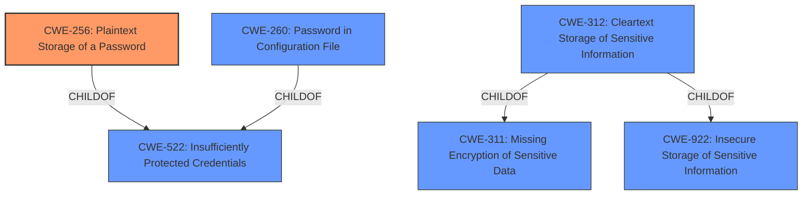

# Analysis Report for CVE-2022-27206

# Vulnerability Analysis Report: CVE-2022-27206

## Description


## Analysis (with Relationship Data)

# Summary
| CWE ID | CWE Name | Confidence | CWE Abstraction Level | CWE Vulnerability Mapping Label | CWE-Vulnerability Mapping Notes |
|---|---|---|---|---|---|
| CWE-256 | Plaintext Storage of a Password | 1.0 | Base | Allowed | Primary CWE |
| CWE-260 | Password in Configuration File | 0.8 | Base | Allowed | Secondary Candidate |
| CWE-312 | Cleartext Storage of Sensitive Information | 0.7 | Base | Allowed | Secondary Candidate |
| CWE-522 | Insufficiently Protected Credentials | 0.6 | Class | Allowed-with-Review | Secondary Candidate |

## Evidence and Confidence

*   **Confidence Score:** 0.9
*   **Evidence Strength:** HIGH

## Relationship Analysis
The primary CWE, CWE-256, is a `Base` level CWE that is a child of CWE-522 (`Class`). The relationship indicates that CWE-256 is a more specific case of storing credentials insecurely. CWE-260 is also a `Base` level CWE and a child of CWE-522, representing a password specifically stored in a configuration file. CWE-312 is a `Base` level CWE and a child of CWE-311 (`Class`) and CWE-922 (`Class`). This indicates that CWE-312 is a specific case of storing sensitive information without encryption. The choice of CWE-256 is driven by the fact that the vulnerability involves storing a password (GitLab client secret) in plaintext.



## Vulnerability Chain
The vulnerability chain starts with the **weakness** of **storing the GitLab client secret unencrypted**. This leads to the impact where users with access to the Jenkins controller file system can view the secret, potentially leading to unauthorized access to the GitLab instance.

## Summary of Analysis
The initial analysis strongly pointed to CWE-256, given the explicit mention of storing a password in plaintext. The retriever results further supported this, with CWE-256 being the top-ranked CWE.

The vulnerability description states that the "Jenkins GitLab Authentication Plugin 1.13 and earlier **stores the GitLab client secret unencrypted** in the global config.xml file on the Jenkins controller where it can be viewed by users with access to the Jenkins controller file system." This statement provides direct evidence for the root cause. The CVE Reference Links Content Summary states the same: "**Root Cause:** The GitLab Authentication Plugin stores the GitLab client secret unencrypted in the global `config.xml` file."

CWE-256 (Plaintext Storage of a Password) is chosen as the primary CWE because the description explicitly mentions storing a password (GitLab client secret) in plaintext, matching the CWE description perfectly. This is a `Base` level CWE, which is preferred.

CWE-260 (Password in Configuration File) was considered as a secondary CWE, as the `config.xml` file can be considered a configuration file.

CWE-312 (Cleartext Storage of Sensitive Information) was also considered, but it's less specific than CWE-256 since it doesn't explicitly call out a password.

CWE-522 (Insufficiently Protected Credentials) is a `Class` level CWE, and while relevant, it's less specific than CWE-256. It's more appropriate to select the `Base` CWE-256.

Other CWEs like CWE-538, CWE-863, CWE-555, CWE-549, CWE-862, and CWE-532 were considered but deemed less relevant as they didn't directly address the root cause of storing a password in plaintext.


## CWE Relationship Analysis

Current CWEs represent these abstraction levels: .


### Vulnerability Chain Analysis

**Chain starting from CWE-862:**
- 862 (Missing Authorization) - ROOT


**Chain starting from CWE-549:**
- 549 (Missing Password Field Masking) - ROOT


### CWE Relationship Diagram

```mermaid
graph TD
    classDef primary fill:#f96,stroke:#333,stroke-width:2px
    classDef secondary fill:#69f,stroke:#333
    classDef tertiary fill:#9e9,stroke:#333
```


*Report generated on 2025-03-31 03:48:41*
