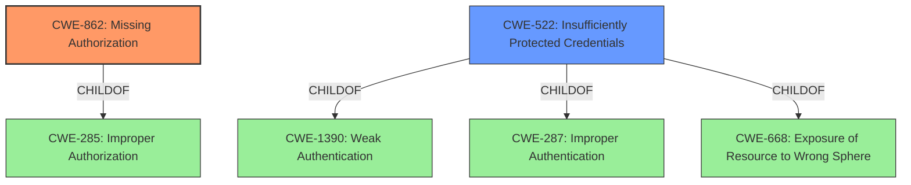

# Analysis Report for CVE-2022-27211

# Vulnerability Analysis Report: CVE-2022-27211

## Description


## Analysis (with Relationship Data)

# Summary
| CWE ID | CWE Name | Confidence | CWE Abstraction Level | CWE Vulnerability Mapping Label | CWE-Vulnerability Mapping Notes |
|---|---|---|---|---|---|
| CWE-862 | Missing Authorization | 1.0 | Class | Primary | Allowed-with-Review |
| CWE-522 | Insufficiently Protected Credentials | 0.7 | Class | Secondary | Allowed-with-Review |

## Evidence and Confidence

*   **Confidence Score:** 0.85
*   **Evidence Strength:** HIGH

## Relationship Analysis
The primary CWE identified is CWE-862, which is a Class-level CWE. It represents the **missing authorization** check. The secondary CWE identified is CWE-522, which is a Class-level CWE. It represents the insufficient protection of credentials. CWE-862 is a child of CWE-285 (Improper Authorization), indicating a general category of authorization issues. However, CWE-862 is more specific as it highlights the absence of an authorization check.



## Vulnerability Chain
The vulnerability chain starts with a **missing permission check** (CWE-862), leading to the ability to connect to an attacker-specified SSH server using attacker-specified credentials IDs, potentially capturing credentials stored in Jenkins (CWE-522).

## Summary of Analysis
The analysis is primarily based on the provided evidence, which includes the vulnerability description and the CVE reference links content summary.

The **Vulnerability Description Key Phrases** clearly states: "**rootcause:** **missing permission check**".

The **CVE Reference Links Content Summary** supports the above statement:
*   **Root Cause:** The Kubernetes Continuous Deploy Plugin (versions 2.3.1 and earlier) lacks a permission check in one of its HTTP endpoints.
*   **Weakness:** Missing authorization check. An HTTP endpoint lacks proper access control, allowing unauthorized access to a resource.
*   **Impact:** Attackers with Overall/Read permission can exploit this vulnerability, combined with another vulnerability (CVE-2022-27209), to connect to an attacker-specified SSH server using attacker-specified credential IDs. This could result in the capture of credentials stored in Jenkins.

The graph relationships influenced the selection by highlighting the hierarchical structure of CWEs related to authorization. While CWE-285 (Improper Authorization) is a parent, CWE-862 (Missing Authorization) is more specific and directly reflects the identified root cause.

CWE-862 is selected as the primary CWE because the **missing permission check** is the direct cause. The impact of capturing credentials stored in Jenkins suggests CWE-522 (Insufficiently Protected Credentials) as a secondary weakness, because the credentials should not have been accessible in the first place without proper authorization.

The selected CWEs are at the optimal level of specificity. CWE-862 accurately represents the **missing authorization** check, and CWE-522 highlights the insufficient protection of stored credentials. A more generic CWE like CWE-285 would not capture the specific nature of the vulnerability.
Relevant CWE Information:


## CWE Relationship Analysis

Current CWEs represent these abstraction levels: .


### Vulnerability Chain Analysis

**Chain starting from CWE-862:**
- 862 (Missing Authorization) - ROOT


**Chain starting from CWE-1390:**
- 1390 (Weak Authentication) - ROOT


### CWE Relationship Diagram

```mermaid
graph TD
    classDef primary fill:#f96,stroke:#333,stroke-width:2px
    classDef secondary fill:#69f,stroke:#333
    classDef tertiary fill:#9e9,stroke:#333
```


*Report generated on 2025-03-30 17:29:16*
